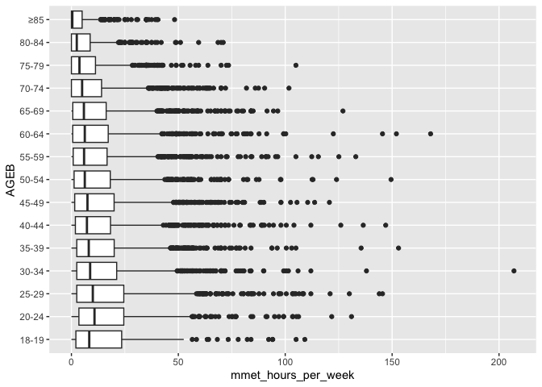

# Modelling physical activity in Melbourne


This Quarto markdown document is intended to contain code to predict
physical activity for sport and recreation excluding walking and
cycling, given explanatory variables (age, sex, SES, education, has car,
etc) that align with the JIBE synthetic population data. This will be
conducted to predict physical activity for residents of Melbourne,
Australia, using the Australian Bureau of Statistics Australian National
Health Survey data (2017-18).

The analysis draws on Belen Zapata-Diomedi’s code for cleaning the NHS
dataset (../document.qmd), and Belen Zapata-Diomedi, Qin Zhang and
Marina Berdokhova’s code for a predictive model of marginal metabolic
equivalent hours per week (mMET house/week) for Manchester, UK.

## Dependencies

Analysis was conducted using R 4.4.1 using a Quarto markdown document
(Quarto 1.5.55) in Positron IDE (2024.10.0), with renv 1.0.11 for
package management.

The following packages have been installed using renv:

    renv::install(c('dplyr','corrplot','vtable','rmarkdown'))

In principle, the R environment for this notebook should be able to be
restored by running

    renv::restore()

Load libaries

``` r
library(dplyr)
library(vtable)
library(corrplot)
library(ggplot2)
```

## Data

[National Health
Survey](https://www.abs.gov.au/statistics/microdata-tablebuilder/available-microdata-tablebuilder/national-health-survey)
(NHS) data for 2017-18 were retrieved from the [Microdata
Downloads](https://microdatadownload.abs.gov.au/MicrodataDownload/login.xhtml)
section of the Australian Bureau of Statistics website on 3 December
2024. ABS Microdata were accessed under the [ABS/Universities Australia
Agreement
(2024)](https://www.abs.gov.au/statistics/microdata-tablebuilder/absuniversities-australia-agreement)
by Carl Higgs (RMIT University). The NHS Microdata data descriptions are
available for download
[here](https://www.abs.gov.au/statistics/microdata-tablebuilder/available-microdata-tablebuilder/national-health-survey#data-item-lists).

NHS microdata are provided in CSV, SAS, SPSS, or Stata formats. The CSV
data do not have labels, hence the `haven` package could be installed to
read the labelled data in .dta (Stata) format. However, perhaps labels
are not required — for now, CSV will be used to keep things simple.

| File (csv, dta, etc) | Description                |
|----------------------|----------------------------|
| NHS17HHB             | Household level data       |
| NHS17SPB             | Person level data          |
| NHS17A3B             | Alcohol day level data     |
| NHS17A4B             | Alcohol type level data    |
| NHS17CNB             | Conditions level data      |
| NHS17MDB             | Medications level data     |
| NHS17HLB             | Health Literacy level data |

ABS NHS 2017-18 Microdata files

The household data contain geographic attributes and could potentially
be used to restrict the sample, e.g. to residents of urban areas within
Greater Melbourne. Sensitivity analysis could be conducted to evaluate
the impact of this decision, e.g. relative to all persons and all
persons living in Australian urban regions.

Household variables of interest include:

| Variable | Description | Comment |
|----|----|----|
| ABSHIDB | Household identifier | Link with persons |
| STATE16 | State or Territory (ASGS 2016) | 2 == Victoria |
| NUMKHHBC | Number |  |
| of children aged 0-17 years  in household | 0, 1, 2, 3==3+ |  |
| SA1SF2DN | SEIFA - Index of Relative Socio-economic Disadvantage - 2016 - SA1 - Deciles - National |  |

Person-level variables of interest (see data dictionaries for detailed
codes) include:

| Variable | Description | Comment |
|----|----|----|
| ABSPID | Person identifier | Need to verify that this is unique within households |
| ABSHIDB | Household identifier | Link with households |
| AGEB | Age of person | 1== 0-4 years  … 19 == 85 years+ |
| SEX | Sex of person | 1==Male, 2==Female |
| LFSBC | Labour force status | 0==NA, 1==Employed, 2==Unemployed, 3==Not in the labour force |
| HYSCHCBC | Highest year of school completed | 0==NA, 1==Postgraduate, … 13==Never attended school |
| HIGHLVLBC | Level of highest educational attainment | 0==NA, 1==Postgraduate, … 13==Never attended school |
| EMPSTAT | Labour force full-time/part-time status | 0==NA, 1==Employed full time … 6 Not in labour force |
| Walk for recreation (mins) | EXFSRMIN | Total minutes walked for fitness, recreation or sport in last week (for at least 10 minutes) |
| Walk for transport (mins) | EXTRAMIN | Total minutes spent walking for transport in last week (for at least 10 minutes) |
| Moderate exercise (mins) | EXLWMMIN | Total minutes undertaken moderate exercise last week (for example, a light jog, strenght and toning exercises, lifting small boxes and sweeping) |
| Vigorous exercise (mins) | EXLWVMIN | Total minutes undertaken vigorous exercise last week (for example, playing basketball, running, lifting heavy boxes, and strength and toning exercises) |

## Methods

### Read and join the data

Adults aged 18 years and over from the persons dataset are left joined
to the household data, with only the relevant variables retained. The
core exposure variables are renamed to enhance readability of the
subsequent code.

``` r
data_dir <- '/Users/E33390/Library/CloudStorage/OneDrive-RMITUniversity/projects/abs/microdata/NHS2017-18_CSV/NHS2017-18_CSV/'
data <- list(
    households = read.csv(paste0(data_dir,'NHS17HHB.csv')),
    persons = read.csv(paste0(data_dir,'NHS17SPB.csv'))
)
```

``` r
nhs <- left_join(
            data$households %>% 
                select(
                    c( 
                        "ABSHIDB",
                        "STATE16", 
                        "NUMKHHBC",
                        "SA1SF2DN"
                    )
                ),
            data$persons %>% 
                select(
                    c(
                        "ABSPID",
                        "ABSHIDB",
                        "AGEB",
                        "SEX",
                        "LFSBC",
                        "HYSCHCBC",
                        "HIGHLVBC",
                        "EXFSRMIN",
                        "EXTRAMIN",
                        "EXLWMMIN",
                        "EXLWVMIN"
                    )
                ) %>% rename(
                    walk_recreation_min=EXFSRMIN,
                    walk_transport_min=EXTRAMIN,
                    mod_excercise_min=EXLWMMIN,
                    vig_excercise_min=EXLWVMIN
                )%>% 
                filter(
                    AGEB > 4
                ), 
        by = "ABSHIDB"
        ) 
nhs %>% st(out='kable')
```

| Variable            | N     | Mean | Std. Dev. | Min | Pctl. 25 | Pctl. 75 | Max   |
|:--------------------|:------|:-----|:----------|:----|:---------|:---------|:------|
| STATE16             | 16376 | 3.6  | 2.2       | 1   | 2        | 5        | 8     |
| NUMKHHBC            | 16376 | 0.54 | 0.92      | 0   | 0        | 1        | 3     |
| SA1SF2DN            | 16376 | 5.4  | 2.8       | 1   | 3        | 8        | 10    |
| ABSPID              | 16370 | 1    | 0         | 1   | 1        | 1        | 1     |
| AGEB                | 16370 | 12   | 3.6       | 5   | 9        | 15       | 19    |
| SEX                 | 16370 | 1.5  | 0.5       | 1   | 1        | 2        | 2     |
| LFSBC               | 16370 | 1.8  | 0.96      | 1   | 1        | 3        | 3     |
| HYSCHCBC            | 16370 | 2    | 1.3       | 1   | 1        | 3        | 5     |
| HIGHLVBC            | 16370 | 4.5  | 2.6       | 1   | 2        | 6        | 12    |
| walk_recreation_min | 16370 | 153  | 2474      | 0   | 0        | 120      | 99998 |
| walk_transport_min  | 16370 | 352  | 5236      | 0   | 0        | 90       | 99998 |
| mod_excercise_min   | 16370 | 67   | 1359      | 0   | 0        | 40       | 99998 |
| vig_excercise_min   | 16370 | 32   | 104       | 0   | 0        | 0        | 2400  |

Summary Statistics

### Data preparation

Missing data or NA values (e.g 99997 and 99998) are replaced as missing,
while maximum values of walking time variables are truncated at 840
minutes to constrain influence of extreme outliers.

SA1 Index of Relative Socio-economic Disadvantage (IRSD; `SA1SF2DN`) is
rescaled to use quintiles rather than deciles, for consistency with the
synthetic population, with ‘1’ being most deprived and ‘5’ being least
deprived.

Age is treated as a factor variable. Note that while most age brackets
are 5 years, the age bracket of 18-19 is an exception.

For now, I have retained labour force status for comparability with
Manchester analysis that considered employment, as well as two potential
variables for considering education: one considers highest school level
to year 12, the other has more levels also including postgraduate and
technical/further education certificates. Perhaps a simplified
combination of those two variables may be most parsimonious, and
something that can be considered together later.

Marginal metabolic equivalent house per week (mMET hours/week; `mmet`)
are calculated as the sum of hours spent walking for recreation, walking
for transport, doing moderate exercise and doing vigorous exercise, with
each respectively multiplied by the metabolic equivalent of these tasks
(METs).

``` r
MMET_MOD <- 3.5 # As in meta analysis GArcia et al. 
MMET_VIG <- 7 # As in meta analysis GArcia et al. 
MMET_CYCLING <- 5.8 # From ithimr (check)
MMET_WALKING <- 2.5 # From ithimr (check)

pa_data <- nhs  %>%
    mutate_all(~ ifelse( . %in% c(99997, 99998), NA, .)) %>%
    mutate(
        walk_recreation_min = case_when(
                walk_recreation_min > 840 ~ 840, 
                TRUE ~  walk_recreation_min # handles unexpected values using default
            ),
        walk_transport_min = case_when(
                walk_transport_min > 840 ~ 840, 
                TRUE ~ walk_transport_min
            ),
        mod_excercise_min = case_when(
                mod_excercise_min > 840 ~ 840, 
                TRUE ~ mod_excercise_min
            ),
        vig_excercise_min = case_when(
                vig_excercise_min > 840 ~ 840, 
                TRUE ~ vig_excercise_min
            )
    ) %>%
    mutate (
        AGEB = factor(
            AGEB, 
            levels = 5:19, 
            labels = c("18-19","20-24", "25-29", "30-34", "35-39", 
                        "40-44", "45-49", "50-54", "55-59", 
                        "60-64", "65-69", "70-74", "75-79", 
                        "80-84", "≥85"),
            ordered = TRUE
        )
    ) %>%
    mutate(
        SA1SF2DN = case_when(
            SA1SF2DN %in% c(1, 2) ~ 1,
            SA1SF2DN %in% c(3, 4) ~ 2,
            SA1SF2DN %in% c(5, 6) ~ 3,
            SA1SF2DN %in% c(7, 8) ~ 4,
            SA1SF2DN %in% c(9, 10) ~ 5
        )
    ) %>% 
    mutate(
        SA1SF2DN = factor(
            SA1SF2DN, 
            levels = 1:5, 
            labels = c("1 (most deprived)", "2", "3", "4", "5 (least deprived)"),
            ordered = TRUE)
    ) %>%
    mutate(
        SEX = factor(
            SEX, 
            levels = 1:2, 
            labels = c("Male", "Female"),
            ordered = TRUE)
    ) %>%
    mutate(
        LFSBC = factor(
            LFSBC,
            levels = c(0, 1, 2, 3),
            labels = c(
                "Not applicable",
                "Employed",
                "Unemployed",
                "Not in the labour force"
                )
            )
    ) %>%
    mutate(
        HYSCHCBC = factor(
            HYSCHCBC,
            levels = c(0, 1, 2, 3, 4, 5, 9),
            labels = c(
                    "Not applicable",
                    "Year 12 or equivalent",
                    "Year 11 or equivalent",
                    "Year 10 or equivalent",
                    "Year 9 or equivalent",
                    "Year 8 or below including never attended School",
                    "Not asked"
                )
            )
    ) %>%
    mutate(
        HIGHLVBC = factor(
            HIGHLVBC,
            levels = c(0, 1, 2, 3, 4, 5, 6, 7, 8, 9, 10, 11, 12),
            labels = c(
                    "Not applicable",
                    "Postgraduate Degree, Graduate Diploma/Graduate Certificate",
                    "Bachelor Degree",
                    "Advanced Diploma/Diploma",
                    "Certificates III/IV",
                    "Year 12",
                    "Year 11",
                    "Year 10",
                    "Certificates I/II",
                    "Year 9 and below",
                    "Certificate not further defined",
                    "Level not determined",
                    "Never attended school and no non-school qualification"
                )
        )
    ) %>%
    mutate(
        mmet_hours_per_week=walk_recreation_min/60* MMET_WALKING +
             walk_transport_min/60 * MMET_WALKING + 
             mod_excercise_min/60 * MMET_MOD + 
             vig_excercise_min/60 * MMET_VIG
    )  %>%
    mutate(
        mmet_hours_per_week_zero = ifelse(mmet_hours_per_week == 0, 1, 0))

pa_data %>% st(out='kable')
```

| Variable | N | Mean | Std. Dev. | Min | Pctl. 25 | Pctl. 75 | Max |
|:---|:---|:---|:---|:---|:---|:---|:---|
| STATE16 | 16376 | 3.6 | 2.2 | 1 | 2 | 5 | 8 |
| NUMKHHBC | 16376 | 0.54 | 0.92 | 0 | 0 | 1 | 3 |
| SA1SF2DN | 16376 |  |  |  |  |  |  |
| … 1 (most deprived) | 3177 | 19% |  |  |  |  |  |
| … 2 | 3419 | 21% |  |  |  |  |  |
| … 3 | 3489 | 21% |  |  |  |  |  |
| … 4 | 3305 | 20% |  |  |  |  |  |
| … 5 (least deprived) | 2986 | 18% |  |  |  |  |  |
| ABSPID | 16370 | 1 | 0 | 1 | 1 | 1 | 1 |
| AGEB | 16370 |  |  |  |  |  |  |
| … 18-19 | 321 | 2% |  |  |  |  |  |
| … 20-24 | 853 | 5% |  |  |  |  |  |
| … 25-29 | 1145 | 7% |  |  |  |  |  |
| … 30-34 | 1431 | 9% |  |  |  |  |  |
| … 35-39 | 1467 | 9% |  |  |  |  |  |
| … 40-44 | 1377 | 8% |  |  |  |  |  |
| … 45-49 | 1452 | 9% |  |  |  |  |  |
| … 50-54 | 1348 | 8% |  |  |  |  |  |
| … 55-59 | 1403 | 9% |  |  |  |  |  |
| … 60-64 | 1386 | 8% |  |  |  |  |  |
| … 65-69 | 1293 | 8% |  |  |  |  |  |
| … 70-74 | 1163 | 7% |  |  |  |  |  |
| … 75-79 | 760 | 5% |  |  |  |  |  |
| … 80-84 | 546 | 3% |  |  |  |  |  |
| … ≥85 | 425 | 3% |  |  |  |  |  |
| SEX | 16370 |  |  |  |  |  |  |
| … Male | 7576 | 46% |  |  |  |  |  |
| … Female | 8794 | 54% |  |  |  |  |  |
| LFSBC | 16370 |  |  |  |  |  |  |
| … Not applicable | 0 | 0% |  |  |  |  |  |
| … Employed | 9936 | 61% |  |  |  |  |  |
| … Unemployed | 412 | 3% |  |  |  |  |  |
| … Not in the labour force | 6022 | 37% |  |  |  |  |  |
| HYSCHCBC | 16370 |  |  |  |  |  |  |
| … Not applicable | 0 | 0% |  |  |  |  |  |
| … Year 12 or equivalent | 8991 | 55% |  |  |  |  |  |
| … Year 11 or equivalent | 1589 | 10% |  |  |  |  |  |
| … Year 10 or equivalent | 3621 | 22% |  |  |  |  |  |
| … Year 9 or equivalent | 1057 | 6% |  |  |  |  |  |
| … Year 8 or below including never attended School | 1112 | 7% |  |  |  |  |  |
| … Not asked | 0 | 0% |  |  |  |  |  |
| HIGHLVBC | 16370 |  |  |  |  |  |  |
| … Not applicable | 0 | 0% |  |  |  |  |  |
| … Postgraduate Degree, Graduate Diploma/Graduate Certificate | 1595 | 10% |  |  |  |  |  |
| … Bachelor Degree | 2925 | 18% |  |  |  |  |  |
| … Advanced Diploma/Diploma | 1739 | 11% |  |  |  |  |  |
| … Certificates III/IV | 3408 | 21% |  |  |  |  |  |
| … Year 12 | 2064 | 13% |  |  |  |  |  |
| … Year 11 | 689 | 4% |  |  |  |  |  |
| … Year 10 | 1779 | 11% |  |  |  |  |  |
| … Certificates I/II | 84 | 1% |  |  |  |  |  |
| … Year 9 and below | 1487 | 9% |  |  |  |  |  |
| … Certificate not further defined | 5 | 0% |  |  |  |  |  |
| … Level not determined | 552 | 3% |  |  |  |  |  |
| … Never attended school and no non-school qualification | 43 | 0% |  |  |  |  |  |
| walk_recreation_min | 16360 | 89 | 146 | 0 | 0 | 120 | 840 |
| walk_transport_min | 16325 | 69 | 134 | 0 | 0 | 80 | 840 |
| mod_excercise_min | 16367 | 47 | 112 | 0 | 0 | 40 | 840 |
| vig_excercise_min | 16370 | 31 | 88 | 0 | 0 | 0 | 840 |
| mmet_hours_per_week | 16318 | 13 | 17 | 0 | 1.2 | 18 | 207 |
| mmet_hours_per_week_zero | 16318 | 0.21 | 0.41 | 0 | 0 | 0 | 1 |

Summary Statistics

### Exploratory data analysis

#### Correlations

For now I have included both education variables in the below
exploratory data analysis, although most likely a derived combined
variable for education will be used, pending discussion with the team.
The State variable is also included to get a sense of how variables
differ across Australian states; Victorian-specific results could be
expected to be mostly drawn from Melbourne, and this could be explored
in a sensitivity analysis.

Many of our variables are factor variables for which direct numeric
correlations could be misleading (i.e. they aren’t necessarily ordinal
or linear, e.g. labour force status, or ‘NA’ values in educational
attainment).

``` r
cor=as.data.frame(lapply(pa_data[, c("SA1SF2DN", "AGEB", "SEX", "LFSBC", "HYSCHCBC", "HIGHLVBC", "mmet_hours_per_week")], as.numeric))
cor=na.omit(cor)
correlation_matrix <- cor(cor) %>% as.data.frame()
# corrplot(correlation_matrix %>% as.double(), method = "number",order = "FPC",type="lower") 
correlation_matrix[order(correlation_matrix$mmet_hours_per_week),] %>% round(2)
##                     SA1SF2DN  AGEB   SEX LFSBC HYSCHCBC HIGHLVBC
## HYSCHCBC               -0.25  0.44  0.00  0.38     1.00     0.61
## HIGHLVBC               -0.24  0.26  0.03  0.32     0.61     1.00
## AGEB                   -0.04  1.00  0.02  0.54     0.44     0.26
## LFSBC                  -0.15  0.54  0.11  1.00     0.38     0.32
## SEX                    -0.01  0.02  1.00  0.11     0.00     0.03
## SA1SF2DN                1.00 -0.04 -0.01 -0.15    -0.25    -0.24
## mmet_hours_per_week     0.14 -0.15 -0.08 -0.15    -0.19    -0.18
##                     mmet_hours_per_week
## HYSCHCBC                          -0.19
## HIGHLVBC                          -0.18
## AGEB                              -0.15
## LFSBC                             -0.15
## SEX                               -0.08
## SA1SF2DN                           0.14
## mmet_hours_per_week                1.00
```

Labour force status and age are both more tightly correlated with
completion of high school (HYSCHCBC) than the variable that also
considers postgraduate and certificate training (HIGHLVBC); for now will
use the latter, to reduce risk of multicollinearity.

Persons are theoretically clustered within households. If there is more
than one person within each household, as this data structure implies,
this clustering should be accounted for in the model. The following
checks the maximum number of persons within households, and confirms
that only one person is associated with each household and so clustering
within households will not be required in the model.

``` r
pa_data %>%
  group_by(ABSHIDB) %>%
  summarise(num_persons = n()) %>%
  summarise(max_persons = max(num_persons))
## # A tibble: 1 × 1
##   max_persons
##         <int>
## 1           1
```

Set up data for modelling

``` r
pa_data =pa_data%>%
  select(ABSPID,SEX,AGEB,LFSBC,HIGHLVBC,SA1SF2DN,mmet_hours_per_week, mmet_hours_per_week_zero)%>%
  na.omit()

pa_data_over0=pa_data[pa_data$mmet_hours_per_week>0,]
```

### Modelling

The modelling approach (and earlier data preparation) draws on code from
the Manchester physical activity modelling R code file
`otherSportPA_hurdle_v3.R` authored by Qin Zhang, Belen Zapata-Diomedi
and Marina Berdokhova.

``` r
MonteCarlo_otherSport <- function(model, data,facetVar = NA) {
  sport.var <- as.character(model$formula[2])
  
  probability.matrix <- as.vector(predict(model,data,type = "response"))
  MC.prediction <- rep(NA,nrow(data))
  for(n in c(1:nrow(data))) {
    MC.prediction[n] <- runif(1)<=probability.matrix[n]
  }
  
  data=data%>%mutate(zeroPrediction=MC.prediction)
  
  return(data)
}
```

#### Modelling mMETS hours/week

``` r
m.otherSport <- list()

m.otherSport$linear <- lm(mmet_hours_per_week ~ SEX+AGEB+LFSBC+HIGHLVBC+SA1SF2DN,
                          data = pa_data_over0)
summary(m.otherSport$linear)
## 
## Call:
## lm(formula = mmet_hours_per_week ~ SEX + AGEB + LFSBC + HIGHLVBC + 
##     SA1SF2DN, data = pa_data_over0)
## 
## Residuals:
##     Min      1Q  Median      3Q     Max 
## -23.541 -11.261  -5.260   5.721 195.864 
## 
## Coefficients:
##                                                                Estimate
## (Intercept)                                                    18.97246
## SEX.L                                                          -2.55718
## AGEB.L                                                         -6.88466
## AGEB.Q                                                         -0.96284
## AGEB.C                                                         -2.92909
## AGEB^4                                                         -1.67573
## AGEB^5                                                          1.55209
## AGEB^6                                                         -0.41738
## AGEB^7                                                          0.37137
## AGEB^8                                                          0.16154
## AGEB^9                                                         -1.73124
## AGEB^10                                                         0.35102
## AGEB^11                                                        -0.08166
## AGEB^12                                                        -0.05321
## AGEB^13                                                        -0.40337
## AGEB^14                                                        -0.04849
## LFSBCUnemployed                                                -0.76519
## LFSBCNot in the labour force                                   -1.53202
## HIGHLVBCBachelor Degree                                        -0.58106
## HIGHLVBCAdvanced Diploma/Diploma                               -1.89872
## HIGHLVBCCertificates III/IV                                    -3.09557
## HIGHLVBCYear 12                                                -2.42123
## HIGHLVBCYear 11                                                -4.65462
## HIGHLVBCYear 10                                                -4.35296
## HIGHLVBCCertificates I/II                                      -3.84343
## HIGHLVBCYear 9 and below                                       -5.84367
## HIGHLVBCCertificate not further defined                       -11.50987
## HIGHLVBCLevel not determined                                   -3.54382
## HIGHLVBCNever attended school and no non-school qualification  -2.78747
## SA1SF2DN.L                                                      2.63592
## SA1SF2DN.Q                                                     -0.24421
## SA1SF2DN.C                                                      0.69823
## SA1SF2DN^4                                                      0.20188
##                                                               Std. Error
## (Intercept)                                                      0.50538
## SEX.L                                                            0.22015
## AGEB.L                                                           1.03244
## AGEB.Q                                                           0.92088
## AGEB.C                                                           0.85311
## AGEB^4                                                           0.81345
## AGEB^5                                                           0.75925
## AGEB^6                                                           0.71569
## AGEB^7                                                           0.67793
## AGEB^8                                                           0.64925
## AGEB^9                                                           0.61755
## AGEB^10                                                          0.58606
## AGEB^11                                                          0.55315
## AGEB^12                                                          0.53580
## AGEB^13                                                          0.52612
## AGEB^14                                                          0.52377
## LFSBCUnemployed                                                  0.96667
## LFSBCNot in the labour force                                     0.43286
## HIGHLVBCBachelor Degree                                          0.56869
## HIGHLVBCAdvanced Diploma/Diploma                                 0.64383
## HIGHLVBCCertificates III/IV                                      0.58001
## HIGHLVBCYear 12                                                  0.64698
## HIGHLVBCYear 11                                                  0.91427
## HIGHLVBCYear 10                                                  0.70320
## HIGHLVBCCertificates I/II                                        2.44343
## HIGHLVBCYear 9 and below                                         0.80447
## HIGHLVBCCertificate not further defined                         10.04055
## HIGHLVBCLevel not determined                                     0.94046
## HIGHLVBCNever attended school and no non-school qualification    3.38979
## SA1SF2DN.L                                                       0.36743
## SA1SF2DN.Q                                                       0.34566
## SA1SF2DN.C                                                       0.34131
## SA1SF2DN^4                                                       0.33364
##                                                               t value Pr(>|t|)
## (Intercept)                                                    37.541  < 2e-16
## SEX.L                                                         -11.616  < 2e-16
## AGEB.L                                                         -6.668 2.69e-11
## AGEB.Q                                                         -1.046 0.295780
## AGEB.C                                                         -3.433 0.000598
## AGEB^4                                                         -2.060 0.039414
## AGEB^5                                                          2.044 0.040951
## AGEB^6                                                         -0.583 0.559779
## AGEB^7                                                          0.548 0.583835
## AGEB^8                                                          0.249 0.803511
## AGEB^9                                                         -2.803 0.005064
## AGEB^10                                                         0.599 0.549215
## AGEB^11                                                        -0.148 0.882646
## AGEB^12                                                        -0.099 0.920898
## AGEB^13                                                        -0.767 0.443288
## AGEB^14                                                        -0.093 0.926241
## LFSBCUnemployed                                                -0.792 0.428624
## LFSBCNot in the labour force                                   -3.539 0.000403
## HIGHLVBCBachelor Degree                                        -1.022 0.306920
## HIGHLVBCAdvanced Diploma/Diploma                               -2.949 0.003193
## HIGHLVBCCertificates III/IV                                    -5.337 9.61e-08
## HIGHLVBCYear 12                                                -3.742 0.000183
## HIGHLVBCYear 11                                                -5.091 3.61e-07
## HIGHLVBCYear 10                                                -6.190 6.19e-10
## HIGHLVBCCertificates I/II                                      -1.573 0.115752
## HIGHLVBCYear 9 and below                                       -7.264 3.97e-13
## HIGHLVBCCertificate not further defined                        -1.146 0.251677
## HIGHLVBCLevel not determined                                   -3.768 0.000165
## HIGHLVBCNever attended school and no non-school qualification  -0.822 0.410915
## SA1SF2DN.L                                                      7.174 7.68e-13
## SA1SF2DN.Q                                                     -0.707 0.479882
## SA1SF2DN.C                                                      2.046 0.040803
## SA1SF2DN^4                                                      0.605 0.545130
##                                                                  
## (Intercept)                                                   ***
## SEX.L                                                         ***
## AGEB.L                                                        ***
## AGEB.Q                                                           
## AGEB.C                                                        ***
## AGEB^4                                                        *  
## AGEB^5                                                        *  
## AGEB^6                                                           
## AGEB^7                                                           
## AGEB^8                                                           
## AGEB^9                                                        ** 
## AGEB^10                                                          
## AGEB^11                                                          
## AGEB^12                                                          
## AGEB^13                                                          
## AGEB^14                                                          
## LFSBCUnemployed                                                  
## LFSBCNot in the labour force                                  ***
## HIGHLVBCBachelor Degree                                          
## HIGHLVBCAdvanced Diploma/Diploma                              ** 
## HIGHLVBCCertificates III/IV                                   ***
## HIGHLVBCYear 12                                               ***
## HIGHLVBCYear 11                                               ***
## HIGHLVBCYear 10                                               ***
## HIGHLVBCCertificates I/II                                        
## HIGHLVBCYear 9 and below                                      ***
## HIGHLVBCCertificate not further defined                          
## HIGHLVBCLevel not determined                                  ***
## HIGHLVBCNever attended school and no non-school qualification    
## SA1SF2DN.L                                                    ***
## SA1SF2DN.Q                                                       
## SA1SF2DN.C                                                    *  
## SA1SF2DN^4                                                       
## ---
## Signif. codes:  0 '***' 0.001 '**' 0.01 '*' 0.05 '.' 0.1 ' ' 1
## 
## Residual standard error: 17.36 on 12901 degrees of freedom
## Multiple R-squared:  0.04522,    Adjusted R-squared:  0.04285 
## F-statistic: 19.09 on 32 and 12901 DF,  p-value: < 2.2e-16
```

#### Modelling zero mMETS hours/week

``` r
m.otherSport$zeroModel <- glm(mmet_hours_per_week_zero ~ SEX+AGEB+LFSBC+HIGHLVBC+SA1SF2DN,
                              family = "binomial",data = pa_data)


summary(m.otherSport$zeroModel)
## 
## Call:
## glm(formula = mmet_hours_per_week_zero ~ SEX + AGEB + LFSBC + 
##     HIGHLVBC + SA1SF2DN, family = "binomial", data = pa_data)
## 
## Coefficients:
##                                                                Estimate
## (Intercept)                                                   -2.396893
## SEX.L                                                         -0.060481
## AGEB.L                                                         1.359263
## AGEB.Q                                                        -0.035148
## AGEB.C                                                         0.493210
## AGEB^4                                                         0.412487
## AGEB^5                                                        -0.023270
## AGEB^6                                                         0.190364
## AGEB^7                                                        -0.150073
## AGEB^8                                                         0.133772
## AGEB^9                                                        -0.087819
## AGEB^10                                                        0.200007
## AGEB^11                                                       -0.036972
## AGEB^12                                                       -0.041424
## AGEB^13                                                       -0.025794
## AGEB^14                                                       -0.005714
## LFSBCUnemployed                                               -0.133059
## LFSBCNot in the labour force                                   0.089283
## HIGHLVBCBachelor Degree                                        0.320131
## HIGHLVBCAdvanced Diploma/Diploma                               0.623579
## HIGHLVBCCertificates III/IV                                    1.108270
## HIGHLVBCYear 12                                                0.984607
## HIGHLVBCYear 11                                                1.319901
## HIGHLVBCYear 10                                                1.434079
## HIGHLVBCCertificates I/II                                      1.486106
## HIGHLVBCYear 9 and below                                       1.686075
## HIGHLVBCCertificate not further defined                        1.801405
## HIGHLVBCLevel not determined                                   0.842581
## HIGHLVBCNever attended school and no non-school qualification  1.402093
## SA1SF2DN.L                                                    -0.611036
## SA1SF2DN.Q                                                    -0.063228
## SA1SF2DN.C                                                    -0.028178
## SA1SF2DN^4                                                    -0.027693
##                                                               Std. Error
## (Intercept)                                                     0.097963
## SEX.L                                                           0.029350
## AGEB.L                                                          0.129026
## AGEB.Q                                                          0.113630
## AGEB.C                                                          0.106226
## AGEB^4                                                          0.101914
## AGEB^5                                                          0.096775
## AGEB^6                                                          0.093377
## AGEB^7                                                          0.088874
## AGEB^8                                                          0.084984
## AGEB^9                                                          0.080597
## AGEB^10                                                         0.077021
## AGEB^11                                                         0.073495
## AGEB^12                                                         0.071758
## AGEB^13                                                         0.069523
## AGEB^14                                                         0.068641
## LFSBCUnemployed                                                 0.138028
## LFSBCNot in the labour force                                    0.054913
## HIGHLVBCBachelor Degree                                         0.112424
## HIGHLVBCAdvanced Diploma/Diploma                                0.116741
## HIGHLVBCCertificates III/IV                                     0.104116
## HIGHLVBCYear 12                                                 0.112317
## HIGHLVBCYear 11                                                 0.130495
## HIGHLVBCYear 10                                                 0.109900
## HIGHLVBCCertificates I/II                                       0.251505
## HIGHLVBCYear 9 and below                                        0.113701
## HIGHLVBCCertificate not further defined                         0.919733
## HIGHLVBCLevel not determined                                    0.146586
## HIGHLVBCNever attended school and no non-school qualification   0.337303
## SA1SF2DN.L                                                      0.050882
## SA1SF2DN.Q                                                      0.047827
## SA1SF2DN.C                                                      0.046029
## SA1SF2DN^4                                                      0.044594
##                                                               z value Pr(>|z|)
## (Intercept)                                                   -24.467  < 2e-16
## SEX.L                                                          -2.061  0.03933
## AGEB.L                                                         10.535  < 2e-16
## AGEB.Q                                                         -0.309  0.75708
## AGEB.C                                                          4.643 3.43e-06
## AGEB^4                                                          4.047 5.18e-05
## AGEB^5                                                         -0.240  0.80998
## AGEB^6                                                          2.039  0.04148
## AGEB^7                                                         -1.689  0.09130
## AGEB^8                                                          1.574  0.11547
## AGEB^9                                                         -1.090  0.27589
## AGEB^10                                                         2.597  0.00941
## AGEB^11                                                        -0.503  0.61493
## AGEB^12                                                        -0.577  0.56376
## AGEB^13                                                        -0.371  0.71062
## AGEB^14                                                        -0.083  0.93365
## LFSBCUnemployed                                                -0.964  0.33505
## LFSBCNot in the labour force                                    1.626  0.10397
## HIGHLVBCBachelor Degree                                         2.848  0.00441
## HIGHLVBCAdvanced Diploma/Diploma                                5.342 9.21e-08
## HIGHLVBCCertificates III/IV                                    10.645  < 2e-16
## HIGHLVBCYear 12                                                 8.766  < 2e-16
## HIGHLVBCYear 11                                                10.115  < 2e-16
## HIGHLVBCYear 10                                                13.049  < 2e-16
## HIGHLVBCCertificates I/II                                       5.909 3.44e-09
## HIGHLVBCYear 9 and below                                       14.829  < 2e-16
## HIGHLVBCCertificate not further defined                         1.959  0.05016
## HIGHLVBCLevel not determined                                    5.748 9.03e-09
## HIGHLVBCNever attended school and no non-school qualification   4.157 3.23e-05
## SA1SF2DN.L                                                    -12.009  < 2e-16
## SA1SF2DN.Q                                                     -1.322  0.18616
## SA1SF2DN.C                                                     -0.612  0.54042
## SA1SF2DN^4                                                     -0.621  0.53460
##                                                                  
## (Intercept)                                                   ***
## SEX.L                                                         *  
## AGEB.L                                                        ***
## AGEB.Q                                                           
## AGEB.C                                                        ***
## AGEB^4                                                        ***
## AGEB^5                                                           
## AGEB^6                                                        *  
## AGEB^7                                                        .  
## AGEB^8                                                           
## AGEB^9                                                           
## AGEB^10                                                       ** 
## AGEB^11                                                          
## AGEB^12                                                          
## AGEB^13                                                          
## AGEB^14                                                          
## LFSBCUnemployed                                                  
## LFSBCNot in the labour force                                     
## HIGHLVBCBachelor Degree                                       ** 
## HIGHLVBCAdvanced Diploma/Diploma                              ***
## HIGHLVBCCertificates III/IV                                   ***
## HIGHLVBCYear 12                                               ***
## HIGHLVBCYear 11                                               ***
## HIGHLVBCYear 10                                               ***
## HIGHLVBCCertificates I/II                                     ***
## HIGHLVBCYear 9 and below                                      ***
## HIGHLVBCCertificate not further defined                       .  
## HIGHLVBCLevel not determined                                  ***
## HIGHLVBCNever attended school and no non-school qualification ***
## SA1SF2DN.L                                                    ***
## SA1SF2DN.Q                                                       
## SA1SF2DN.C                                                       
## SA1SF2DN^4                                                       
## ---
## Signif. codes:  0 '***' 0.001 '**' 0.01 '*' 0.05 '.' 0.1 ' ' 1
## 
## (Dispersion parameter for binomial family taken to be 1)
## 
##     Null deviance: 16659  on 16317  degrees of freedom
## Residual deviance: 15278  on 16285  degrees of freedom
## AIC: 15344
## 
## Number of Fisher Scoring iterations: 5
```

#### Modelling outputs

Save the model outputs for usage later

``` r
# Get today's date
today_date <- format(Sys.Date(), "%d%m%Y")

# Save the RDS file with today's date in the filename
saveRDS(m.otherSport, paste0("model_sport_", today_date, ".rds"))
```

``` r
prediction=MonteCarlo_otherSport(m.otherSport$zeroModel,m.otherSport$zeroModel$data)
confusion=prediction%>%group_by(mmet_hours_per_week_zero,zeroPrediction)%>%count()
```

### Predicting mMET hours/week for synthetic population

To predict mMETs for the synthetic population, we need to understand how
the variables are structured and ensure that our model (defined above)
has a comparable structure. We’ll load up the data and consider a
summary of variables to better understand this.

``` r
pp=readRDS("../../../melbourne/synthetic_population/population_final.rds")
pp %>% st(out='kable')
```

| Variable | N | Mean | Std. Dev. | Min | Pctl. 25 | Pctl. 75 | Max |
|:---|:---|:---|:---|:---|:---|:---|:---|
| AgentId | 4174097 | 2087049 | 1204958 | 1 | 1043525 | 3130573 | 4174097 |
| Age | 4174097 | 37 | 22 | -1 | 19 | 53 | 104 |
| Gender | 4174097 |  |  |  |  |  |  |
| … Female | 2128562 | 51% |  |  |  |  |  |
| … Male | 2045535 | 49% |  |  |  |  |  |
| RelationshipStatus | 4174097 |  |  |  |  |  |  |
| … GROUP_HOUSEHOLD | 202422 | 5% |  |  |  |  |  |
| … LONE_PARENT | 176081 | 4% |  |  |  |  |  |
| … LONE_PERSON | 366024 | 9% |  |  |  |  |  |
| … MARRIED | 1918556 | 46% |  |  |  |  |  |
| … O15_CHILD | 285971 | 7% |  |  |  |  |  |
| … RELATIVE | 133914 | 3% |  |  |  |  |  |
| … STUDENT | 264158 | 6% |  |  |  |  |  |
| … U15_CHILD | 826971 | 20% |  |  |  |  |  |
| HouseholdId | 4174097 | 1057931 | 432171 | 1 | 797012 | 1370237 | 1837719 |
| PartnerId | 1918556 | 2097046 | 1206587 | 2469 | 1061171 | 3141437 | 4174097 |
| MotherId | 1323492 | 2095777 | 1204385 | 4563 | 1056389 | 3131546 | 4174092 |
| FatherId | 1125454 | 2096707 | 1205114 | 4567 | 1056012 | 3128035 | 4174091 |
| SA2_MAINCODE | 4174097 | 210185213 | 2543207 | 206011105 | 208021180 | 212051322 | 214021385 |
| SA1_7DIGCODE | 4174097 | 2127554 | 10350 | 2110501 | 2118307 | 2135504 | 2146828 |
| SA1_MAINCODE_2016 | 4174097 | 21018521345 | 254320731 | 20601110501 | 20802118008 | 21205132223 | 21402138547 |
| age_cat | 4174097 | 7.9 | 4.4 | 1 | 4 | 11 | 21 |
| is_employed | 4174097 |  |  |  |  |  |  |
| … No | 2209464 | 53% |  |  |  |  |  |
| … Yes | 1964633 | 47% |  |  |  |  |  |
| education | 4174097 |  |  |  |  |  |  |
| … high | 1036035 | 25% |  |  |  |  |  |
| … low | 1148285 | 28% |  |  |  |  |  |
| … medium | 1989777 | 48% |  |  |  |  |  |
| IRSAD | 4174097 | 6.2 | 2.7 | -1 | 4 | 8 | 11 |
| hhSize | 4174097 | 3.1 | 1.5 | 1 | 2 | 4 | 8 |
| hhCar | 4174097 | 1.8 | 1 | 0 | 1 | 2 | 4 |

Summary Statistics

Considering the above, I think the following points are worth
considering as model refinements:

#### Represent age in years

(e.g. using bracket mid-point) as “Age”. This would better model age as
a continuous variable, for direct prediction using the synthetic
population. A caveat to that would be consideration of whether age is
better modelled as linearly (a more parsimonious approach) or
non-linearly (which its current treatment as a factor variable allows
for, but complicates things and doesn’t directly translate to the
synthetic population variable that is continuous age in years).

mMET hours per week by age backet – there may be some non-linearity
(e.g. 18-19 year olds median METS are lower, but perhaps not
meaningfully so), but broadly, younger people have higher mMETs:

``` r
ggplot(pa_data,aes(x=AGEB, y=mmet_hours_per_week)) + geom_boxplot() + coord_flip()
```



- on the other hand, there is an `age_cat` variable, however I think the
  model would have more power if age could be modelled as continuous.
  Having said that it will be good to consult with Belen and Qin to get
  their recommendations and plans for usage.
- Represent gender using data labels as “Gender”. Currently the sex
  variable is a factor variable with numbers 1 and 2. The Gender
  variable is categorical with string values for “Male” and “Female”.
  May be best to at least change it to binary indicator ‘female’ having
  0 (male) and 1 (female)
- Simplify employment as a binary variable “is_employed” with values of
  ‘No’ and ‘Yes’. This would be most transparent using value 0 for now
  and 1 for yes. But how does one treat a student, are they employed?
- Simplify education as a three level variable education, having values
  ‘low’, ‘medium’, ‘high’. While it might be that this could be
  represented as a pseudo continuous variable (0, 1, 2), I think its
  best to not assume its linear and leave it as a categorical factor
  variable.
- There is a variable ‘IRSAD’ that might be disadvantage but it ranges
  from -1 to 11, so is not clear what this represents (not simply
  deciles, and not quintiles)
- hhSize is present in synthetic population, but it may not be
  conceptually relevant
- hhCar is in synethic population, but there is no data to represent
  this in the NHS data, that I can see.

<!-- -->

    data = pp%>%
      mutate(female=ifelse(SEX==d2,1,0),
             workstat4=case_when(occupation==1 ~ "Employed",
                                 occupation==2 ~ "Unemployed",
                                 occupation==3 ~ "Student",
                                 occupation==4 ~ "Retired"),
             workstat3 = case_when(workstat4 == "Employed" | workstat4 == "Unemployed" ~ "Employed_unemployed",
                                   workstat4 == "Student" ~ "Student",
                                   workstat4 == "Retired" ~ "Retired"),
             age_group = case_when(
               age >= 16 & age < 25 ~ "16-24",
               age >= 25 & age < 35 ~ "25-34",
               age >= 35 & age < 45 ~ "35-44",
               age >= 45 & age < 55 ~ "45-54",
               age >= 55 & age < 65 ~ "55-64",
               age >= 65 & age < 75 ~ "65-74",
               TRUE ~ "75+"))%>%
      select(id,age_group,female,workstat4,workstat3,imd10)
    prediction=MonteCarlo_otherSport(m.otherSport$zeroModel,data)
    table(prediction$zeroPrediction)

    nonzeroPP=prediction%>%filter(!zeroPrediction)
    nonzeroPP_predict=nonzeroPP%>%mutate(wkhrPrediction=predict.lm(m.otherSport$linear,nonzeroPP))
    nonzeroPP_predict=nonzeroPP_predict%>%mutate(otherSport_wkhr=pmax(0,wkhrPrediction))
    pp=pp%>%left_join(nonzeroPP_predict%>%select(id,otherSport_wkhr))
    pp[is.na(pp)] <- 0


    pp=pp%>%mutate(mmetHr_otherSport=otherSport_wkhr*3,
                   mmetHr_total=mmetHr_cycle+mmetHr_walk+mmetHr_otherSport)

    write_csv(pp,"manchester/physicalActivity/pp_health_2021_withOtherSport.csv")

    summary(pp$mmetHr_total)
    ggplot(pp)+stat_ecdf(aes(x=mmetHr_total))

    ######################## PRINT COEFs ########################
    coef(m.otherSport$zeroinfl)
    coef(m.otherSport$zeroinfl, model = "count")
