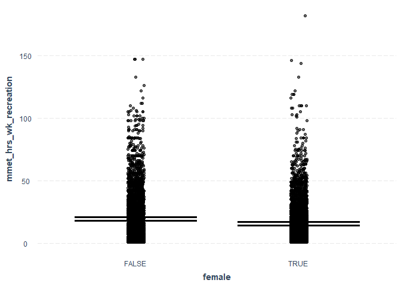
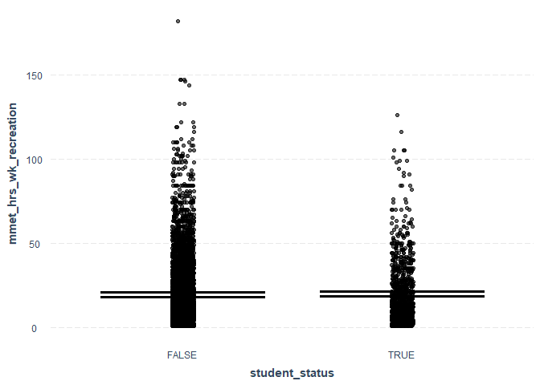
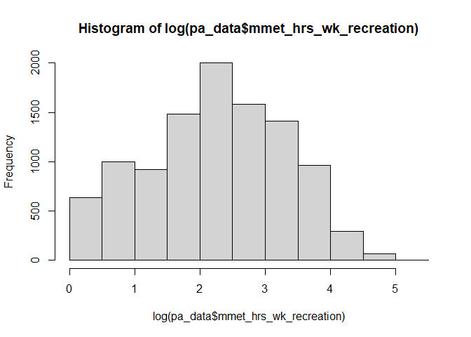

# Modelling physical activity in Melbourne


This Quarto markdown document is intended to contain code to predict
physical activity for sport and recreation including walking and
cycling, given explanatory variables (age, sex, SES, education, has car,
etc) that align with the JIBE synthetic population data. This will be
conducted to predict physical activity for residents of Melbourne,
Australia, using the Australian Bureau of Statistics Australian National
Health Survey data (2017-18).

The analysis draws on Belen Zapata-Diomedi’s code for cleaning the NHS
dataset (../document.qmd), and Belen Zapata-Diomedi, Qin Zhang and
Marina Berdikhanova’s code for a predictive model of marginal metabolic
equivalent hours per week (mMET house/week) for Manchester, UK.

To allow this code to be run on different computers and operating
systems easily, rather than hardcode data paths for inputs there is a
file chooser for the three key inputs used:

1.  ABS NHS households (NHS17HHB.csv)
2.  ABS NHS persons (NHS17PSB.csv)
3.  Melbourne synthetic population (population_final.rds)

The user will be asked to provide paths for these files in this order.
If using RStudio or Visual Studio code, there should be a graphical file
picker. If using Posit or commandline on linux, you may have to enter
the file path string.

## Dependencies

Analysis was conducted using R 4.4.1 using a Quarto markdown document
(Quarto 1.5.55) in Positron IDE (2024.10.0), with renv 1.0.11 for
package management.

The following packages have been installed using renv:

    renv::install(c('dplyr','data.table','ggplot2','vtable','rmarkdown','pscl'))

In principle, the R environment for this notebook should be able to be
restored by running

    renv::restore()

Load libaries

``` r
library(dplyr)
library(vtable) # descrtiptive statistic model.tables
library(jtools) # clean model summaries
library(ggplot2)
library(data.table)
library(MASS) # for glm negative binomial model
```

## Data

[National Health
Survey](https://www.abs.gov.au/statistics/microdata-tablebuilder/available-microdata-tablebuilder/national-health-survey)
(NHS) data for 2017-18 were retrieved from the [Microdata
Downloads](https://microdatadownload.abs.gov.au/MicrodataDownload/login.xhtml)
section of the Australian Bureau of Statistics website on 3 December
2024. ABS Microdata were accessed under the [ABS/Universities Australia
Agreement
(2024)](https://www.abs.gov.au/statistics/microdata-tablebuilder/absuniversities-australia-agreement)
by Carl Higgs (RMIT University). The NHS Microdata data descriptions are
available for download
[here](https://www.abs.gov.au/statistics/microdata-tablebuilder/available-microdata-tablebuilder/national-health-survey#data-item-lists).

NHS microdata are provided in CSV, SAS, SPSS, or Stata formats. The CSV
data do not have labels, hence the `haven` package could be installed to
read the labelled data in .dta (Stata) format. However, perhaps labels
are not required — for now, CSV will be used to keep things simple.

| File (csv, dta, etc) | Description                |
|----------------------|----------------------------|
| NHS17HHB             | Household level data       |
| NHS17SPB             | Person level data          |
| NHS17A3B             | Alcohol day level data     |
| NHS17A4B             | Alcohol type level data    |
| NHS17CNB             | Conditions level data      |
| NHS17MDB             | Medications level data     |
| NHS17HLB             | Health Literacy level data |

ABS NHS 2017-18 Microdata files

The household data contain geographic attributes and could potentially
be used to restrict the sample, e.g. to residents of urban areas within
Greater Melbourne. Sensitivity analysis could be conducted to evaluate
the impact of this decision, e.g. relative to all persons and all
persons living in Australian urban regions.

Household variables of interest include:

| Variable | Description | Comment |
|----|----|----|
| ABSHIDB | Household identifier | Link with persons |
| STATE16 | State or Territory (ASGS 2016) | 2 == Victoria |
| NUMPERBC | Number |  |
| of persons  in household | 0, 1, 2, 3, 4, 5, 6==6+ |  |
| SA1SF2DN | SEIFA - Index of Relative Socio-economic Disadvantage - 2016 - SA1 - Deciles - National |  |

Person-level variables of interest (see data dictionaries for detailed
codes) include:

| Variable | Description | Comment |
|----|----|----|
| ABSPID | Person identifier | person number within household |
| ABSHIDB | Household identifier | Link with households, but actually does not match for CURF records |
| AGEB | Age of person | 1== 0-4 years  … 19 == 85 years+ |
| SEX | Sex of person | 1==Male, 2==Female |
| LFSBC | Labour force status | 0==NA, 1==Employed, 2==Unemployed, 3==Not in the labour force |
| HYSCHCBC | Highest year of school completed | 0==NA, 1==Postgraduate, … 13==Never attended school |
| HIGHLVLBC | Level of highest educational attainment | 0==NA, 1==Postgraduate, … 13==Never attended school |
| EMPSTAT | Labour force full-time/part-time status | 0==NA, 1==Employed full time … 6 Not in labour force |
| Walk for recreation (mins) | EXFSRMIN | Total minutes walked for fitness, recreation or sport in last week (for at least 10 minutes) |
| Walk for transport (mins) | EXTRAMIN | Total minutes spent walking for transport in last week (for at least 10 minutes) |
| Moderate exercise (mins) | EXLWMMIN | Total minutes undertaken moderate exercise last week (for example, a light jog, strenght and toning exercises, lifting small boxes and sweeping) |
| Vigorous exercise (mins) | EXLWVMIN | Total minutes undertaken vigorous exercise last week (for example, playing basketball, running, lifting heavy boxes, and strength and toning exercises) |

## Methods

### Read and join NHS data

Adults aged 18 years and over from the persons dataset are left joined
to the household data, with only the relevant variables retained. The
core exposure variables are renamed to enhance readability of the
subsequent code.

``` r
# choose household file (may require GUI IDE like RStudio/PositStudio/VSCode)
NHS17HHB.csv <- file.choose()
# choose person file (may require GUI IDE like RStudio/PositStudio/VSCode)
NHS17SPB.csv <- file.choose()
data <- list(
    households = read.csv(NHS17HHB.csv),
    persons = read.csv(NHS17SPB.csv)
)
```

``` r
nhs <- dplyr::left_join(
            data$households[c( 
                        "ABSHIDB",
                        "STATE16", 
                        "NUMPERBC",
                        "SA1SF2DN"
                    )],
            data$persons[c(
                        "ABSHIDB",
                        "ABSPID",
                        "AGEB",
                        "SEX",
                        "LFSBC",
                        "STDYFTPT",
                        "HYSCHCBC",
                        "HIGHLVBC",
                        "EXFSRMIN",
                        "EXTRAMIN",
                        "EXLWMMIN",
                        "EXLWVMIN"
                    )
                ] %>% rename(
                    walk_recreation_min=EXFSRMIN,
                    walk_transport_min=EXTRAMIN,
                    mod_excercise_min=EXLWMMIN,
                    vig_excercise_min=EXLWVMIN
                )%>% 
                filter(
                    AGEB > 4
                ), 
        by = c("ABSHIDB")
        ) 
nhs %>% st(out='kable')
```

| Variable            | N     | Mean | Std. Dev. | Min | Pctl. 25 | Pctl. 75 | Max   |
|:--------------------|:------|:-----|:----------|:----|:---------|:---------|:------|
| STATE16             | 16376 | 3.6  | 2.2       | 1   | 2        | 5        | 8     |
| NUMPERBC            | 16376 | 2.4  | 1.3       | 1   | 1        | 3        | 6     |
| SA1SF2DN            | 16376 | 5.4  | 2.8       | 1   | 3        | 8        | 10    |
| ABSPID              | 16370 | 1    | 0         | 1   | 1        | 1        | 1     |
| AGEB                | 16370 | 12   | 3.6       | 5   | 9        | 15       | 19    |
| SEX                 | 16370 | 1.5  | 0.5       | 1   | 1        | 2        | 2     |
| LFSBC               | 16370 | 1.8  | 0.96      | 1   | 1        | 3        | 3     |
| STDYFTPT            | 16370 | 2.9  | 0.45      | 1   | 3        | 3        | 3     |
| HYSCHCBC            | 16370 | 2    | 1.3       | 1   | 1        | 3        | 5     |
| HIGHLVBC            | 16370 | 4.5  | 2.6       | 1   | 2        | 6        | 12    |
| walk_recreation_min | 16370 | 153  | 2474      | 0   | 0        | 120      | 99998 |
| walk_transport_min  | 16370 | 352  | 5236      | 0   | 0        | 90       | 99998 |
| mod_excercise_min   | 16370 | 67   | 1359      | 0   | 0        | 40       | 99998 |
| vig_excercise_min   | 16370 | 32   | 104       | 0   | 0        | 0        | 2400  |

Summary Statistics

### Read and consider the synthetic population data

To predict recreationals mMETs for the synthetic population, we need to
understand how the variables are structured and ensure that our NHS
derived data that we will use in modelling has a comparable structure.
We’ll load up the data and consider a summary of variables to better
understand this.

I am using
[data.table](https://cran.r-project.org/web/packages/data.table/vignettes/datatable-intro.html)
as it is meant to be optimised for handling large datasets, like this
synthetic population. This performs subsequent operations deriving new
variables much faster. To ensure the source data that we’ll later attach
modelled results to remains otherwise unmodified, I’ll also create a
copy ‘pp’. The name ‘pp’ is used to refer to the synthetic population in
related modelling work undertaken for Manchester.

``` r
population_final.rds <- file.choose()
synpop <- readRDS(population_final.rds) %>% as.data.table()
synpop %>% st(out='kable')
```

| Variable | N | Mean | Std. Dev. | Min | Pctl. 25 | Pctl. 75 | Max |
|:---|:---|:---|:---|:---|:---|:---|:---|
| AgentId | 4174097 | 2087049 | 1204958 | 1 | 1043525 | 3130573 | 4174097 |
| Age | 4174097 | 37 | 22 | -1 | 19 | 53 | 104 |
| Gender | 4174097 |  |  |  |  |  |  |
| … Female | 2128562 | 51% |  |  |  |  |  |
| … Male | 2045535 | 49% |  |  |  |  |  |
| RelationshipStatus | 4174097 |  |  |  |  |  |  |
| … GROUP_HOUSEHOLD | 202422 | 5% |  |  |  |  |  |
| … LONE_PARENT | 176081 | 4% |  |  |  |  |  |
| … LONE_PERSON | 366024 | 9% |  |  |  |  |  |
| … MARRIED | 1918556 | 46% |  |  |  |  |  |
| … O15_CHILD | 285971 | 7% |  |  |  |  |  |
| … RELATIVE | 133914 | 3% |  |  |  |  |  |
| … STUDENT | 264158 | 6% |  |  |  |  |  |
| … U15_CHILD | 826971 | 20% |  |  |  |  |  |
| HouseholdId | 4174097 | 1057931 | 432171 | 1 | 797012 | 1370237 | 1837719 |
| PartnerId | 1918556 | 2097046 | 1206587 | 2469 | 1061171 | 3141437 | 4174097 |
| MotherId | 1323492 | 2095777 | 1204385 | 4563 | 1056389 | 3131546 | 4174092 |
| FatherId | 1125454 | 2096707 | 1205114 | 4567 | 1056012 | 3128035 | 4174091 |
| SA2_MAINCODE | 4174097 | 210185213 | 2543207 | 206011105 | 208021180 | 212051322 | 214021385 |
| SA1_7DIGCODE | 4174097 | 2127554 | 10350 | 2110501 | 2118307 | 2135504 | 2146828 |
| SA1_MAINCODE_2016 | 4174097 | 21018521345 | 254320731 | 20601110501 | 20802118008 | 21205132223 | 21402138547 |
| age_cat | 4174097 | 7.9 | 4.4 | 1 | 4 | 11 | 21 |
| is_employed | 4174097 |  |  |  |  |  |  |
| … No | 2209464 | 53% |  |  |  |  |  |
| … Yes | 1964633 | 47% |  |  |  |  |  |
| education | 4174097 |  |  |  |  |  |  |
| … high | 1036035 | 25% |  |  |  |  |  |
| … low | 1148285 | 28% |  |  |  |  |  |
| … medium | 1989777 | 48% |  |  |  |  |  |
| IRSAD | 4174097 | 6.2 | 2.7 | -1 | 4 | 8 | 11 |
| hhSize | 4174097 | 3.1 | 1.5 | 1 | 2 | 4 | 8 |
| hhCar | 4174097 | 1.8 | 1 | 0 | 1 | 2 | 4 |

Summary Statistics

``` r
pp <- data.table(synpop)
```

Considering the above, I think the following points are worth
considering as model refinements:

- Represent age in years (e.g. using bracket mid-point) as “Age”. This
  would better model age as a continuous variable, for direct prediction
  using the synthetic population. A caveat to that would be
  consideration of whether age is better modelled as linearly (a more
  parsimonious approach) or non-linearly (which its current treatment as
  a factor variable allows for, but complicates things and doesn’t
  directly translate to the synthetic population variable that is
  continuous age in years).
  - on the other hand, there is an `age_cat` variable, however I think
    the model would have more power if age could be modelled as
    continuous. Having said that it will be good to consult with Belen
    and Qin to get their recommendations and plans for usage.
- Represent sex as a binary indicator ‘female’ having 0 (male) and 1
  (female)
- Simplify employment as a binary variable “is_employed” with values of
  0 (no) and 1 (yes).
- Simplify education as a three level variable education, having values
  ‘low’, ‘medium’, ‘high’. While it might be that this could be
  represented as a pseudo continuous variable (0, 1, 2), I think its
  best to not assume its linear and leave it as a categorical factor
  variable. Break points for low, medium and high may be subjective;
  need to consult what this represent in synthetic population. For now,
  have assumed any tertiary education (Bachelor and higher) is high;
  Year 10, 11, 12, and Certificates higher than III are medium; and
  certificates I/II, or Year 9 or lower is low.
- There is a variable ‘IRSAD’ that might be disadvantage but it ranges
  from -1 to 11, so is not clear what this represents (not simply
  deciles, and not quintiles)
- other considerations:
  - The synthetic population seems to have ‘student’ as a category in
    RelationshipStatus – if that does identify someone as a student,
    then perhaps we can consider ‘is_student’ in the model for mMETs.
  - hhSize is present in synthetic population. It may not be
    conceptually relevant, but is present in household data for NHS, so
    we could consider its appropriateness for the model.
  - hhCar is in synethic population, but there is no data to represent
    this in the NHS data, that I can see.

### Data preparation

Missing data or NA values (e.g 99997 and 99998) are replaced as missing,
while maximum values of walking time variables are truncated at 840
minutes to constrain influence of extreme outliers.

SA1 Index of Relative Socio-economic Disadvantage (IRSD; `SA1SF2DN`) is
rescaled to use quintiles rather than deciles, for consistency with the
synthetic population, with ‘1’ being most deprived and ‘5’ being least
deprived.

Two age variables will be created for consideration, first as a factor
variable and second in years, using the first age bracket year.

To match the synthetic population data for Melbourne a binary indicator
‘is_employed’ will be created, along with a possible supplementary
indicator ‘is_student’ that could be derived for the synthetic
population.

Education will be summarised using categories of low, medium and high
for direct comparison with the synthetic population.

Marginal metabolic equivalent hours per week (mMET hours/week; `mmet`)
are calculated as the sum of hours spent walking for recreation, doing
moderate exercise and doing vigorous exercise, with each respectively
multiplied by the metabolic equivalent of these tasks (METs) minus one
(already in MMETs in code). These have been rounded to integers to
support consideration of negative binomial models, that may make sense
for this type of positive skewed zero-inflated data (a possible
alternative to a linear hurdle model).

When deriving factor variables I have set ordered to False, as the
alternative setting needlessly over-complicates the modelling
(i.e. derives polynomial functions) and limits our capacity to transfer
predictions for the synthetic population (see
https://stackoverflow.com/questions/57297771/interpretation-of-l-q-c-4-for-logistic-regression).

Remember that SA1 IRSD ranges from 1 (most deprived) to 5 (least
deprived).

``` r
MMET_MOD <- 3.5 # As in meta analysis GArcia et al. 
MMET_VIG <- 7 # As in meta analysis GArcia et al. 
MMET_CYCLING <- 5.8 # From ithimr (check)
MMET_WALKING <- 2.5 # From ithimr (check)

pa_data <- nhs  %>%
    mutate_all(~ ifelse( . %in% c(99997, 99998), NA, .)) %>%
    mutate(
        walk_recreation_min = case_when(
                walk_recreation_min > 840 ~ 840, 
                TRUE ~  walk_recreation_min # handles unexpected values using default
            ),
        walk_transport_min = case_when(
                walk_transport_min > 840 ~ 840, 
                TRUE ~ walk_transport_min
            ),
        mod_excercise_min = case_when(
                mod_excercise_min > 840 ~ 840, 
                TRUE ~ mod_excercise_min
            ),
        vig_excercise_min = case_when(
                vig_excercise_min > 840 ~ 840, 
                TRUE ~ vig_excercise_min
            )
    ) %>%
    mutate(
        irsd_sa1 = case_when(
            SA1SF2DN %in% c(1, 2) ~ 1,
            SA1SF2DN %in% c(3, 4) ~ 2,
            SA1SF2DN %in% c(5, 6) ~ 3,
            SA1SF2DN %in% c(7, 8) ~ 4,
            SA1SF2DN %in% c(9, 10) ~ 5
        ),
        irsd_sa1_quintile_cat = factor(
            irsd_sa1, 
            levels = 1:5, 
            labels = c("1 (most deprived)", "2", "3 (reference)", "4", "5 (least deprived)")
        )
    ) %>% 
    mutate(
        irsd_sa1_quintile_cat = relevel(irsd_sa1_quintile_cat, ref = "3 (reference)")
    ) %>%
    mutate(
        age_years = case_when(
            AGEB == 5 ~ 18,
            AGEB == 6 ~ 20,
            AGEB == 7 ~ 25,
            AGEB == 8 ~ 30,
            AGEB == 9 ~ 35,
            AGEB == 10 ~ 40,
            AGEB == 11 ~ 45,
            AGEB == 12 ~ 50,
            AGEB == 13 ~ 55,
            AGEB == 14 ~ 60,
            AGEB == 15 ~ 65,
            AGEB == 16 ~ 70,
            AGEB == 17 ~ 75,
            AGEB == 18 ~ 80,
            AGEB == 19 ~ 85,
            TRUE ~ NA_real_  # Handle unexpected values
        ),
            AGEB = factor(
                AGEB, 
                levels = 5:19, 
                labels = c("18-19","20-24", "25-29", "30-34", "35-39", 
                            "40-44", "45-49", "50-54", "55-59", 
                            "60-64", "65-69", "70-74", "75-79", 
                            "80-84", "≥85"),
                ordered = FALSE
            ),
        female=ifelse(SEX==2,1,0),
        is_employed=case_when(
                LFSBC==1 ~ 1,
                LFSBC %in% c(0,2,3) ~ 0
            ),
        is_student=ifelse(STDYFTPT %in% c(1,2),1,0),
        education = case_when(
            HIGHLVBC %in% c(1,2) ~ 2,
            HIGHLVBC %in% c(3,7) ~ 1,
            HIGHLVBC %in% c(8,12) ~ 0,
            TRUE ~ NA_real_  # Handle unexpected values
            ),
        education = factor(
            education,
            levels=0:2,
            labels=c('low','medium','high'),
            ordered=FALSE
        )
    )  %>%
    mutate(
        mmet_hrs_wk_recreation = round(
            walk_recreation_min/60* MMET_WALKING + 
            mod_excercise_min/60 * MMET_MOD + 
            vig_excercise_min/60 * MMET_VIG
            ), 
        mmet_hrs_wk_total = round(
            walk_transport_min/60 * MMET_WALKING + 
            walk_recreation_min/60* MMET_WALKING +
            mod_excercise_min/60 * MMET_MOD + 
            vig_excercise_min/60 * MMET_VIG
        ),
        mmet_hrs_wk_recreation_zero = ifelse(mmet_hrs_wk_recreation == 0, 1, 0)
    ) 

pa_data %>% st(out='kable')
```

| Variable                    | N     | Mean  | Std. Dev. | Min | Pctl. 25 | Pctl. 75 | Max |
|:----------------------------|:------|:------|:----------|:----|:---------|:---------|:----|
| STATE16                     | 16376 | 3.6   | 2.2       | 1   | 2        | 5        | 8   |
| NUMPERBC                    | 16376 | 2.4   | 1.3       | 1   | 1        | 3        | 6   |
| SA1SF2DN                    | 16376 | 5.4   | 2.8       | 1   | 3        | 8        | 10  |
| ABSPID                      | 16370 | 1     | 0         | 1   | 1        | 1        | 1   |
| AGEB                        | 16370 |       |           |     |          |          |     |
| … 18-19                     | 321   | 2%    |           |     |          |          |     |
| … 20-24                     | 853   | 5%    |           |     |          |          |     |
| … 25-29                     | 1145  | 7%    |           |     |          |          |     |
| … 30-34                     | 1431  | 9%    |           |     |          |          |     |
| … 35-39                     | 1467  | 9%    |           |     |          |          |     |
| … 40-44                     | 1377  | 8%    |           |     |          |          |     |
| … 45-49                     | 1452  | 9%    |           |     |          |          |     |
| … 50-54                     | 1348  | 8%    |           |     |          |          |     |
| … 55-59                     | 1403  | 9%    |           |     |          |          |     |
| … 60-64                     | 1386  | 8%    |           |     |          |          |     |
| … 65-69                     | 1293  | 8%    |           |     |          |          |     |
| … 70-74                     | 1163  | 7%    |           |     |          |          |     |
| … 75-79                     | 760   | 5%    |           |     |          |          |     |
| … 80-84                     | 546   | 3%    |           |     |          |          |     |
| … ≥85                       | 425   | 3%    |           |     |          |          |     |
| SEX                         | 16370 | 1.5   | 0.5       | 1   | 1        | 2        | 2   |
| LFSBC                       | 16370 | 1.8   | 0.96      | 1   | 1        | 3        | 3   |
| STDYFTPT                    | 16370 | 2.9   | 0.45      | 1   | 3        | 3        | 3   |
| HYSCHCBC                    | 16370 | 2     | 1.3       | 1   | 1        | 3        | 5   |
| HIGHLVBC                    | 16370 | 4.5   | 2.6       | 1   | 2        | 6        | 12  |
| walk_recreation_min         | 16360 | 89    | 146       | 0   | 0        | 120      | 840 |
| walk_transport_min          | 16325 | 69    | 134       | 0   | 0        | 80       | 840 |
| mod_excercise_min           | 16367 | 47    | 112       | 0   | 0        | 40       | 840 |
| vig_excercise_min           | 16370 | 31    | 88        | 0   | 0        | 0        | 840 |
| irsd_sa1                    | 16376 | 3     | 1.4       | 1   | 2        | 4        | 5   |
| irsd_sa1_quintile_cat       | 16376 |       |           |     |          |          |     |
| … 3 (reference)             | 3489  | 21%   |           |     |          |          |     |
| … 1 (most deprived)         | 3177  | 19%   |           |     |          |          |     |
| … 2                         | 3419  | 21%   |           |     |          |          |     |
| … 4                         | 3305  | 20%   |           |     |          |          |     |
| … 5 (least deprived)        | 2986  | 18%   |           |     |          |          |     |
| age_years                   | 16370 | 49    | 18        | 18  | 35       | 65       | 85  |
| female                      | 16370 | 0.54  | 0.5       | 0   | 0        | 1        | 1   |
| is_employed                 | 16370 | 0.61  | 0.49      | 0   | 0        | 1        | 1   |
| is_student                  | 16376 | 0.095 | 0.29      | 0   | 0        | 0        | 1   |
| education                   | 8165  |       |           |     |          |          |     |
| … low                       | 127   | 2%    |           |     |          |          |     |
| … medium                    | 3518  | 43%   |           |     |          |          |     |
| … high                      | 4520  | 55%   |           |     |          |          |     |
| mmet_hrs_wk_recreation      | 16359 | 10    | 15        | 0   | 0        | 14       | 182 |
| mmet_hrs_wk_total           | 16318 | 13    | 17        | 0   | 1        | 18       | 207 |
| mmet_hrs_wk_recreation_zero | 16359 | 0.37  | 0.48      | 0   | 0        | 1        | 1   |

Summary Statistics

### Exploratory data analysis

The following function can be used for retrieving core summary
statistics that can be subsequently combined in a comparison table, for
example, comparing sub-groups and overall for relevant variables, and
against external reference standards.

``` r
summary_stats <- function(
    data,
    variable
) {
    summary.table <- data %>%
        summarise(
            count = sum(!is.na(get(variable))),
            mean = mean(get(variable), na.rm = TRUE),
            sd = sd(get(variable), na.rm = TRUE),
            min = min(get(variable), na.rm = TRUE),
            p25 = quantile(get(variable), 0.25, na.rm = TRUE),
            p50 = median(get(variable), na.rm = TRUE),
            p75 = quantile(get(variable), 0.75, na.rm = TRUE),
            max = max(get(variable), na.rm = TRUE)
        ) 
    return (summary.table)
}


summary_stats_by <- function(
    data,
    variable,
    by
) {
    library(dplyr)
    grouped_data <- data %>% group_by(get(by))
    summary_table <- grouped_data %>% 
        summarise(
            n = n(),
            count = sum(!is.na(get(variable))),
            mean = mean(get(variable), na.rm = TRUE),
            sd = sd(get(variable), na.rm = TRUE),
            min = min(get(variable), na.rm = TRUE),
            p25 = quantile(get(variable), 0.25, na.rm = TRUE),
            p50 = median(get(variable), na.rm = TRUE),
            p75 = quantile(get(variable), 0.75, na.rm = TRUE),
            max = max(get(variable), na.rm = TRUE)
        )%>% 
        rename(!!by := 'get(by)')
    
    return(summary_table)
}

mmets_summaries <- list()
```

#### Summary statistics of mMET hours/week for prediction model (recreation only)

The variable `mmet_hrs_wk_recreation` combines moderate recreational,
vigorous recreational and walking for recreation acitivies.

``` r
desc <- "NHS (recreation)"
var <- 'mmet_hrs_wk_recreation'
mmets_summaries[['recreation']] = rbind(
    cbind(
        summary=desc, 
        sex="Men",
        summary_stats(pa_data %>% filter(SEX==1),var)
    ),
    cbind(
        summary=desc, 
        sex="Women",
        summary_stats(pa_data %>% filter(SEX==2),var)
    ),
    cbind(
        summary=desc, 
        sex="Overall",
        summary_stats(pa_data,var)
    )
)
```

#### Summary statistics of mmets for comparison with Meta analysis (recreational exercise, and walking for recreation and transport)

The variable `mmet_hrs_wk_total` combines moderate recreational,
vigorous recreational and walking for recreation and transport
activities.

``` r
desc <- "NHS (total)"
var <- 'mmet_hrs_wk_total'
mmets_summaries[['total']]  <- rbind(
    cbind(
        summary=desc, 
        sex="Men",
        summary_stats(pa_data %>% filter(SEX==1),var)
    ),
    cbind(
        summary=desc, 
        sex="Women",
        summary_stats(pa_data %>% filter(SEX==2),var)
    ),
    cbind(
        summary=desc, 
        sex="Overall",
        summary_stats(pa_data,var)
    )
)
```

This estimate of total mMET hours/week can support comparisons with
meta-analysis results. According to
https://shiny.mrc-epid.cam.ac.uk/meta-analyses-physical-activity/ the
marginal MET hours per week overall, and by sex for all-cause mortality
was,

| summary       | sex     | count | mean   | sd  | min | p25  | p50   | p75   | max    |
|---------------|---------|-------|--------|-----|-----|------|-------|-------|--------|
| Meta-analysis | Men     |       | 18.698 |     | 0   | 2.73 | 10.66 | 23.87 | 156.45 |
| Meta-analysis | Women   |       | 17.352 |     | 0   | 2.61 | 10.66 | 22.82 | 103.6  |
| Meta-analysis | Overall |       | 16.908 |     | 0   | 2.35 | 10.5  | 22.5  | 130.02 |

``` r
meta_analysis_results <- data.frame(
  summary = rep("meta-analysis (total)", 3),
  sex = c("Men", "Women", "Overall"),
  count = c(NA, NA, NA),
  mean = c(18.698, 17.352, 16.908),
  sd = c(NA, NA, NA),
  min = c(0, 0, 0),
  p25 = c(2.73, 2.61, 2.35),
  p50 = c(10.66, 10.66, 10.5),
  p75 = c(23.87, 22.82, 22.5),
  max = c(156.45, 103.6, 130.02)
)

mmets_comparison <- rbind(
        meta_analysis_results,
        mmets_summaries[['total']],
        mmets_summaries[['recreation']]
    )
options(knitr.kable.NA = '-')
knitr::kable(
    mmets_comparison,
    caption = "Marginal MET hours per week",
    digits=3
)
```

| summary               | sex     | count |   mean |     sd | min |  p25 |   p50 |   p75 |    max |
|:----------------------|:--------|------:|-------:|-------:|----:|-----:|------:|------:|-------:|
| meta-analysis (total) | Men     |    \- | 18.698 |     \- |   0 | 2.73 | 10.66 | 23.87 | 156.45 |
| meta-analysis (total) | Women   |    \- | 17.352 |     \- |   0 | 2.61 | 10.66 | 22.82 | 103.60 |
| meta-analysis (total) | Overall |    \- | 16.908 |     \- |   0 | 2.35 | 10.50 | 22.50 | 130.02 |
| NHS (total)           | Men     |  7552 | 14.464 | 18.876 |   0 | 1.00 |  8.00 | 21.00 | 153.00 |
| NHS (total)           | Women   |  8766 | 11.568 | 15.343 |   0 | 1.00 |  6.00 | 16.00 | 207.00 |
| NHS (total)           | Overall | 16318 | 12.909 | 17.130 |   0 | 1.00 |  7.00 | 18.00 | 207.00 |
| NHS (recreation)      | Men     |  7575 | 11.473 | 17.201 |   0 | 0.00 |  4.00 | 16.00 | 147.00 |
| NHS (recreation)      | Women   |  8784 |  8.816 | 13.725 |   0 | 0.00 |  4.00 | 12.00 | 182.00 |
| NHS (recreation)      | Overall | 16359 | 10.046 | 15.488 |   0 | 0.00 |  4.00 | 14.00 | 182.00 |

Marginal MET hours per week

#### Correlations

For now I have included both education variables in the below
exploratory data analysis, although most likely a derived combined
variable for education will be used, pending discussion with the team.
The State variable is also included to get a sense of how variables
differ across Australian states; Victorian-specific results could be
expected to be mostly drawn from Melbourne, and this could be explored
in a sensitivity analysis.

Many of our variables are factor variables for which direct numeric
correlations could be misleading (i.e. they aren’t necessarily ordinal
or linear, e.g. labour force status, or ‘NA’ values in educational
attainment).

``` r
cor=as.data.frame(lapply(pa_data[, c("irsd_sa1", "age_years", "female", "is_employed", "is_student", "education", "NUMPERBC", "mmet_hrs_wk_recreation")], as.numeric))
cor=na.omit(cor)
correlation_matrix <- cor(cor) %>% as.data.frame()
# corrplot(correlation_matrix %>% as.double(), method = "number",order = "FPC",type="lower") 
correlation_matrix[order(correlation_matrix$mmet_hrs_wk_recreation),] %>% round(2)
##                        irsd_sa1 age_years female is_employed is_student
## female                    -0.03      0.02   1.00       -0.10       0.01
## age_years                 -0.01      1.00   0.02       -0.52      -0.26
## NUMPERBC                   0.12     -0.38  -0.03        0.23       0.06
## is_student                 0.00     -0.26   0.01        0.08       1.00
## is_employed                0.13     -0.52  -0.10        1.00       0.08
## irsd_sa1                   1.00     -0.01  -0.03        0.13       0.00
## education                  0.25     -0.24  -0.04        0.26       0.10
## mmet_hrs_wk_recreation     0.13     -0.10  -0.11        0.11       0.02
##                        education NUMPERBC mmet_hrs_wk_recreation
## female                     -0.04    -0.03                  -0.11
## age_years                  -0.24    -0.38                  -0.10
## NUMPERBC                    0.12     1.00                   0.01
## is_student                  0.10     0.06                   0.02
## is_employed                 0.26     0.23                   0.11
## irsd_sa1                    0.25     0.12                   0.13
## education                   1.00     0.12                   0.15
## mmet_hrs_wk_recreation      0.15     0.01                   1.00
```

None of the variables in themselves are strongly associated with mMET
hours/week. Age is associated with lower mMET hours/week, as is being
female (negative correlations). Associations with age may be slightly
non-linear; a sensitivity analysis further below suggests that although
mMET hours/week peaked in the 20-24 years age group not the youngest
(18-19 years; n=33, the smallest sample and may not be representative),
the trend is broadly monotonic and arguably approximately linear albeit
with increasing rate of decline after age 70. Number of persons in
household and being a student were not associated with mMETs and need
not be included in the model. Employment, lower socio-economic
deprivation, and higher degree of education had weak positive
associations with mMET hours/week.

#### Clustering

Persons are theoretically clustered within households. If there is more
than one person within each household, as this data structure implies,
this clustering should be accounted for in the model. The following
checks the maximum number of persons within households, and confirms
that only one person is associated with each household and so clustering
within households will not be required in the model.

``` r
pa_data %>%
  group_by(ABSHIDB) %>%
  summarise(num_persons = n()) %>%
  summarise(max_persons = max(num_persons))
## # A tibble: 1 × 1
##   max_persons
##         <int>
## 1           1
```

#### Set up data for modelling

Select relevant variables and only retain records with full data.

``` r
pa_data =pa_data[
    c('ABSPID', 'AGEB', 'age_years', 'female', 'is_employed', 'education', 'irsd_sa1','irsd_sa1_quintile_cat','mmet_hrs_wk_recreation', 'mmet_hrs_wk_recreation_zero')
    ] %>% na.omit()

pa_data %>% st(out='kable')
```

| Variable                    | N    | Mean | Std. Dev. | Min | Pctl. 25 | Pctl. 75 | Max |
|:----------------------------|:-----|:-----|:----------|:----|:---------|:---------|:----|
| ABSPID                      | 8158 | 1    | 0         | 1   | 1        | 1        | 1   |
| AGEB                        | 8158 |      |           |     |          |          |     |
| … 18-19                     | 33   | 0%   |           |     |          |          |     |
| … 20-24                     | 254  | 3%   |           |     |          |          |     |
| … 25-29                     | 607  | 7%   |           |     |          |          |     |
| … 30-34                     | 828  | 10%  |           |     |          |          |     |
| … 35-39                     | 856  | 10%  |           |     |          |          |     |
| … 40-44                     | 794  | 10%  |           |     |          |          |     |
| … 45-49                     | 807  | 10%  |           |     |          |          |     |
| … 50-54                     | 701  | 9%   |           |     |          |          |     |
| … 55-59                     | 725  | 9%   |           |     |          |          |     |
| … 60-64                     | 718  | 9%   |           |     |          |          |     |
| … 65-69                     | 613  | 8%   |           |     |          |          |     |
| … 70-74                     | 551  | 7%   |           |     |          |          |     |
| … 75-79                     | 316  | 4%   |           |     |          |          |     |
| … 80-84                     | 211  | 3%   |           |     |          |          |     |
| … ≥85                       | 144  | 2%   |           |     |          |          |     |
| age_years                   | 8158 | 48   | 17        | 18  | 35       | 60       | 85  |
| female                      | 8158 | 0.59 | 0.49      | 0   | 0        | 1        | 1   |
| is_employed                 | 8158 | 0.66 | 0.47      | 0   | 0        | 1        | 1   |
| education                   | 8158 |      |           |     |          |          |     |
| … low                       | 127  | 2%   |           |     |          |          |     |
| … medium                    | 3515 | 43%  |           |     |          |          |     |
| … high                      | 4516 | 55%  |           |     |          |          |     |
| irsd_sa1                    | 8158 | 3.2  | 1.4       | 1   | 2        | 4        | 5   |
| irsd_sa1_quintile_cat       | 8158 |      |           |     |          |          |     |
| … 3 (reference)             | 1737 | 21%  |           |     |          |          |     |
| … 1 (most deprived)         | 1220 | 15%  |           |     |          |          |     |
| … 2                         | 1548 | 19%  |           |     |          |          |     |
| … 4                         | 1772 | 22%  |           |     |          |          |     |
| … 5 (least deprived)        | 1881 | 23%  |           |     |          |          |     |
| mmet_hrs_wk_recreation      | 8158 | 11   | 16        | 0   | 0        | 16       | 147 |
| mmet_hrs_wk_recreation_zero | 8158 | 0.31 | 0.46      | 0   | 0        | 1        | 1   |

Summary Statistics

Now the full analytical sample has been determined, its worth noting the
sample sizes for the default reference categories of the factor
variables summarised above. For age, the first category (default
reference) is ages 18-19, for which there are only 33 individuals; this
is further reduced to 19 after those with zero recorded recreational
physical activity are excluded (below). Comparisons with this category
against all others will result in poor estimates lacking precision due
to the small referrent group sample size (see Lash, Timothy L. et al.,
eds. Modern Epidemiology. 4th ed. Phil: Wolters Kluwer / Lippincott
Williams & Wilkins, 2021.
[p719](https://ebookcentral.proquest.com/lib/rmit/reader.action?docID=6947080&ppg=719)).
A better reference choice, if including age as categorical instead of
continuous, would be persons aged 35-39 (n=856, or n=627 undertaking any
recreational physical activity).

A similar issue is observed with education where ‘low’ only contains
n=59 individuals, compared to 2103 (medium) and 3513 (high). While the
high category has the largest sample count in the NHS reference data,
‘medium’ is the most meaningful normative reference point and also the
most common category in the synthetic population; so the reference for
education should be set to ‘medium’.

The middle quintile ‘3’ was already set as a reference category in the
data set up stage, as the normative group.

``` r
pa_data$AGEB <- relevel(pa_data$AGEB, ref = "35-39")
pa_data$education <- relevel(pa_data$education, ref = "medium")
```

With intentional factor variable reference levels established, a subset
of data for persons who record at least some mMET hours/week will be
copied to a new dataframe.

``` r
pa_data_over0=pa_data[pa_data$mmet_hrs_wk_recreation>0,]
pa_data_over0 %>% st(out='kable')
```

| Variable                    | N    | Mean | Std. Dev. | Min | Pctl. 25 | Pctl. 75 | Max |
|:----------------------------|:-----|:-----|:----------|:----|:---------|:---------|:----|
| ABSPID                      | 5645 | 1    | 0         | 1   | 1        | 1        | 1   |
| AGEB                        | 5645 |      |           |     |          |          |     |
| … 35-39                     | 625  | 11%  |           |     |          |          |     |
| … 18-19                     | 19   | 0%   |           |     |          |          |     |
| … 20-24                     | 190  | 3%   |           |     |          |          |     |
| … 25-29                     | 463  | 8%   |           |     |          |          |     |
| … 30-34                     | 609  | 11%  |           |     |          |          |     |
| … 40-44                     | 566  | 10%  |           |     |          |          |     |
| … 45-49                     | 589  | 10%  |           |     |          |          |     |
| … 50-54                     | 480  | 9%   |           |     |          |          |     |
| … 55-59                     | 487  | 9%   |           |     |          |          |     |
| … 60-64                     | 489  | 9%   |           |     |          |          |     |
| … 65-69                     | 435  | 8%   |           |     |          |          |     |
| … 70-74                     | 349  | 6%   |           |     |          |          |     |
| … 75-79                     | 191  | 3%   |           |     |          |          |     |
| … 80-84                     | 97   | 2%   |           |     |          |          |     |
| … ≥85                       | 56   | 1%   |           |     |          |          |     |
| age_years                   | 5645 | 47   | 16        | 18  | 35       | 60       | 85  |
| female                      | 5645 | 0.58 | 0.49      | 0   | 0        | 1        | 1   |
| is_employed                 | 5645 | 0.69 | 0.46      | 0   | 0        | 1        | 1   |
| education                   | 5645 |      |           |     |          |          |     |
| … medium                    | 2092 | 37%  |           |     |          |          |     |
| … low                       | 59   | 1%   |           |     |          |          |     |
| … high                      | 3494 | 62%  |           |     |          |          |     |
| irsd_sa1                    | 5645 | 3.3  | 1.4       | 1   | 2        | 5        | 5   |
| irsd_sa1_quintile_cat       | 5645 |      |           |     |          |          |     |
| … 3 (reference)             | 1178 | 21%  |           |     |          |          |     |
| … 1 (most deprived)         | 686  | 12%  |           |     |          |          |     |
| … 2                         | 982  | 17%  |           |     |          |          |     |
| … 4                         | 1314 | 23%  |           |     |          |          |     |
| … 5 (least deprived)        | 1485 | 26%  |           |     |          |          |     |
| mmet_hrs_wk_recreation      | 5645 | 16   | 17        | 1   | 5        | 22       | 147 |
| mmet_hrs_wk_recreation_zero | 5645 | 0    | 0         | 0   | 0        | 0        | 0   |

Summary Statistics

#### Synthetic population data set up

The NHS survey provides age in brackets, while the synthetic population
has continuous age as well as an age category variable. The grouping of
the latter are not explicitly named however, and if we were to use age
groups it may be best to create a new group to specifically match the
NHS brackets used in modelling.

Let’s have a look at the age brackets in the synthetic population first:

``` r
summary_stats_by(pp,'Age','age_cat') %>% print(n=Inf)
## # A tibble: 21 × 10
##    age_cat      n  count   mean    sd   min   p25   p50   p75   max
##      <dbl>  <int>  <int>  <dbl> <dbl> <int> <dbl> <dbl> <dbl> <int>
##  1       1 284254 284254   2.03  1.41    -1     1     2     3     4
##  2       2 284561 284561   7.00  1.41     5     6     7     8     9
##  3       3 263525 263525  12.0   1.42    10    11    12    13    14
##  4       4 249681 249681  17.1   1.42    15    16    17    18    19
##  5       5 313927 313927  22.1   1.41    20    21    22    23    24
##  6       6 327370 327370  27.0   1.41    25    26    27    28    29
##  7       7 333619 333619  32.0   1.41    30    31    32    33    34
##  8       8 296799 296799  36.9   1.42    35    36    37    38    39
##  9       9 292171 292171  42.0   1.42    40    41    42    43    44
## 10      10 286509 286509  46.9   1.41    45    46    47    48    49
## 11      11 260520 260520  52.0   1.41    50    51    52    53    54
## 12      12 271781 271781  56.9   1.42    55    56    57    58    59
## 13      13 188611 188611  61.8   1.45    60    60    62    63    64
## 14      14 157211 157211  67.0   1.43    65    66    67    68    69
## 15      15 148115 148115  71.9   1.41    70    71    72    73    74
## 16      16  90766  90766  76.8   1.44    75    75    77    78    79
## 17      17  62918  62918  81.9   1.41    80    81    82    83    84
## 18      18  42481  42481  86.5   1.43    85    85    86    88    89
## 19      19  15741  15741  91.5   1.36    90    90    91    93    94
## 20      20   3511   3511  96.2   1.25    95    95    96    97    99
## 21      21     26     26 101.    1.37   100   100   101   101   104
```

The age brackets don’t match the NHS variable; as expected, we’ll have
to create a new age bracket variable.

``` r
age_breaks <- c(18, 20, 25, 30, 35, 40, 45, 50, 55, 60, 65, 70, 75, 80, 85, Inf)
age_labels <- c("18-19", "20-24", "25-29", "30-34", "35-39", 
                "40-44", "45-49", "50-54", "55-59", 
                "60-64", "65-69", "70-74", "75-79", 
                "80-84", "≥85")
pp$AGEB <- cut(pp$Age, breaks = age_breaks, labels = age_labels, right = FALSE)
pp$AGEB <- relevel(pp$AGEB, ref = "35-39")
summary_stats_by(pp,'Age','AGEB') %>% print(n=Inf)
```

Great, so now there’s an age bracket variable in the synthetic
population that matches the NHS data breaks.

We also want to set the reference levels for other variables to match
those in the NHS drawn physical activity data.

``` r
pp$education <- factor(pp$education)
pp$education <- relevel(pp$education, ref = "medium")
```

There are some remaining variables to derive in order to get our
synthetic population data into the equivalent format to our model,
e.g. by converting string categorical variables to binary indicators and
adapting the SEIFA IRSD to quintiles. Then we can use our predictions
and apply them to the synthetic population.

``` r
# Perform the transformations
pp[, `:=`(
    irsd_sa1 = fifelse(IRSAD %in% c(1, 2), 1,
                fifelse(IRSAD %in% c(3, 4), 2,
                fifelse(IRSAD %in% c(5, 6), 3,
                fifelse(IRSAD %in% c(7, 8), 4,
                fifelse(IRSAD %in% c(9, 10), 5, NA_real_))))),
    age_years = Age,
    female = fifelse(Gender == "Female", 1, 0),
    is_employed = fifelse(is_employed == "Yes", 1, 0)
)]

pp$irsd_sa1_quintile_cat = factor(
        pp$irsd_sa1, 
        levels = 1:5, 
        labels = c("1 (most deprived)", "2", "3 (reference)", "4", "5 (least deprived)")
    )
pp$irsd_sa1_quintile_cat = relevel(pp$irsd_sa1_quintile_cat, ref = "3 (reference)")

# Select the relevant columns
data <- pp[Age >= 18, .(AgentId, age_years, AGEB, female, is_employed, education, irsd_sa1, irsd_sa1_quintile_cat)] 
data %>% st(out='kable')
```

| Variable              | N       | Mean    | Std. Dev. | Min | Pctl. 25 | Pctl. 75 | Max     |
|:----------------------|:--------|:--------|:----------|:----|:---------|:---------|:--------|
| AgentId               | 3199371 | 2084203 | 1204886   | 1   | 1041335  | 3133223  | 4174097 |
| age_years             | 3199371 | 45      | 18        | 18  | 30       | 58       | 104     |
| AGEB                  | 3199371 |         |           |     |          |          |         |
| … 35-39               | 296799  | 9%      |           |     |          |          |         |
| … 18-19               | 107295  | 3%      |           |     |          |          |         |
| … 20-24               | 313927  | 10%     |           |     |          |          |         |
| … 25-29               | 327370  | 10%     |           |     |          |          |         |
| … 30-34               | 333619  | 10%     |           |     |          |          |         |
| … 40-44               | 292171  | 9%      |           |     |          |          |         |
| … 45-49               | 286509  | 9%      |           |     |          |          |         |
| … 50-54               | 260520  | 8%      |           |     |          |          |         |
| … 55-59               | 271781  | 8%      |           |     |          |          |         |
| … 60-64               | 188611  | 6%      |           |     |          |          |         |
| … 65-69               | 157211  | 5%      |           |     |          |          |         |
| … 70-74               | 148115  | 5%      |           |     |          |          |         |
| … 75-79               | 90766   | 3%      |           |     |          |          |         |
| … 80-84               | 62918   | 2%      |           |     |          |          |         |
| … ≥85                 | 61759   | 2%      |           |     |          |          |         |
| female                | 3199371 | 0.52    | 0.5       | 0   | 0        | 1        | 1       |
| is_employed           | 3199371 | 0       | 0         | 0   | 0        | 0        | 0       |
| education             | 3199371 |         |           |     |          |          |         |
| … medium              | 1880352 | 59%     |           |     |          |          |         |
| … high                | 1035911 | 32%     |           |     |          |          |         |
| … low                 | 283108  | 9%      |           |     |          |          |         |
| irsd_sa1              | 3193813 | 3.4     | 1.3       | 1   | 2        | 5        | 5       |
| irsd_sa1_quintile_cat | 3193813 |         |           |     |          |          |         |
| … 3 (reference)       | 642405  | 20%     |           |     |          |          |         |
| … 1 (most deprived)   | 406176  | 13%     |           |     |          |          |         |
| … 2                   | 491099  | 15%     |           |     |          |          |         |
| … 4                   | 845299  | 26%     |           |     |          |          |         |
| … 5 (least deprived)  | 808834  | 25%     |           |     |          |          |         |

Summary Statistics

### Modelling

The modelling approach (and earlier data preparation) draws on code from
the Manchester physical activity modelling R code file
`otherSportPA_hurdle_v3.R` authored by Qin Zhang, Belen Zapata-Diomedi
and Marina Berdikhanova.

Age as categorical does not display any clear trend, whereas there is a
strong association for age when modelled as a continuous variable.
Because the purpose of this model is prediction and not inference, the
use of age brackets may be justified to account for the slight
non-linearity observed when making predictions for the synthetic
population. This implications of this decision will be explored further
in subsequent sensitivity analysis.

A negative binomial model was used to model the recreational physical
activity data for those who recorded mMET hours/week as it was found to
provide a better prediction for the skewed data than a linear model.
Modelling options supporting this decision are explored in a sensitivity
analysis further below.

Note that negative binomial regression results are expressed as
log(rate) — meaning they need to be exponentiated to be interpreted as
mMET hours/week. That is done when making predictions for the response
variable.

``` r
# initialise model list
m.mMETs_recreational <- list()
```

``` r
# Logistic regression model of zero mMETS hours/week
m.mMETs_recreational$zeroModel <- glm(
    mmet_hrs_wk_recreation_zero ~ female + AGEB + is_employed + education + irsd_sa1_quintile_cat,
    family = "binomial",
    data = pa_data
)

summ(m.mMETs_recreational$zeroModel, confint = TRUE, digits = 3)
```

|                    |                             |
|:-------------------|----------------------------:|
| Observations       |                        8158 |
| Dependent variable | mmet_hrs_wk_recreation_zero |
| Type               |    Generalized linear model |
| Family             |                    binomial |
| Link               |                       logit |

 

|                         |          |
|:------------------------|---------:|
| χ²(22)                  |  557.625 |
| p                       |    0.000 |
| Pseudo-R² (Cragg-Uhler) |    0.093 |
| Pseudo-R² (McFadden)    |    0.055 |
| AIC                     | 9563.903 |
| BIC                     | 9725.058 |

 

|                                         |   Est. |   2.5% |  97.5% |  z val. |     p |
|:----------------------------------------|-------:|-------:|-------:|--------:|------:|
| (Intercept)                             | -0.408 | -0.635 | -0.181 |  -3.522 | 0.000 |
| female                                  |  0.061 | -0.040 |  0.161 |   1.185 | 0.236 |
| AGEB18-19                               |  0.137 | -0.581 |  0.855 |   0.374 | 0.709 |
| AGEB20-24                               | -0.274 | -0.603 |  0.055 |  -1.634 | 0.102 |
| AGEB25-29                               | -0.198 | -0.443 |  0.048 |  -1.577 | 0.115 |
| AGEB30-34                               | -0.056 | -0.277 |  0.165 |  -0.497 | 0.619 |
| AGEB40-44                               |  0.054 | -0.167 |  0.274 |   0.477 | 0.633 |
| AGEB45-49                               | -0.048 | -0.270 |  0.174 |  -0.421 | 0.674 |
| AGEB50-54                               |  0.068 | -0.158 |  0.294 |   0.587 | 0.557 |
| AGEB55-59                               |  0.074 | -0.150 |  0.298 |   0.649 | 0.516 |
| AGEB60-64                               |  0.053 | -0.174 |  0.280 |   0.459 | 0.646 |
| AGEB65-69                               | -0.150 | -0.397 |  0.097 |  -1.191 | 0.234 |
| AGEB70-74                               |  0.129 | -0.125 |  0.382 |   0.996 | 0.319 |
| AGEB75-79                               |  0.244 | -0.052 |  0.539 |   1.617 | 0.106 |
| AGEB80-84                               |  0.797 |  0.462 |  1.131 |   4.670 | 0.000 |
| AGEB≥85                                 |  1.203 |  0.808 |  1.598 |   5.967 | 0.000 |
| is_employed                             | -0.092 | -0.220 |  0.037 |  -1.393 | 0.164 |
| educationlow                            |  0.219 | -0.148 |  0.585 |   1.169 | 0.243 |
| educationhigh                           | -0.647 | -0.751 | -0.543 | -12.193 | 0.000 |
| irsd_sa1_quintile_cat1 (most deprived)  |  0.310 |  0.153 |  0.467 |   3.875 | 0.000 |
| irsd_sa1_quintile_cat2                  |  0.114 | -0.033 |  0.262 |   1.516 | 0.129 |
| irsd_sa1_quintile_cat4                  | -0.288 | -0.438 | -0.139 |  -3.772 | 0.000 |
| irsd_sa1_quintile_cat5 (least deprived) | -0.530 | -0.684 | -0.376 |  -6.733 | 0.000 |
|  Standard errors: MLE                   |        |        |        |         |       |

``` r
# Negative binomial model for amount of mMET hours/week physical activity
m.mMETs_recreational$neg_binom_over0 <- glm.nb(
    mmet_hrs_wk_recreation ~ female + AGEB + is_employed + education + irsd_sa1_quintile_cat,
    data = pa_data_over0
)

summ(m.mMETs_recreational$neg_binom_over0, confint = TRUE, digits = 3)
```

|                    |                          |
|:-------------------|-------------------------:|
| Observations       |                     5645 |
| Dependent variable |   mmet_hrs_wk_recreation |
| Type               | Generalized linear model |
| Family             | Negative Binomial(1.248) |
| Link               |                      log |

 

|                         |           |
|:------------------------|----------:|
| χ²(5622)                |   289.485 |
| p                       |     0.000 |
| Pseudo-R² (Cragg-Uhler) |     0.050 |
| Pseudo-R² (McFadden)    |     0.007 |
| AIC                     | 42930.206 |
| BIC                     | 43089.531 |

 

|                                         |   Est. |   2.5% |  97.5% | z val. |     p |
|:----------------------------------------|-------:|-------:|-------:|-------:|------:|
| (Intercept)                             |  2.759 |  2.644 |  2.875 | 46.853 | 0.000 |
| female                                  | -0.249 | -0.298 | -0.200 | -9.881 | 0.000 |
| AGEB18-19                               |  0.502 |  0.080 |  0.923 |  2.332 | 0.020 |
| AGEB20-24                               |  0.157 |  0.006 |  0.308 |  2.038 | 0.042 |
| AGEB25-29                               |  0.215 |  0.104 |  0.327 |  3.786 | 0.000 |
| AGEB30-34                               |  0.019 | -0.085 |  0.123 |  0.362 | 0.717 |
| AGEB40-44                               |  0.000 | -0.105 |  0.106 |  0.009 | 0.993 |
| AGEB45-49                               |  0.136 |  0.031 |  0.241 |  2.548 | 0.011 |
| AGEB50-54                               |  0.115 |  0.004 |  0.226 |  2.026 | 0.043 |
| AGEB55-59                               |  0.083 | -0.027 |  0.194 |  1.474 | 0.140 |
| AGEB60-64                               |  0.088 | -0.025 |  0.200 |  1.530 | 0.126 |
| AGEB65-69                               |  0.146 |  0.026 |  0.266 |  2.377 | 0.017 |
| AGEB70-74                               | -0.007 | -0.139 |  0.125 | -0.102 | 0.919 |
| AGEB75-79                               | -0.273 | -0.435 | -0.110 | -3.291 | 0.001 |
| AGEB80-84                               | -0.255 | -0.465 | -0.045 | -2.382 | 0.017 |
| AGEB≥85                                 | -0.451 | -0.719 | -0.184 | -3.303 | 0.001 |
| is_employed                             |  0.077 |  0.009 |  0.144 |  2.237 | 0.025 |
| educationlow                            | -0.075 | -0.322 |  0.172 | -0.597 | 0.550 |
| educationhigh                           |  0.117 |  0.064 |  0.171 |  4.316 | 0.000 |
| irsd_sa1_quintile_cat1 (most deprived)  | -0.155 | -0.244 | -0.065 | -3.399 | 0.001 |
| irsd_sa1_quintile_cat2                  | -0.063 | -0.142 |  0.016 | -1.571 | 0.116 |
| irsd_sa1_quintile_cat4                  | -0.020 | -0.094 |  0.053 | -0.547 | 0.584 |
| irsd_sa1_quintile_cat5 (least deprived) |  0.056 | -0.016 |  0.127 |  1.526 | 0.127 |
|  Standard errors: MLE                   |        |        |        |        |       |

### Evaluating model fit

#### Binary predictions of any recreational physical activity being undertaken.

``` r
predicted_probabilities <- predict(m.mMETs_recreational$zeroModel, type = "response")
predicted_binary <- ifelse(predicted_probabilities > 0.5, 1, 0)
observed_binary <- pa_data$mmet_hrs_wk_recreation_zero
confusion_matrix <- table(Predicted = predicted_binary, Observed = observed_binary)
print(confusion_matrix)
##          Observed
## Predicted    0    1
##         0 5413 2240
##         1  232  273
```

#### Combined-model predictions

Predictions of amount of physical activity.

``` r
nonzero_predictions <- predict(
    m.mMETs_recreational$neg_binom_over0, 
    type = "response", 
    newdata = pa_data)
combined_predictions <- ifelse(predicted_probabilities > 0.5, 0, nonzero_predictions)

# Evaluate the model
observed_values <- pa_data$mmet_hrs_wk_recreation
results <- data.frame(
    observed_values = observed_values,
    combined_predictions = combined_predictions
)
ggplot(results, aes(x = observed_values, y = combined_predictions)) +
    geom_point(alpha = 0.5) +
    geom_abline(slope = 1, intercept = 0, color = "red", linetype = "dashed") +
    labs(
        title = "Scatter Plot of Observed vs. Predicted mMET Hours/Week",
        x = "Observed mMET Hours/Week",
        y = "Predicted mMET Hours/Week"
    ) +
    theme_minimal()
```


Lets look at effects from the main predictive model for amount of mMET
hours/week:

``` r
effect_plot(
    m.mMETs_recreational$neg_binom_over0, pred = AGEB, interval = TRUE, plot.points = TRUE, 
            jitter = 0.05)
```


``` r
effect_plot(
    m.mMETs_recreational$neg_binom_over0, pred = female, interval = TRUE, plot.points = TRUE, 
            jitter = 0.05)
```



``` r
            
effect_plot(
    m.mMETs_recreational$neg_binom_over0, pred = education, interval = TRUE, plot.points = TRUE, 
            jitter = 0.05)
```


``` r
            
effect_plot(
    m.mMETs_recreational$neg_binom_over0, pred = is_employed, interval = TRUE, plot.points = TRUE, 
            jitter = 0.05)
```



``` r
            
effect_plot(
    m.mMETs_recreational$neg_binom_over0, pred = irsd_sa1_quintile_cat, interval = TRUE, plot.points = TRUE, 
            jitter = 0.05)
```


### Prediction of mMET hours/week for synthetic population

``` r
MonteCarlo <- function(model, data,facetVar = NA) {
  probability.matrix <- as.vector(predict(model,data,type = "response"))
  MC.prediction <- rep(NA,nrow(data))
  for(n in c(1:nrow(data))) {
    MC.prediction[n] <- runif(1)<=probability.matrix[n]
  }
  data=data%>%mutate(zeroPrediction=MC.prediction)
  return(data)
}
```

#### Prediction of adults undertaking any recreational physical activity

``` r
mmets_prediction=MonteCarlo(m.mMETs_recreational$zeroModel,data)
table(mmets_prediction$zeroPrediction)
## 
##   FALSE    TRUE 
## 2107479 1086334
```

#### Prediction of amount of recreational physical activity

``` r
setDT(mmets_prediction)

mmets_prediction[, mMETs_recreational := ifelse(
  zeroPrediction == FALSE,
  predict(m.mMETs_recreational$neg_binom_over0, .SD, type = "response"),
  0
)]
```

#### Join estimates to synthetic population

``` r
synpop[mmets_prediction,on='AgentId',mMETs_recreational := i.mMETs_recreational]
summary(synpop$mMETs_recreational)
ggplot(synpop)+stat_ecdf(aes(x=mMETs_recreational))
```

``` r
fwrite(synpop,"pp_health_2021_mMETS_recreational.csv")
```

``` r
# Layout to split the screen
layout(mat = matrix(c(1,2),2,1, byrow=TRUE),  height = c(1,8))
 
# Draw the boxplot and the histogram 
par(mar=c(0, 3.1, 1.1, 2.1))
boxplot(synpop$mMETs_recreational, horizontal=TRUE , ylim=c(0,30), xaxt="n" , col=rgb(0.8,0.8,0,0.5) , frame=F)
par(mar=c(4, 3.1, 1.1, 2.1))
hist(synpop$mMETs_recreational, breaks=40 , col=rgb(0.2,0.8,0.5,0.5) , border=F , main="" , xlab="Predicted mMET hours/week", xlim=c(0,30))
```


#### Combined comparison

``` r
desc <- "Synthetic population (recreation)"
var <- 'mMETs_recreational'
mmets_comparison <- rbind(
    mmets_comparison,
    cbind(
        summary=desc, 
        sex="Men",
        summary_stats(synpop %>% filter(Gender=='Male'),var)
    ),
    cbind(
        summary=desc, 
        sex="Women",
        summary_stats(synpop %>% filter(Gender=='Female'),var)
    ),
    cbind(
        summary=desc, 
        sex="Overall",
        summary_stats(synpop,var)
    )
)

options(knitr.kable.NA = '-')
knitr::kable(
    mmets_comparison,
    caption = "Marginal MET hours per week",
    digits=2
)
```

| summary | sex | count | mean | sd | min | p25 | p50 | p75 | max |
|:---|:---|---:|---:|---:|---:|---:|---:|---:|---:|
| meta-analysis (total) | Men | \- | 18.70 | \- | 0 | 2.73 | 10.66 | 23.87 | 156.45 |
| meta-analysis (total) | Women | \- | 17.35 | \- | 0 | 2.61 | 10.66 | 22.82 | 103.60 |
| meta-analysis (total) | Overall | \- | 16.91 | \- | 0 | 2.35 | 10.50 | 22.50 | 130.02 |
| NHS (total) | Men | 7552 | 14.46 | 18.88 | 0 | 1.00 | 8.00 | 21.00 | 153.00 |
| NHS (total) | Women | 8766 | 11.57 | 15.34 | 0 | 1.00 | 6.00 | 16.00 | 207.00 |
| NHS (total) | Overall | 16318 | 12.91 | 17.13 | 0 | 1.00 | 7.00 | 18.00 | 207.00 |
| NHS (recreation) | Men | 7575 | 11.47 | 17.20 | 0 | 0.00 | 4.00 | 16.00 | 147.00 |
| NHS (recreation) | Women | 8784 | 8.82 | 13.72 | 0 | 0.00 | 4.00 | 12.00 | 182.00 |
| NHS (recreation) | Overall | 16359 | 10.05 | 15.49 | 0 | 0.00 | 4.00 | 14.00 | 182.00 |
| Synthetic population (recreation) | Men | 1542991 | 11.88 | 8.72 | 0 | 0.00 | 16.10 | 18.47 | 31.00 |
| Synthetic population (recreation) | Women | 1650822 | 9.12 | 6.87 | 0 | 0.00 | 12.55 | 14.54 | 24.17 |
| Synthetic population (recreation) | Overall | 3193813 | 10.45 | 7.94 | 0 | 0.00 | 13.56 | 16.78 | 31.00 |

Marginal MET hours per week

Comparing the meta-analysis estimates for gender-stratified physical
activity mMET hours/week to those in the Australian NHS data, the latter
has broadly similar if slightly lower estimates overall; approximately 4
mMET-hours/week lower (albeit, with substantial variation). Conversely,
the maximum recorded mMET/hours were higher in the NHS data than in the
meta-analysis. While gender-specific trends were broadly similar (women
on average recording lower mMET hours/week in both the meta-analysis and
NHS total and recreation estimates), the maximum mMET hours/week for
women was higher for women in the Australian NHS sample. It is worth
noting the limitation of the Australian NHS data that it is national and
not restricted to an urban population; this could be an important
difference, if cohort studies tend to have an urban focus.

The modelled estimates for recreational mMET hours/week were similar on
average to the NHS data from which they were based (similar means by sex
and overall). As the estimates were based on modelled averages, the
reduced variability by sex and overall is not surprising. The median
(and 75th percentile, to a lesser degree) of the synthetic population
estimates were substantially higher than the NHS data they were modelled
from. This may relate to demographic differences with the synthetic
population reflecting demographics of an urban population in Melbourne,
compared with the NHS data’s national population. Likely it also
reflects aspects of the modelling approach: the hurdle design’s binomial
model appears to effectively model the propensity to undertake any
recreational physical activity (i.e. the zeros) but the modelling of
mMET hours/week may otherwise approximate a normal distribution. This
was the case regardless of using a linear model (as currently used, for
comparability with the Manchester approach) or a negative binomial model
(which resulted in similar if slightly reduced estimates, approximately
1 mMET hour/week lower). Given the similarity, the simpler model may be
preferred, and hence was ultimately used despite the earlier exploratory
analysis.

The resulting synthetic population estimates for mMET hours/week
arguably make sense as these are estimates based on average effects
given demographic covariates, not true results for individuals. They are
by definition, according to the methods used, normative. Therefore it is
not suprising the long tail of maximum mMET hours in the meta-analysis
and NHS survey data is truncated to approximately 20 mMET hours/week.
Despite not representing the full and skewed distribution of mMET
hours/week that would be expected in the population, if the purpose of
the synthetic population is for inference on average effects for the
basic range of included covariates, these estimates should be adequate
for usage as exposures in the health modelling.

## Sensitivity analysis

### Age as categorical or continuous

Age appears to be only mildly non-linear, and basically appears
associated with a monotonic reduction in mMET hours/week as one ages,
with a steeper rate of decline beyond age 70. However, in a model there
could be advantages for approximating this as a linear process; were it
to matter (it doesn’t for this use case, because the aim is not
inference) there would be more statistical power modelling it as a
continuous rather than categorical process. Categorical variables can
also risk overfitting to noisy processes in the sample data. Let’s
explore the influence of the choice.

There may be some non-linearity (e.g. 18-19 year olds median METS are
lower, but perhaps not meaningfully so), but broadly, younger people
have higher mMETs:

``` r
ggplot(pa_data,aes(x=AGEB, y=mmet_hrs_wk_recreation)) + geom_boxplot() + coord_flip()
```


``` r
qplot(x=pa_data$age_years,y=pa_data$mmet_hrs_wk_recreation, geom='smooth', span =0.5)
```


Looking at the qplot, to me it seems reasonable on grounds of parsimony
to model the relationship between age and mMET hours/week as a linear
function. There is a drop off after 70, however our data is relatively
sparse beyond there and our last category does capture persons older
than 85. Its easier to interpret the story from the qplot than boxplots
too.

On the other hand, because the purpose of this model is for prediction
rather than inference, maybe it would make sense to leave as a
categorical variable. This would match the approach taken for
Manchester, using age as a factor variable to account for non-linearity.

``` r
m.mMETs_recreational$neg_binom_over0_years <- glm.nb(
    mmet_hrs_wk_recreation ~ female + age_years + is_employed + education + irsd_sa1_quintile_cat,
    data = pa_data_over0
)

summ(m.mMETs_recreational$neg_binom_over0_years, confint = TRUE, digits = 3)
summ(m.mMETs_recreational$neg_binom_over0, confint = TRUE, digits = 3)

anova(m.mMETs_recreational$neg_binom_over0, m.mMETs_recreational$neg_binom_over0_years, test='LRT')
```

The model with years as continuous is easier to understand at a glance;
it arguably more clearly indicates that there is an approximately linear
negative association between age and recreational physical activity
amount.

However, the difference in AIC is negligible and slightly lower for the
model with age as a categorical variable. Statistically, the likelihood
ratio test also suggests the model with age as a categorical variable is
the preferred model. The latter was ultimately used in the main
analysis.

### Hurdle model

A hurdle model is a natural choice for rate data like marginal MET
hours/week for recreation, because it can describe two distinct data
generating processes: individuals’ undertaking of any recorded
recreational physical activity, and mMET hours/week for those who
undertake any. In the context of physical activity data, many
individuals may report zero physical activity, while others report
varying positive amounts. The hurdle model first models the probability
of a zero versus a non-zero outcome using a binomial model, and then
models the positive counts separately using a truncated count model
(e.g., Poisson or Negative Binomial). This approach can allow for more
accurate modeling of the data distribution when there is an excess of
zeros and overdispersion in the positive counts, which is common in
physical activity data.

Considering the non-normal nature of mMET hours/week, which is a
positively skewed rate variable (a non-negative count of hours per
week), it is worth considering whether a Poisson model might be more
appropriate and provide a better fit.

``` r
hist(pa_data$mmet_hrs_wk_recreation) 
```


``` r
hist(log(pa_data$mmet_hrs_wk_recreation))
```



``` r
summary(pa_data$mmet_hrs_wk_recreation)
##    Min. 1st Qu.  Median    Mean 3rd Qu.    Max. 
##     0.0     0.0     5.0    11.4    16.0   147.0
mean_mmet <- mean(pa_data$mmet_hrs_wk_recreation)
var_mmet <- var(pa_data$mmet_hrs_wk_recreation)

print(paste("Mean:", mean_mmet))
## [1] "Mean: 11.3961755332189"
print(paste("Variance:", var_mmet))
## [1] "Variance: 261.594159700458"
if (var_mmet > 2 * mean_mmet) {
    print("var_mmet > 2 * mean_mmet (Consider using a Negative Binomial or Zero-Inflated Negative Binomial model due to overdispersion)")
}
## [1] "var_mmet > 2 * mean_mmet (Consider using a Negative Binomial or Zero-Inflated Negative Binomial model due to overdispersion)"
```

The model may appear appoximately normally distributed on a log scale,
it also has considerably over-dispersion so a negative binomial model
may be appropriate, potentially accounting for the large number of
zeros.

The various modelling choices are evaluated below to understand their
implications on predictions.

#### Linear, Poisson, or negative binomial?

``` r
library(pscl) # for zero-inflated model
m.mMETs_recreational$linear <- lm(
    mmet_hrs_wk_recreation ~ female + AGEB + is_employed+education + irsd_sa1_quintile_cat,
    data = pa_data_over0)

m.mMETs_recreational$poisson <- glm(
    mmet_hrs_wk_recreation ~ female + AGEB + is_employed + education + irsd_sa1_quintile_cat,
    family = "poisson",
    data = pa_data_over0
)

# zero-inflated model uses the full data as an alternative to the hurdle model
m.mMETs_recreational$zinb <- zeroinfl(
    mmet_hrs_wk_recreation ~ female + AGEB + is_employed + education + irsd_sa1_quintile_cat | female + AGEB + is_employed + education + irsd_sa1_quintile_cat,
    data = pa_data,
    dist = "negbin"
)

aic_values <- data.frame(
    Model = c("Linear", "Poisson", "Negative binomial", "Zero-inflated negative binomial"),
    AIC = c(
        AIC(m.mMETs_recreational$linear), 
        AIC(m.mMETs_recreational$poisson), 
        AIC(m.mMETs_recreational$neg_binom_over0),
        AIC(m.mMETs_recreational$zinb)
    )
)
print(aic_values)
##                             Model       AIC
## 1                          Linear  47931.79
## 2                         Poisson 100573.62
## 3               Negative binomial  42930.21
## 4 Zero-inflated negative binomial  51897.58
```

The negative binomial hurdle model appears to be the best model, and so
was ultimately used in the main analysis.

## Save output models

``` r
# Get today's date
today_date <- format(Sys.Date(), "%d%m%Y")

# Save the RDS file with today's date in the filename
saveRDS(m.mMETs_recreational, paste0("model_recreational_mMETs_", today_date, ".rds"))
```
