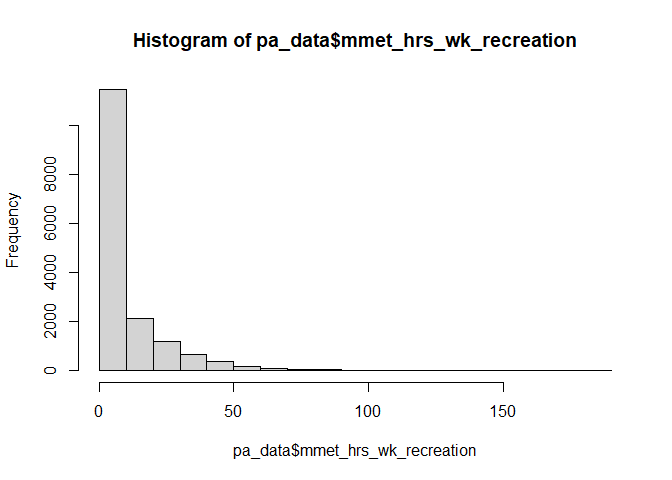

# Modelling physical activity in Melbourne


This Quarto markdown document is intended to contain code to predict
physical activity for sport and recreation including walking and
cycling, given explanatory variables (age, sex, SES, education, has car,
etc) that align with the JIBE synthetic population data. This will be
conducted to predict physical activity for residents of Melbourne,
Australia, using the Australian Bureau of Statistics Australian National
Health Survey data (2017-18).

The analysis draws on Belen Zapata-Diomedi’s code for cleaning the NHS
dataset (../document.qmd), and Belen Zapata-Diomedi, Qin Zhang and
Marina Berdokhova’s code for a predictive model of marginal metabolic
equivalent hours per week (mMET house/week) for Manchester, UK.

To allow this code to be run on different computers and operating
systems easily, rather than hardcode data paths for inputs there is a
file chooser for the three key inputs used:

1.  ABS NHS households (NHS17HHB.csv)
2.  ABS NHS persons (NHS17PSB.csv)
3.  Melbourne synthetic population (population_final.rds)

The user will be asked to provide paths for these files in this order.
If using RStudio or Visual Studio code, there should be a graphical file
picker. If using Posit or commandline on linux, you may have to enter
the file path string.

## Dependencies

Analysis was conducted using R 4.4.1 using a Quarto markdown document
(Quarto 1.5.55) in Positron IDE (2024.10.0), with renv 1.0.11 for
package management.

The following packages have been installed using renv:

    renv::install(c('dplyr','data.table','ggplot2','vtable','rmarkdown','pscl'))

In principle, the R environment for this notebook should be able to be
restored by running

    renv::restore()

Load libaries

``` r
library(dplyr)
library(vtable)
library(ggplot2)
library(data.table)
```

## Data

[National Health
Survey](https://www.abs.gov.au/statistics/microdata-tablebuilder/available-microdata-tablebuilder/national-health-survey)
(NHS) data for 2017-18 were retrieved from the [Microdata
Downloads](https://microdatadownload.abs.gov.au/MicrodataDownload/login.xhtml)
section of the Australian Bureau of Statistics website on 3 December
2024. ABS Microdata were accessed under the [ABS/Universities Australia
Agreement
(2024)](https://www.abs.gov.au/statistics/microdata-tablebuilder/absuniversities-australia-agreement)
by Carl Higgs (RMIT University). The NHS Microdata data descriptions are
available for download
[here](https://www.abs.gov.au/statistics/microdata-tablebuilder/available-microdata-tablebuilder/national-health-survey#data-item-lists).

NHS microdata are provided in CSV, SAS, SPSS, or Stata formats. The CSV
data do not have labels, hence the `haven` package could be installed to
read the labelled data in .dta (Stata) format. However, perhaps labels
are not required — for now, CSV will be used to keep things simple.

| File (csv, dta, etc) | Description                |
|----------------------|----------------------------|
| NHS17HHB             | Household level data       |
| NHS17SPB             | Person level data          |
| NHS17A3B             | Alcohol day level data     |
| NHS17A4B             | Alcohol type level data    |
| NHS17CNB             | Conditions level data      |
| NHS17MDB             | Medications level data     |
| NHS17HLB             | Health Literacy level data |

ABS NHS 2017-18 Microdata files

The household data contain geographic attributes and could potentially
be used to restrict the sample, e.g. to residents of urban areas within
Greater Melbourne. Sensitivity analysis could be conducted to evaluate
the impact of this decision, e.g. relative to all persons and all
persons living in Australian urban regions.

Household variables of interest include:

| Variable | Description | Comment |
|----|----|----|
| ABSHIDB | Household identifier | Link with persons |
| STATE16 | State or Territory (ASGS 2016) | 2 == Victoria |
| NUMPERBC | Number |  |
| of persons  in household | 0, 1, 2, 3, 4, 5, 6==6+ |  |
| SA1SF2DN | SEIFA - Index of Relative Socio-economic Disadvantage - 2016 - SA1 - Deciles - National |  |

Person-level variables of interest (see data dictionaries for detailed
codes) include:

| Variable | Description | Comment |
|----|----|----|
| ABSPID | Person identifier | person number within household |
| ABSHIDB | Household identifier | Link with households, but actually does not match for CURF records |
| AGEB | Age of person | 1== 0-4 years  … 19 == 85 years+ |
| SEX | Sex of person | 1==Male, 2==Female |
| LFSBC | Labour force status | 0==NA, 1==Employed, 2==Unemployed, 3==Not in the labour force |
| HYSCHCBC | Highest year of school completed | 0==NA, 1==Postgraduate, … 13==Never attended school |
| HIGHLVLBC | Level of highest educational attainment | 0==NA, 1==Postgraduate, … 13==Never attended school |
| EMPSTAT | Labour force full-time/part-time status | 0==NA, 1==Employed full time … 6 Not in labour force |
| Walk for recreation (mins) | EXFSRMIN | Total minutes walked for fitness, recreation or sport in last week (for at least 10 minutes) |
| Walk for transport (mins) | EXTRAMIN | Total minutes spent walking for transport in last week (for at least 10 minutes) |
| Moderate exercise (mins) | EXLWMMIN | Total minutes undertaken moderate exercise last week (for example, a light jog, strenght and toning exercises, lifting small boxes and sweeping) |
| Vigorous exercise (mins) | EXLWVMIN | Total minutes undertaken vigorous exercise last week (for example, playing basketball, running, lifting heavy boxes, and strength and toning exercises) |

## Methods

### Read and join NHS data

Adults aged 18 years and over from the persons dataset are left joined
to the household data, with only the relevant variables retained. The
core exposure variables are renamed to enhance readability of the
subsequent code.

``` r
# choose household file (may require GUI IDE like RStudio/PositStudio/VSCode)
NHS17HHB.csv <- file.choose()
# choose person file (may require GUI IDE like RStudio/PositStudio/VSCode)
NHS17SPB.csv <- file.choose()
data <- list(
    households = read.csv(NHS17HHB.csv),
    persons = read.csv(NHS17SPB.csv)
)
```

``` r
nhs <- dplyr::left_join(
            data$households %>% 
                select(
                    c( 
                        "ABSHIDB",
                        "STATE16", 
                        "NUMPERBC",
                        "SA1SF2DN"
                    )
                ),
            data$persons %>% 
                select(
                    c(
                        "ABSHIDB",
                        "ABSPID",
                        "AGEB",
                        "SEX",
                        "LFSBC",
                        "STDYFTPT",
                        "HYSCHCBC",
                        "HIGHLVBC",
                        "EXFSRMIN",
                        "EXTRAMIN",
                        "EXLWMMIN",
                        "EXLWVMIN"
                    )
                ) %>% rename(
                    walk_recreation_min=EXFSRMIN,
                    walk_transport_min=EXTRAMIN,
                    mod_excercise_min=EXLWMMIN,
                    vig_excercise_min=EXLWVMIN
                )%>% 
                filter(
                    AGEB > 4
                ), 
        by = c("ABSHIDB")
        ) 
nhs %>% st(out='kable')
```

| Variable            | N     | Mean | Std. Dev. | Min | Pctl. 25 | Pctl. 75 | Max   |
|:--------------------|:------|:-----|:----------|:----|:---------|:---------|:------|
| STATE16             | 16376 | 3.6  | 2.2       | 1   | 2        | 5        | 8     |
| NUMPERBC            | 16376 | 2.4  | 1.3       | 1   | 1        | 3        | 6     |
| SA1SF2DN            | 16376 | 5.4  | 2.8       | 1   | 3        | 8        | 10    |
| ABSPID              | 16370 | 1    | 0         | 1   | 1        | 1        | 1     |
| AGEB                | 16370 | 12   | 3.6       | 5   | 9        | 15       | 19    |
| SEX                 | 16370 | 1.5  | 0.5       | 1   | 1        | 2        | 2     |
| LFSBC               | 16370 | 1.8  | 0.96      | 1   | 1        | 3        | 3     |
| STDYFTPT            | 16370 | 2.9  | 0.45      | 1   | 3        | 3        | 3     |
| HYSCHCBC            | 16370 | 2    | 1.3       | 1   | 1        | 3        | 5     |
| HIGHLVBC            | 16370 | 4.5  | 2.6       | 1   | 2        | 6        | 12    |
| walk_recreation_min | 16370 | 153  | 2474      | 0   | 0        | 120      | 99998 |
| walk_transport_min  | 16370 | 352  | 5236      | 0   | 0        | 90       | 99998 |
| mod_excercise_min   | 16370 | 67   | 1359      | 0   | 0        | 40       | 99998 |
| vig_excercise_min   | 16370 | 32   | 104       | 0   | 0        | 0        | 2400  |

Summary Statistics

### Read and consider the synthetic population data

To predict recreationals mMETs for the synthetic population, we need to
understand how the variables are structured and ensure that our NHS
derived data that we will use in modelling has a comparable structure.
We’ll load up the data and consider a summary of variables to better
understand this.

I am using
[data.table](https://cran.r-project.org/web/packages/data.table/vignettes/datatable-intro.html)
as it is meant to be optimised for handling large datasets, like this
synthetic population. This performs subsequent operations deriving new
variables much faster.

``` r
population_final.rds <- file.choose()
pp <- readRDS(population_final.rds) %>% as.data.table()
pp %>% st(out='kable')
```

| Variable | N | Mean | Std. Dev. | Min | Pctl. 25 | Pctl. 75 | Max |
|:---|:---|:---|:---|:---|:---|:---|:---|
| AgentId | 4174097 | 2087049 | 1204958 | 1 | 1043525 | 3130573 | 4174097 |
| Age | 4174097 | 37 | 22 | -1 | 19 | 53 | 104 |
| Gender | 4174097 |  |  |  |  |  |  |
| … Female | 2128562 | 51% |  |  |  |  |  |
| … Male | 2045535 | 49% |  |  |  |  |  |
| RelationshipStatus | 4174097 |  |  |  |  |  |  |
| … GROUP_HOUSEHOLD | 202422 | 5% |  |  |  |  |  |
| … LONE_PARENT | 176081 | 4% |  |  |  |  |  |
| … LONE_PERSON | 366024 | 9% |  |  |  |  |  |
| … MARRIED | 1918556 | 46% |  |  |  |  |  |
| … O15_CHILD | 285971 | 7% |  |  |  |  |  |
| … RELATIVE | 133914 | 3% |  |  |  |  |  |
| … STUDENT | 264158 | 6% |  |  |  |  |  |
| … U15_CHILD | 826971 | 20% |  |  |  |  |  |
| HouseholdId | 4174097 | 1057931 | 432171 | 1 | 797012 | 1370237 | 1837719 |
| PartnerId | 1918556 | 2097046 | 1206587 | 2469 | 1061171 | 3141437 | 4174097 |
| MotherId | 1323492 | 2095777 | 1204385 | 4563 | 1056389 | 3131546 | 4174092 |
| FatherId | 1125454 | 2096707 | 1205114 | 4567 | 1056012 | 3128035 | 4174091 |
| SA2_MAINCODE | 4174097 | 210185213 | 2543207 | 206011105 | 208021180 | 212051322 | 214021385 |
| SA1_7DIGCODE | 4174097 | 2127554 | 10350 | 2110501 | 2118307 | 2135504 | 2146828 |
| SA1_MAINCODE_2016 | 4174097 | 21018521345 | 254320731 | 20601110501 | 20802118008 | 21205132223 | 21402138547 |
| age_cat | 4174097 | 7.9 | 4.4 | 1 | 4 | 11 | 21 |
| is_employed | 4174097 |  |  |  |  |  |  |
| … No | 2209464 | 53% |  |  |  |  |  |
| … Yes | 1964633 | 47% |  |  |  |  |  |
| education | 4174097 |  |  |  |  |  |  |
| … high | 1036035 | 25% |  |  |  |  |  |
| … low | 1148285 | 28% |  |  |  |  |  |
| … medium | 1989777 | 48% |  |  |  |  |  |
| IRSAD | 4174097 | 6.2 | 2.7 | -1 | 4 | 8 | 11 |
| hhSize | 4174097 | 3.1 | 1.5 | 1 | 2 | 4 | 8 |
| hhCar | 4174097 | 1.8 | 1 | 0 | 1 | 2 | 4 |

Summary Statistics

Considering the above, I think the following points are worth
considering as model refinements:

- Represent age in years (e.g. using bracket mid-point) as “Age”. This
  would better model age as a continuous variable, for direct prediction
  using the synthetic population. A caveat to that would be
  consideration of whether age is better modelled as linearly (a more
  parsimonious approach) or non-linearly (which its current treatment as
  a factor variable allows for, but complicates things and doesn’t
  directly translate to the synthetic population variable that is
  continuous age in years).
  - on the other hand, there is an `age_cat` variable, however I think
    the model would have more power if age could be modelled as
    continuous. Having said that it will be good to consult with Belen
    and Qin to get their recommendations and plans for usage.
- Represent sex as a binary indicator ‘female’ having 0 (male) and 1
  (female)
- Simplify employment as a binary variable “is_employed” with values of
  0 (no) and 1 (yes).
- Simplify education as a three level variable education, having values
  ‘low’, ‘medium’, ‘high’. While it might be that this could be
  represented as a pseudo continuous variable (0, 1, 2), I think its
  best to not assume its linear and leave it as a categorical factor
  variable. Break points for low, medium and high may be subjective;
  need to consult what this represent in synthetic population. For now,
  have assumed any tertiary education (Bachelor and higher) is high;
  Year 10, 11, 12, and Certificates higher than III are medium; and
  certificates I/II, or Year 9 or lower is low.
- There is a variable ‘IRSAD’ that might be disadvantage but it ranges
  from -1 to 11, so is not clear what this represents (not simply
  deciles, and not quintiles)
- other considerations:
  - The synthetic population seems to have ‘student’ as a category in
    RelationshipStatus – if that does identify someone as a student,
    then perhaps we can consider ‘is_student’ in the model for mMETs.
  - hhSize is present in synthetic population. It may not be
    conceptually relevant, but is present in household data for NHS, so
    we could consider its appropriateness for the model.
  - hhCar is in synethic population, but there is no data to represent
    this in the NHS data, that I can see.

### Data preparation

Missing data or NA values (e.g 99997 and 99998) are replaced as missing,
while maximum values of walking time variables are truncated at 840
minutes to constrain influence of extreme outliers.

SA1 Index of Relative Socio-economic Disadvantage (IRSD; `SA1SF2DN`) is
rescaled to use quintiles rather than deciles, for consistency with the
synthetic population, with ‘1’ being most deprived and ‘5’ being least
deprived.

Two age variables will be created for consideration, first as a factor
variable and second in years, using the first age bracket year.

To match the synthetic population data for Melbourne a binary indicator
‘is_employed’ will be created, along with a possible supplementary
indicator ‘is_student’ that could be derived for the synthetic
population.

Education will be summarised using categories of low, medium and high
for direct comparison with the synthetic population.

Marginal metabolic equivalent hours per week (mMET hours/week; `mmet`)
are calculated as the sum of hours spent walking for recreation, doing
moderate exercise and doing vigorous exercise, with each respectively
multiplied by the metabolic equivalent of these tasks (METs) minus one
(already in MMETs in code).

When deriving factor variables I have set ordered to False, as the
alternative setting needlessly over-complicates the modelling
(i.e. derives polynomial functions) and limits our capacity to transfer
predictions for the synthetic population (see
https://stackoverflow.com/questions/57297771/interpretation-of-l-q-c-4-for-logistic-regression).

Remember that SA1 IRSD ranges from 1 (most deprived) to 5 (least
deprived).

``` r
MMET_MOD <- 3.5 # As in meta analysis GArcia et al. 
MMET_VIG <- 7 # As in meta analysis GArcia et al. 
MMET_CYCLING <- 5.8 # From ithimr (check)
MMET_WALKING <- 2.5 # From ithimr (check)

pa_data <- nhs  %>%
    mutate_all(~ ifelse( . %in% c(99997, 99998), NA, .)) %>%
    mutate(
        walk_recreation_min = case_when(
                walk_recreation_min > 840 ~ 840, 
                TRUE ~  walk_recreation_min # handles unexpected values using default
            ),
        walk_transport_min = case_when(
                walk_transport_min > 840 ~ 840, 
                TRUE ~ walk_transport_min
            ),
        mod_excercise_min = case_when(
                mod_excercise_min > 840 ~ 840, 
                TRUE ~ mod_excercise_min
            ),
        vig_excercise_min = case_when(
                vig_excercise_min > 840 ~ 840, 
                TRUE ~ vig_excercise_min
            )
    ) %>%
    mutate(
        irsd_sa1 = case_when(
            SA1SF2DN %in% c(1, 2) ~ 1,
            SA1SF2DN %in% c(3, 4) ~ 2,
            SA1SF2DN %in% c(5, 6) ~ 3,
            SA1SF2DN %in% c(7, 8) ~ 4,
            SA1SF2DN %in% c(9, 10) ~ 5
        )
    ) %>% 
  mutate(
    age_years = case_when(
        AGEB == 5 ~ 18,
        AGEB == 6 ~ 20,
        AGEB == 7 ~ 25,
        AGEB == 8 ~ 30,
        AGEB == 9 ~ 35,
        AGEB == 10 ~ 40,
        AGEB == 11 ~ 45,
        AGEB == 12 ~ 50,
        AGEB == 13 ~ 55,
        AGEB == 14 ~ 60,
        AGEB == 15 ~ 65,
        AGEB == 16 ~ 70,
        AGEB == 17 ~ 75,
        AGEB == 18 ~ 80,
        AGEB == 19 ~ 85,
        TRUE ~ NA_real_  # Handle unexpected values
    ),
        AGEB = factor(
            AGEB, 
            levels = 5:19, 
            labels = c("18-19","20-24", "25-29", "30-34", "35-39", 
                        "40-44", "45-49", "50-54", "55-59", 
                        "60-64", "65-69", "70-74", "75-79", 
                        "80-84", "≥85"),
            ordered = FALSE
        ),
    female=ifelse(SEX==2,1,0),
    is_employed=case_when(
            LFSBC==1 ~ 1,
            LFSBC %in% c(0,2,3) ~ 0
        ),
    is_student=ifelse(STDYFTPT %in% c(1,2),1,0),
    education = case_when(
        HIGHLVBC %in% c(1,2) ~ 2,
        HIGHLVBC %in% c(3,7) ~ 1,
        HIGHLVBC %in% c(8,12) ~ 0,
        TRUE ~ NA_real_  # Handle unexpected values
        ),
    education = factor(
        education,
        levels=0:2,
        labels=c('low','medium','high'),
        ordered=FALSE
    )
    )  %>%
    mutate(
        mmet_hrs_wk_recreation =
            walk_recreation_min/60* MMET_WALKING + 
            mod_excercise_min/60 * MMET_MOD + 
            vig_excercise_min/60 * MMET_VIG, 
        mmet_hrs_wk_total = 
            walk_transport_min/60 * MMET_WALKING + 
            walk_recreation_min/60* MMET_WALKING +
            mod_excercise_min/60 * MMET_MOD + 
            vig_excercise_min/60 * MMET_VIG,
        mmet_hrs_wk_recreation_zero = ifelse(mmet_hrs_wk_recreation == 0, 1, 0)
    ) 

pa_data %>% st(out='kable')
```

| Variable                    | N     | Mean  | Std. Dev. | Min | Pctl. 25 | Pctl. 75 | Max |
|:----------------------------|:------|:------|:----------|:----|:---------|:---------|:----|
| STATE16                     | 16376 | 3.6   | 2.2       | 1   | 2        | 5        | 8   |
| NUMPERBC                    | 16376 | 2.4   | 1.3       | 1   | 1        | 3        | 6   |
| SA1SF2DN                    | 16376 | 5.4   | 2.8       | 1   | 3        | 8        | 10  |
| ABSPID                      | 16370 | 1     | 0         | 1   | 1        | 1        | 1   |
| AGEB                        | 16370 |       |           |     |          |          |     |
| … 18-19                     | 321   | 2%    |           |     |          |          |     |
| … 20-24                     | 853   | 5%    |           |     |          |          |     |
| … 25-29                     | 1145  | 7%    |           |     |          |          |     |
| … 30-34                     | 1431  | 9%    |           |     |          |          |     |
| … 35-39                     | 1467  | 9%    |           |     |          |          |     |
| … 40-44                     | 1377  | 8%    |           |     |          |          |     |
| … 45-49                     | 1452  | 9%    |           |     |          |          |     |
| … 50-54                     | 1348  | 8%    |           |     |          |          |     |
| … 55-59                     | 1403  | 9%    |           |     |          |          |     |
| … 60-64                     | 1386  | 8%    |           |     |          |          |     |
| … 65-69                     | 1293  | 8%    |           |     |          |          |     |
| … 70-74                     | 1163  | 7%    |           |     |          |          |     |
| … 75-79                     | 760   | 5%    |           |     |          |          |     |
| … 80-84                     | 546   | 3%    |           |     |          |          |     |
| … ≥85                       | 425   | 3%    |           |     |          |          |     |
| SEX                         | 16370 | 1.5   | 0.5       | 1   | 1        | 2        | 2   |
| LFSBC                       | 16370 | 1.8   | 0.96      | 1   | 1        | 3        | 3   |
| STDYFTPT                    | 16370 | 2.9   | 0.45      | 1   | 3        | 3        | 3   |
| HYSCHCBC                    | 16370 | 2     | 1.3       | 1   | 1        | 3        | 5   |
| HIGHLVBC                    | 16370 | 4.5   | 2.6       | 1   | 2        | 6        | 12  |
| walk_recreation_min         | 16360 | 89    | 146       | 0   | 0        | 120      | 840 |
| walk_transport_min          | 16325 | 69    | 134       | 0   | 0        | 80       | 840 |
| mod_excercise_min           | 16367 | 47    | 112       | 0   | 0        | 40       | 840 |
| vig_excercise_min           | 16370 | 31    | 88        | 0   | 0        | 0        | 840 |
| irsd_sa1                    | 16376 | 3     | 1.4       | 1   | 2        | 4        | 5   |
| age_years                   | 16370 | 49    | 18        | 18  | 35       | 65       | 85  |
| female                      | 16370 | 0.54  | 0.5       | 0   | 0        | 1        | 1   |
| is_employed                 | 16370 | 0.61  | 0.49      | 0   | 0        | 1        | 1   |
| is_student                  | 16376 | 0.095 | 0.29      | 0   | 0        | 0        | 1   |
| education                   | 8165  |       |           |     |          |          |     |
| … low                       | 127   | 2%    |           |     |          |          |     |
| … medium                    | 3518  | 43%   |           |     |          |          |     |
| … high                      | 4520  | 55%   |           |     |          |          |     |
| mmet_hrs_wk_recreation      | 16359 | 10    | 15        | 0   | 0        | 14       | 182 |
| mmet_hrs_wk_total           | 16318 | 13    | 17        | 0   | 1.2      | 18       | 207 |
| mmet_hrs_wk_recreation_zero | 16359 | 0.36  | 0.48      | 0   | 0        | 1        | 1   |

Summary Statistics

### Exploratory data analysis

The following function can be used for retrieving core summary
statistics that can be subsequently combined in a comparison table, for
example, comparing sub-groups and overall for relevant variables, and
against external reference standards.

``` r
summary_stats <- function(
    data,
    variable
) {
    summary.table <- data %>%
        summarise(
            count = sum(!is.na(get(variable))),
            mean = mean(get(variable), na.rm = TRUE),
            sd = sd(get(variable), na.rm = TRUE),
            min = min(get(variable), na.rm = TRUE),
            p25 = quantile(get(variable), 0.25, na.rm = TRUE),
            p50 = median(get(variable), na.rm = TRUE),
            p75 = quantile(get(variable), 0.75, na.rm = TRUE),
            max = max(get(variable), na.rm = TRUE)
        ) 
    return (summary.table)
}

mmets_summaries <- list()
```

#### Summary statistics of mMET hours/week for prediction model (recreation only)

The variable `mmet_hrs_wk_recreation` combines moderate recreational,
vigorous recreational and walking for recreation acitivies.

``` r
desc <- "NHS (recreation)"
var <- 'mmet_hrs_wk_recreation'
mmets_summaries[['recreation']] = rbind(
    cbind(
        summary=desc, 
        sex="Men",
        summary_stats(pa_data %>% filter(SEX==1),var)
    ),
    cbind(
        summary=desc, 
        sex="Women",
        summary_stats(pa_data %>% filter(SEX==2),var)
    ),
    cbind(
        summary=desc, 
        sex="Overall",
        summary_stats(pa_data,var)
    )
)
```

#### Summary statistics of mmets for comparison with Meta analysis (recreational exercise, and walking for recreation and transport)

The variable `mmet_hrs_wk_total` combines moderate recreational,
vigorous recreational and walking for recreation and transport
activities.

``` r
desc <- "NHS (total)"
var <- 'mmet_hrs_wk_total'
mmets_summaries[['total']]  <- rbind(
    cbind(
        summary=desc, 
        sex="Men",
        summary_stats(pa_data %>% filter(SEX==1),var)
    ),
    cbind(
        summary=desc, 
        sex="Women",
        summary_stats(pa_data %>% filter(SEX==2),var)
    ),
    cbind(
        summary=desc, 
        sex="Overall",
        summary_stats(pa_data,var)
    )
)
```

This estimate of total mMET hours/week can support comparisons with
meta-analysis results. According to
https://shiny.mrc-epid.cam.ac.uk/meta-analyses-physical-activity/ the
marginal MET hours per week overall, and by sex for all-cause mortality
was,

| summary       | sex     | count | mean   | sd  | min | p25  | p50   | p75   | max    |
|---------------|---------|-------|--------|-----|-----|------|-------|-------|--------|
| Meta-analysis | Men     |       | 18.698 |     | 0   | 2.73 | 10.66 | 23.87 | 156.45 |
| Meta-analysis | Women   |       | 17.352 |     | 0   | 2.61 | 10.66 | 22.82 | 103.6  |
| Meta-analysis | Overall |       | 16.908 |     | 0   | 2.35 | 10.5  | 22.5  | 130.02 |

``` r
meta_analysis_results <- data.frame(
  summary = rep("meta-analysis (total)", 3),
  sex = c("Men", "Women", "Overall"),
  count = c(NA, NA, NA),
  mean = c(18.698, 17.352, 16.908),
  sd = c(NA, NA, NA),
  min = c(0, 0, 0),
  p25 = c(2.73, 2.61, 2.35),
  p50 = c(10.66, 10.66, 10.5),
  p75 = c(23.87, 22.82, 22.5),
  max = c(156.45, 103.6, 130.02)
)

mmets_comparison <- rbind(
        meta_analysis_results,
        mmets_summaries[['total']],
        mmets_summaries[['recreation']]
    )
options(knitr.kable.NA = '-')
knitr::kable(
    mmets_comparison,
    caption = "Marginal MET hours per week",
    digits=3
)
```

| summary               | sex     | count |   mean |     sd | min |  p25 |    p50 |    p75 |    max |
|:----------------------|:--------|------:|-------:|-------:|----:|-----:|-------:|-------:|-------:|
| meta-analysis (total) | Men     |    \- | 18.698 |     \- |   0 | 2.73 | 10.660 | 23.870 | 156.45 |
| meta-analysis (total) | Women   |    \- | 17.352 |     \- |   0 | 2.61 | 10.660 | 22.820 | 103.60 |
| meta-analysis (total) | Overall |    \- | 16.908 |     \- |   0 | 2.35 | 10.500 | 22.500 | 130.02 |
| NHS (total)           | Men     |  7552 | 14.476 | 18.868 |   0 | 1.25 |  7.500 | 21.000 | 153.00 |
| NHS (total)           | Women   |  8766 | 11.574 | 15.331 |   0 | 1.25 |  6.250 | 16.083 | 207.00 |
| NHS (total)           | Overall | 16318 | 12.917 | 17.120 |   0 | 1.25 |  6.667 | 17.500 | 207.00 |
| NHS (recreation)      | Men     |  7575 | 11.473 | 17.196 |   0 | 0.00 |  4.000 | 16.500 | 147.00 |
| NHS (recreation)      | Women   |  8784 |  8.815 | 13.720 |   0 | 0.00 |  3.604 | 12.250 | 182.00 |
| NHS (recreation)      | Overall | 16359 | 10.046 | 15.484 |   0 | 0.00 |  3.750 | 14.000 | 182.00 |

Marginal MET hours per week

#### Age

mMET hours per week by age backet – there may be some non-linearity
(e.g. 18-19 year olds median METS are lower, but perhaps not
meaningfully so), but broadly, younger people have higher mMETs:

``` r
ggplot(pa_data,aes(x=AGEB, y=mmet_hrs_wk_recreation)) + geom_boxplot() + coord_flip()
```


``` r
qplot(x=pa_data$age_years,y=pa_data$mmet_hrs_wk_recreation, geom='smooth', span =0.5)
```


Looking at the qplot, to me it seems reasonable on grounds of parsimony
to model the relationship between age and mMET hours/week as a linear
function. There is a drop off after 70, however our data is relatively
sparse beyond there and our last category does capture persons older
than 85. Its easier to interpret the story from the qplot than boxplots
too.

#### Correlations

For now I have included both education variables in the below
exploratory data analysis, although most likely a derived combined
variable for education will be used, pending discussion with the team.
The State variable is also included to get a sense of how variables
differ across Australian states; Victorian-specific results could be
expected to be mostly drawn from Melbourne, and this could be explored
in a sensitivity analysis.

Many of our variables are factor variables for which direct numeric
correlations could be misleading (i.e. they aren’t necessarily ordinal
or linear, e.g. labour force status, or ‘NA’ values in educational
attainment).

``` r
cor=as.data.frame(lapply(pa_data[, c("irsd_sa1", "age_years", "female", "is_employed", "is_student", "education", "NUMPERBC", "mmet_hrs_wk_recreation")], as.numeric))
cor=na.omit(cor)
correlation_matrix <- cor(cor) %>% as.data.frame()
# corrplot(correlation_matrix %>% as.double(), method = "number",order = "FPC",type="lower") 
correlation_matrix[order(correlation_matrix$mmet_hrs_wk_recreation),] %>% round(2)
##                        irsd_sa1 age_years female is_employed is_student
## female                    -0.03      0.02   1.00       -0.10       0.01
## age_years                 -0.01      1.00   0.02       -0.52      -0.26
## NUMPERBC                   0.12     -0.38  -0.03        0.23       0.06
## is_student                 0.00     -0.26   0.01        0.08       1.00
## is_employed                0.13     -0.52  -0.10        1.00       0.08
## irsd_sa1                   1.00     -0.01  -0.03        0.13       0.00
## education                  0.25     -0.24  -0.04        0.26       0.10
## mmet_hrs_wk_recreation     0.13     -0.10  -0.11        0.11       0.02
##                        education NUMPERBC mmet_hrs_wk_recreation
## female                     -0.04    -0.03                  -0.11
## age_years                  -0.24    -0.38                  -0.10
## NUMPERBC                    0.12     1.00                   0.01
## is_student                  0.10     0.06                   0.02
## is_employed                 0.26     0.23                   0.11
## irsd_sa1                    0.25     0.12                   0.13
## education                   1.00     0.12                   0.15
## mmet_hrs_wk_recreation      0.15     0.01                   1.00
```

None of the variables in themselves are strongly associated with mMET
hours/week. As indicated above, age in years has a negative association.
Being female is similarly associated with lower mMET hours/week. Number
of persons in household and being a student were not associated with
mMETs and need not be included in the model. Employment, lower
socio-economic deprivation, and higher degree of education had weak
positive associations with mMET hours/week.

#### Clustering

Persons are theoretically clustered within households. If there is more
than one person within each household, as this data structure implies,
this clustering should be accounted for in the model. The following
checks the maximum number of persons within households, and confirms
that only one person is associated with each household and so clustering
within households will not be required in the model.

``` r
pa_data %>%
  group_by(ABSHIDB) %>%
  summarise(num_persons = n()) %>%
  summarise(max_persons = max(num_persons))
## # A tibble: 1 × 1
##   max_persons
##         <int>
## 1           1
```

#### Set up data for modelling

Select relevant variables and only retain records with full data.

``` r
pa_data =pa_data%>%
  select(ABSPID, age_years, female, is_employed, education, irsd_sa1, mmet_hrs_wk_recreation, mmet_hrs_wk_recreation_zero)%>%
  na.omit()

pa_data %>% st(out='kable')
```

| Variable                    | N    | Mean | Std. Dev. | Min | Pctl. 25 | Pctl. 75 | Max |
|:----------------------------|:-----|:-----|:----------|:----|:---------|:---------|:----|
| ABSPID                      | 8158 | 1    | 0         | 1   | 1        | 1        | 1   |
| age_years                   | 8158 | 48   | 17        | 18  | 35       | 60       | 85  |
| female                      | 8158 | 0.59 | 0.49      | 0   | 0        | 1        | 1   |
| is_employed                 | 8158 | 0.66 | 0.47      | 0   | 0        | 1        | 1   |
| education                   | 8158 |      |           |     |          |          |     |
| … low                       | 127  | 2%   |           |     |          |          |     |
| … medium                    | 3515 | 43%  |           |     |          |          |     |
| … high                      | 4516 | 55%  |           |     |          |          |     |
| irsd_sa1                    | 8158 | 3.2  | 1.4       | 1   | 2        | 4        | 5   |
| mmet_hrs_wk_recreation      | 8158 | 11   | 16        | 0   | 0        | 16       | 147 |
| mmet_hrs_wk_recreation_zero | 8158 | 0.3  | 0.46      | 0   | 0        | 1        | 1   |

Summary Statistics

Copy a subset of data for persons who record at least some mMET
hours/week

``` r
pa_data_over0=pa_data[pa_data$mmet_hrs_wk_recreation>0,]
pa_data_over0 %>% st(out='kable')
```

| Variable                    | N    | Mean | Std. Dev. | Min   | Pctl. 25 | Pctl. 75 | Max |
|:----------------------------|:-----|:-----|:----------|:------|:---------|:---------|:----|
| ABSPID                      | 5675 | 1    | 0         | 1     | 1        | 1        | 1   |
| age_years                   | 5675 | 47   | 16        | 18    | 35       | 60       | 85  |
| female                      | 5675 | 0.58 | 0.49      | 0     | 0        | 1        | 1   |
| is_employed                 | 5675 | 0.69 | 0.46      | 0     | 0        | 1        | 1   |
| education                   | 5675 |      |           |       |          |          |     |
| … low                       | 59   | 1%   |           |       |          |          |     |
| … medium                    | 2103 | 37%  |           |       |          |          |     |
| … high                      | 3513 | 62%  |           |       |          |          |     |
| irsd_sa1                    | 5675 | 3.3  | 1.4       | 1     | 2        | 5        | 5   |
| mmet_hrs_wk_recreation      | 5675 | 16   | 17        | 0.058 | 5        | 22       | 147 |
| mmet_hrs_wk_recreation_zero | 5675 | 0    | 0         | 0     | 0        | 0        | 0   |

Summary Statistics

### Modelling

The modelling approach (and earlier data preparation) draws on code from
the Manchester physical activity modelling R code file
`otherSportPA_hurdle_v3.R` authored by Qin Zhang, Belen Zapata-Diomedi
and Marina Berdokhova.

#### Modelling mMETS hours/week

``` r
m.mMETs_recreational <- list()

m.mMETs_recreational$linear <- lm(
    mmet_hrs_wk_recreation ~ female+age_years+is_employed+education+irsd_sa1,
    data = pa_data_over0)
summary(m.mMETs_recreational$linear)
## 
## Call:
## lm(formula = mmet_hrs_wk_recreation ~ female + age_years + is_employed + 
##     education + irsd_sa1, data = pa_data_over0)
## 
## Residuals:
##     Min      1Q  Median      3Q     Max 
## -20.874 -11.131  -5.343   5.700 129.395 
## 
## Coefficients:
##                 Estimate Std. Error t value Pr(>|t|)    
## (Intercept)     15.32732    2.50272   6.124 9.72e-10 ***
## female          -4.38253    0.45627  -9.605  < 2e-16 ***
## age_years       -0.04418    0.01648  -2.681  0.00736 ** 
## is_employed      1.22782    0.57750   2.126  0.03354 *  
## educationmedium  1.35621    2.24513   0.604  0.54582    
## educationhigh    3.03972    2.25362   1.349  0.17745    
## irsd_sa1         0.72676    0.17124   4.244 2.23e-05 ***
## ---
## Signif. codes:  0 '***' 0.001 '**' 0.01 '*' 0.05 '.' 0.1 ' ' 1
## 
## Residual standard error: 16.9 on 5668 degrees of freedom
## Multiple R-squared:  0.03074,    Adjusted R-squared:  0.02971 
## F-statistic: 29.96 on 6 and 5668 DF,  p-value: < 2.2e-16
```

In this model, most predicted results were slightly under-estimated
compared with the observed values (median -5.6 mMET hours/week; IQR
-11.7 to 6.3).

#### Modelling zero mMETS hours/week

``` r
m.mMETs_recreational$zeroModel <- glm(
    mmet_hrs_wk_recreation_zero ~ female+age_years+is_employed+education+irsd_sa1,
    family = "binomial",
    data = pa_data
)

summary(m.mMETs_recreational$zeroModel)
## 
## Call:
## glm(formula = mmet_hrs_wk_recreation_zero ~ female + age_years + 
##     is_employed + education + irsd_sa1, family = "binomial", 
##     data = pa_data)
## 
## Coefficients:
##                  Estimate Std. Error z value Pr(>|z|)    
## (Intercept)      0.011910   0.220602   0.054    0.957    
## female           0.061363   0.050981   1.204    0.229    
## age_years        0.009021   0.001764   5.114 3.16e-07 ***
## is_employed     -0.077738   0.061589  -1.262    0.207    
## educationmedium -0.296728   0.184373  -1.609    0.108    
## educationhigh   -0.948681   0.187114  -5.070 3.98e-07 ***
## irsd_sa1        -0.207157   0.018654 -11.105  < 2e-16 ***
## ---
## Signif. codes:  0 '***' 0.001 '**' 0.01 '*' 0.05 '.' 0.1 ' ' 1
## 
## (Dispersion parameter for binomial family taken to be 1)
## 
##     Null deviance: 10026.5  on 8157  degrees of freedom
## Residual deviance:  9523.6  on 8151  degrees of freedom
## AIC: 9537.6
## 
## Number of Fisher Scoring iterations: 4
```

Considering the non-normal nature of mMET hours/week, which is a
positively skewed rate variable (a non-negative count of hours per
week), it is worth considering whether a Poisson model might be more
appropriate and provide a better fit.

``` r
hist(pa_data$mmet_hrs_wk_recreation) 
```



``` r
hist(log(pa_data$mmet_hrs_wk_recreation))
```


``` r
summary(pa_data$mmet_hrs_wk_recreation)
##    Min. 1st Qu.  Median    Mean 3rd Qu.    Max. 
##     0.0     0.0     5.0    11.4    16.5   147.0
mean_mmet <- mean(pa_data$mmet_hrs_wk_recreation)
var_mmet <- var(pa_data$mmet_hrs_wk_recreation)

print(paste("Mean:", mean_mmet))
## [1] "Mean: 11.3956658086132"
print(paste("Variance:", var_mmet))
## [1] "Variance: 261.523882062808"
if (var_mmet > 2 * mean_mmet) {
    print("var_mmet > 2 * mean_mmet (Consider using a Negative Binomial or Zero-Inflated Negative Binomial model due to overdispersion)")
}
## [1] "var_mmet > 2 * mean_mmet (Consider using a Negative Binomial or Zero-Inflated Negative Binomial model due to overdispersion)"
```

The model may appear appoximately normally distributed on a log scale,
it also has considerably over-dispersion so a negative binomial model
may be appropriate, potentially accounting for the large number of
zeros.

``` r
library(MASS)
library(pscl)

m.mMETs_recreational$neg_binom <- glm.nb(
    mmet_hrs_wk_recreation ~ female + age_years + is_employed + education + irsd_sa1,
    data = pa_data
)

summary(m.mMETs_recreational$neg_binom)
## 
## Call:
## glm.nb(formula = mmet_hrs_wk_recreation ~ female + age_years + 
##     is_employed + education + irsd_sa1, data = pa_data, init.theta = 0.4059568459, 
##     link = log)
## 
## Coefficients:
##                  Estimate Std. Error z value Pr(>|z|)    
## (Intercept)      1.961664   0.171756  11.421  < 2e-16 ***
## female          -0.268164   0.036186  -7.411 1.26e-13 ***
## age_years       -0.006163   0.001268  -4.859 1.18e-06 ***
## is_employed      0.134090   0.044912   2.986 0.002830 ** 
## educationmedium  0.261049   0.148348   1.760 0.078458 .  
## educationhigh    0.568500   0.149750   3.796 0.000147 ***
## irsd_sa1         0.111184   0.013397   8.300  < 2e-16 ***
## ---
## Signif. codes:  0 '***' 0.001 '**' 0.01 '*' 0.05 '.' 0.1 ' ' 1
## 
## (Dispersion parameter for Negative Binomial(0.406) family taken to be 1)
## 
##     Null deviance: 9527.0  on 8157  degrees of freedom
## Residual deviance: 9172.2  on 8151  degrees of freedom
## AIC: 52911
## 
## Number of Fisher Scoring iterations: 1
## 
## 
##               Theta:  0.40596 
##           Std. Err.:  0.00712 
## 
##  2 x log-likelihood:  -52895.36700

# Zero-Inflated Negative Binomial model
pa_data$mmet_hrs_wk_recreation_round <- round(pa_data$mmet_hrs_wk_recreation)

m.mMETs_recreational$zinb <- zeroinfl(
    mmet_hrs_wk_recreation_round ~ female + age_years + is_employed + education + irsd_sa1 | female + age_years + is_employed + education + irsd_sa1,
    data = pa_data,
    dist = "negbin"
)

# Summary of the Zero-Inflated Negative Binomial model
summary(m.mMETs_recreational$zinb)
## 
## Call:
## zeroinfl(formula = mmet_hrs_wk_recreation_round ~ female + age_years + 
##     is_employed + education + irsd_sa1 | female + age_years + is_employed + 
##     education + irsd_sa1, data = pa_data, dist = "negbin")
## 
## Pearson residuals:
##     Min      1Q  Median      3Q     Max 
## -0.8547 -0.6503 -0.3881  0.3068  9.6822 
## 
## Count model coefficients (negbin with log link):
##                  Estimate Std. Error z value Pr(>|z|)    
## (Intercept)      2.564554   0.160300  15.998  < 2e-16 ***
## female          -0.277879   0.029181  -9.523  < 2e-16 ***
## age_years       -0.003029   0.001066  -2.842 0.004478 ** 
## is_employed      0.102191   0.036514   2.799 0.005132 ** 
## educationmedium  0.139622   0.145291   0.961 0.336558    
## educationhigh    0.253521   0.145686   1.740 0.081825 .  
## irsd_sa1         0.049026   0.010973   4.468  7.9e-06 ***
## Log(theta)      -0.100787   0.027872  -3.616 0.000299 ***
## 
## Zero-inflation model coefficients (binomial with logit link):
##                  Estimate Std. Error z value Pr(>|z|)    
## (Intercept)     -0.214384   0.259826  -0.825    0.409    
## female          -0.007305   0.063315  -0.115    0.908    
## age_years        0.010793   0.002237   4.824 1.40e-06 ***
## is_employed     -0.066264   0.076508  -0.866    0.386    
## educationmedium -0.266808   0.210002  -1.271    0.204    
## educationhigh   -1.032516   0.215043  -4.801 1.58e-06 ***
## irsd_sa1        -0.238384   0.023429 -10.175  < 2e-16 ***
## ---
## Signif. codes:  0 '***' 0.001 '**' 0.01 '*' 0.05 '.' 0.1 ' ' 1 
## 
## Theta = 0.9041 
## Number of iterations in BFGS optimization: 21 
## Log-likelihood: -2.596e+04 on 15 Df
```

``` r
# Compare AIC values
aic_values <- data.frame(
    Model = c("Linear", "Binomial", "neg_binom", "zinb"),
    AIC = c(
        AIC(m.mMETs_recreational$linear), 
        AIC(m.mMETs_recreational$zeroModel), 
        AIC(m.mMETs_recreational$neg_binom),
        AIC(m.mMETs_recreational$zinb)
    )
)
print(aic_values)
##       Model       AIC
## 1    Linear 48202.418
## 2  Binomial  9537.568
## 3 neg_binom 52911.367
## 4      zinb 51955.672
```

### Predictions

``` r
MonteCarlo <- function(model, data,facetVar = NA) {
  probability.matrix <- as.vector(predict(model,data,type = "response"))
  MC.prediction <- rep(NA,nrow(data))
  for(n in c(1:nrow(data))) {
    MC.prediction[n] <- runif(1)<=probability.matrix[n]
  }
  data=data%>%mutate(zeroPrediction=MC.prediction)
  return(data)
}
```

``` r
predicted_mmet <- predict(m.mMETs_recreational$zinb, type = "response")
predicted_binary <- ifelse(predicted_mmet > 0, 1, 0)
actual_binary <- ifelse(pa_data$mmet_hrs_wk_recreation > 0, 1, 0)
confusion_matrix <- table(Predicted = predicted_binary, Actual = actual_binary)
print(confusion_matrix)
##          Actual
## Predicted    0    1
##         1 2483 5675

results <- data.frame(
    predicted_mmet = predicted_mmet,
    actual_binary = pa_data$actual_binary <- ifelse(pa_data$mmet_hrs_wk_recreation > 0, "Greater than 0", "0")
)
# Generate box plots
ggplot(results, aes(x = actual_binary, y = predicted_mmet)) +
    geom_boxplot() +
    labs(
        title = "Predicted mMET Hours/Week by Actual mMET Hours/Week > 0 Status",
        x = "Actual mMET Hours/Week > 0 Status",
        y = "Predicted mMET Hours/Week"
    ) +
    theme_minimal()
```


While the model overestimates mMET hours for those who were estimated to
have accrued none, those with none predicted were significantly lower
which may be a more realistic estimate. (i.e. in the real world, it may
be unlikely that zero physical activity is conducted, some physical
activity does occur incidentally as a result of being alive, so the
over-estimation of the ‘zero’ observed mMET hours/week may not be such a
problem, necessarily).

But … the original zero model still did by far the best at predicting
zeros, perhaps using the zero model with negative binomial regression
for the over zeros would be the best model.

``` r
m.mMETs_recreational$neg_binom_over0 <- glm.nb(
    mmet_hrs_wk_recreation ~ female + age_years + is_employed + education + irsd_sa1,
    data = pa_data_over0
)

summary(m.mMETs_recreational$neg_binom_over0)
## 
## Call:
## glm.nb(formula = mmet_hrs_wk_recreation ~ female + age_years + 
##     is_employed + education + irsd_sa1, data = pa_data_over0, 
##     init.theta = 1.219615465, link = log)
## 
## Coefficients:
##                   Estimate Std. Error z value Pr(>|z|)    
## (Intercept)      2.6755083  0.1406500  19.022  < 2e-16 ***
## female          -0.2593484  0.0253337 -10.237  < 2e-16 ***
## age_years       -0.0029654  0.0009167  -3.235  0.00122 ** 
## is_employed      0.0942392  0.0321723   2.929  0.00340 ** 
## educationmedium  0.1118735  0.1265456   0.884  0.37667    
## educationhigh    0.2174604  0.1269927   1.712  0.08683 .  
## irsd_sa1         0.0452333  0.0095310   4.746 2.08e-06 ***
## ---
## Signif. codes:  0 '***' 0.001 '**' 0.01 '*' 0.05 '.' 0.1 ' ' 1
## 
## (Dispersion parameter for Negative Binomial(1.2196) family taken to be 1)
## 
##     Null deviance: 6500.6  on 5674  degrees of freedom
## Residual deviance: 6277.4  on 5668  degrees of freedom
## AIC: 43149
## 
## Number of Fisher Scoring iterations: 1
## 
## 
##               Theta:  1.2196 
##           Std. Err.:  0.0230 
## 
##  2 x log-likelihood:  -43133.2230

# Compare AIC values
aic_values <- data.frame(
    Model = c("Linear", "Binomial", "neg_binom", "zinb","neg_binom_over0"),
    AIC = c(
        AIC(m.mMETs_recreational$linear), 
        AIC(m.mMETs_recreational$zeroModel), 
        AIC(m.mMETs_recreational$neg_binom),
        AIC(m.mMETs_recreational$zinb),
        AIC(m.mMETs_recreational$neg_binom_over0)
    )
)
print(aic_values)
##             Model       AIC
## 1          Linear 48202.418
## 2        Binomial  9537.568
## 3       neg_binom 52911.367
## 4            zinb 51955.672
## 5 neg_binom_over0 43149.223
```

The combination of negative binomial model with the zero model appears
to outperform the linear model.

``` r
# Make predictions using the zero model
predicted_probabilities <- predict(m.mMETs_recreational$zeroModel, type = "response")

# Convert predicted probabilities to binary outcomes using a threshold of 0.5
predicted_binary <- ifelse(predicted_probabilities > 0.5, 1, 0)

# Actual binary outcomes
actual_binary <- pa_data$mmet_hrs_wk_recreation_zero

# Generate the confusion matrix
confusion_matrix <- table(Predicted = predicted_binary, Actual = actual_binary)
print(confusion_matrix)
##          Actual
## Predicted    0    1
##         0 5447 2230
##         1  228  253
```

Review the combined predictions

``` r
nonzero_predictions <- predict(
    m.mMETs_recreational$neg_binom_over0, 
    type = "response", 
    newdata = pa_data)
combined_predictions <- ifelse(predicted_probabilities > 0.5, 0, nonzero_predictions)

# Evaluate the model
actual_values <- pa_data$mmet_hrs_wk_recreation
results <- data.frame(
    actual_values = actual_values,
    combined_predictions = combined_predictions
)
ggplot(results, aes(x = actual_values, y = combined_predictions)) +
    geom_point(alpha = 0.5) +
    geom_abline(slope = 1, intercept = 0, color = "red", linetype = "dashed") +
    labs(
        title = "Scatter Plot of Actual vs. Predicted mMET Hours/Week",
        x = "Actual mMET Hours/Week",
        y = "Predicted mMET Hours/Week"
    ) +
    theme_minimal()
```


Save the model outputs for usage later

``` r
# Get today's date
today_date <- format(Sys.Date(), "%d%m%Y")

# Save the RDS file with today's date in the filename
saveRDS(m.mMETs_recreational, paste0("model_total_mMETs_", today_date, ".rds"))
```

#### Predicting mMET hours/week for synthetic population

Now we need to get our synthetic population data into the equivalent
format to our model, e.g. by converting string categorical variables to
binary indicators and adapting the SEIFA IRSD to quintiles. Then we can
use our predictions and apply them to the synthetic population.

``` r
# Perform the transformations
pp[, `:=`(
    irsd_sa1 = fifelse(IRSAD %in% c(1, 2), 1,
                fifelse(IRSAD %in% c(3, 4), 2,
                fifelse(IRSAD %in% c(5, 6), 3,
                fifelse(IRSAD %in% c(7, 8), 4,
                fifelse(IRSAD %in% c(9, 10), 5, NA_real_))))),
    age_years = Age,
    female = fifelse(Gender == "Female", 1, 0),
    is_employed = fifelse(is_employed == "Yes", 1, 0),
    education = fifelse(education == 'high', 2,
                fifelse(education == 'medium', 1,
                fifelse(education == 'low', 0, NA_real_)))
)]

# Convert education to a factor
pp[, education := factor(education, levels = 0:2, labels = c('low', 'medium', 'high'), ordered = FALSE)]

# Select the relevant columns
data <- pp[, .(AgentId, age_years, female, is_employed, education, irsd_sa1)]
  

data %>% st(out='kable')
```

| Variable    | N       | Mean    | Std. Dev. | Min | Pctl. 25 | Pctl. 75 | Max     |
|:------------|:--------|:--------|:----------|:----|:---------|:---------|:--------|
| AgentId     | 4174097 | 2087049 | 1204958   | 1   | 1043525  | 3130573  | 4174097 |
| age_years   | 4174097 | 37      | 22        | -1  | 19       | 53       | 104     |
| female      | 4174097 | 0.51    | 0.5       | 0   | 0        | 1        | 1       |
| is_employed | 4174097 | 0       | 0         | 0   | 0        | 0        | 0       |
| education   | 4174097 |         |           |     |          |          |         |
| … low       | 1148285 | 28%     |           |     |          |          |         |
| … medium    | 1989777 | 48%     |           |     |          |          |         |
| … high      | 1036035 | 25%     |           |     |          |          |         |
| irsd_sa1    | 4167715 | 3.3     | 1.3       | 1   | 2        | 4        | 5       |

Summary Statistics

#### Prediction of mMET hours/week for synethic population

``` r
prediction=MonteCarlo(m.mMETs_recreational$zeroModel,data)
table(prediction$zeroPrediction)
## 
##   FALSE    TRUE 
## 2747770 1419945
```

#### Join estimates back onto synthetic population

``` r
nonzeroPP <- prediction %>% filter(!zeroPrediction)

nonzeroPP_predict <- nonzeroPP %>% mutate(
    mMETs_recreational = predict(m.mMETs_recreational$linear, nonzeroPP)
)

pp <- pp %>% 
      left_join(
        nonzeroPP_predict %>% dplyr::select('AgentId','mMETs_recreational')
      )
pp <- pp %>% mutate(
    mMETs_recreational = ifelse(is.na(mMETs_recreational), 0, mMETs_recreational)
)
summary(pp$mMETs_recreational)
##    Min. 1st Qu.  Median    Mean 3rd Qu.    Max. 
##    0.00    0.00   13.42   10.26   16.65   21.34
ggplot(pp)+stat_ecdf(aes(x=mMETs_recreational))
```


``` r
fwrite(pp,"pp_health_2021_withTotalMMets.csv")
```

``` r
# Layout to split the screen
layout(mat = matrix(c(1,2),2,1, byrow=TRUE),  height = c(1,8))
 
# Draw the boxplot and the histogram 
par(mar=c(0, 3.1, 1.1, 2.1))
boxplot(pp$mMETs_recreational, horizontal=TRUE , ylim=c(0,30), xaxt="n" , col=rgb(0.8,0.8,0,0.5) , frame=F)
par(mar=c(4, 3.1, 1.1, 2.1))
hist(pp$mMETs_recreational, breaks=40 , col=rgb(0.2,0.8,0.5,0.5) , border=F , main="" , xlab="Predicted mMET hours/week", xlim=c(0,30))
```


#### Combined comparison

``` r
desc <- "Synthetic population (recreation)"
var <- 'mMETs_recreational'
mmets_comparison <- rbind(
    mmets_comparison,
    cbind(
        summary=desc, 
        sex="Men",
        summary_stats(pp %>% filter(Gender=='Male'),var)
    ),
    cbind(
        summary=desc, 
        sex="Women",
        summary_stats(pp %>% filter(Gender=='Female'),var)
    ),
    cbind(
        summary=desc, 
        sex="Overall",
        summary_stats(pp,var)
    )
)

options(knitr.kable.NA = '-')
knitr::kable(
    mmets_comparison,
    caption = "Marginal MET hours per week",
    digits=2
)
```

| summary | sex | count | mean | sd | min | p25 | p50 | p75 | max |
|:---|:---|---:|---:|---:|---:|---:|---:|---:|---:|
| meta-analysis (total) | Men | \- | 18.70 | \- | 0 | 2.73 | 10.66 | 23.87 | 156.45 |
| meta-analysis (total) | Women | \- | 17.35 | \- | 0 | 2.61 | 10.66 | 22.82 | 103.60 |
| meta-analysis (total) | Overall | \- | 16.91 | \- | 0 | 2.35 | 10.50 | 22.50 | 130.02 |
| NHS (total) | Men | 7552 | 14.48 | 18.87 | 0 | 1.25 | 7.50 | 21.00 | 153.00 |
| NHS (total) | Women | 8766 | 11.57 | 15.33 | 0 | 1.25 | 6.25 | 16.08 | 207.00 |
| NHS (total) | Overall | 16318 | 12.92 | 17.12 | 0 | 1.25 | 6.67 | 17.50 | 207.00 |
| NHS (recreation) | Men | 7575 | 11.47 | 17.20 | 0 | 0.00 | 4.00 | 16.50 | 147.00 |
| NHS (recreation) | Women | 8784 | 8.82 | 13.72 | 0 | 0.00 | 3.60 | 12.25 | 182.00 |
| NHS (recreation) | Overall | 16359 | 10.05 | 15.48 | 0 | 0.00 | 3.75 | 14.00 | 182.00 |
| Synthetic population (recreation) | Men | 2045535 | 11.81 | 8.49 | 0 | 0.00 | 16.71 | 18.33 | 21.34 |
| Synthetic population (recreation) | Women | 2128562 | 8.77 | 6.54 | 0 | 0.00 | 12.27 | 14.04 | 16.96 |
| Synthetic population (recreation) | Overall | 4174097 | 10.26 | 7.71 | 0 | 0.00 | 13.42 | 16.65 | 21.34 |

Marginal MET hours per week

Comparing the meta-analysis estimates for gender-stratified physical
activity mMET hours/week to those in the Australian NHS data, the latter
has broadly similar if slightly lower estimates overall; approximately 4
mMET-hours/week lower (albeit, with substantial variation). Conversely,
the maximum recorded mMET/hours were higher in the NHS data than in the
meta-analysis. While gender-specific trends were broadly similar (women
on average recording lower mMET hours/week in both the meta-analysis and
NHS total and recreation estimates), the maximum mMET hours/week for
women was higher for women in the Australian NHS sample. It is worth
noting the limitation of the Australian NHS data that it is national and
not restricted to an urban population; this could be an important
difference, if cohort studies tend to have an urban focus.

The modelled estimates for recreational mMET hours/week were similar on
average to the NHS data from which they were based (similar means by sex
and overall). As the estimates were based on modelled averages, the
reduced variability by sex and overall is not surprising. The median
(and 75th percentile, to a lesser degree) of the synthetic population
estimates were substantially higher than the NHS data they were modelled
from. This may relate to demographic differences with the synthetic
population reflecting demographics of an urban population in Melbourne,
compared with the NHS data’s national population. Likely it also
reflects aspects of the modelling approach: the hurdle design’s binomial
model appears to effectively model the propensity to undertake any
recreational physical activity (i.e. the zeros) but the modelling of
mMET hours/week may otherwise approximate a normal distribution. This
was the case regardless of using a linear model (as currently used, for
comparability with the Manchester approach) or a negative binomial model
(which resulted in similar if slightly reduced estimates, approximately
1 mMET hour/week lower). Given the similarity, the simpler model may be
preferred, and hence was ultimately used despite the earlier exploratory
analysis.

The resulting synthetic population estimates for mMET hours/week
arguably make sense as these are estimates based on average effects
given demographic covariates, not true results for individuals. They are
by definition, according to the methods used, normative. Therefore it is
not suprising the long tail of maximum mMET hours in the meta-analysis
and NHS survey data is truncated to approximately 20 mMET hours/week.
Despite not representing the full and skewed distribution of mMET
hours/week that would be expected in the population, if the purpose of
the synthetic population is for inference on average effects for the
basic range of included covariates, these estimates should be adequate
for usage as exposures in the health modelling.
