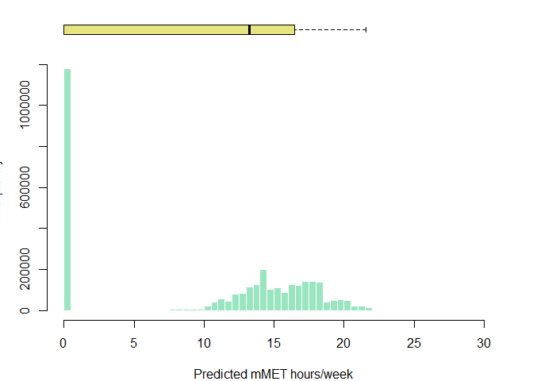

# Modelling physical activity in Melbourne


This Quarto markdown document is intended to contain code to predict
physical activity for sport and recreation including walking and
cycling, given explanatory variables (age, sex, employment and student
status, and socio-economic status, etc) that align with the JIBE
synthetic population data. This will be conducted to predict physical
activity for residents of Melbourne, Australia, using the Australian
Bureau of Statistics Australian National Health Survey data (2017-18).

The analysis draws on Belen Zapata-Diomedi’s code for cleaning the NHS
dataset (../document.qmd), and Belen Zapata-Diomedi, Qin Zhang and
Marina Berdikhanova’s code for a predictive model of marginal metabolic
equivalent hours per week (mMET house/week) for Manchester, UK.

For comparability with the Manhcester model in the JIBE workflow, we may
wish to more or less closely mirror the variables used in the physical
activity model, as detailed in the Manchester coefficients file,
`sportPAmodel.csv`. This contains a binary gender indicator (`female`),
an age group factor variable (\<25, 25-34, 35-44, 45-54, 55-64, 65-74,
75+), work status (retired, student or ddddunemployed), and relative
socio-economic disadvantage (UK Index of Multiple Deprivation; `imd10`).
The latter variable is included as a continuous variable in the
Manchester analysis.

## Usage

To allow this code to be run on different computers and operating
systems easily, rather than hardcode data paths for inputs there is a
file chooser for the three key inputs used:

1.  ABS NHS households (NHS17HHB.csv)
2.  ABS NHS persons (NHS17PSB.csv)
3.  Melbourne synthetic population (population_final.rds)

The user will be asked to provide paths for these files in this order.
If using RStudio or Visual Studio code, there should be a graphical file
picker. If using Posit or commandline on linux, you may have to enter
the file path string.

## Dependencies

Analysis was conducted using R 4.4.1 using a Quarto markdown document
(Quarto 1.5.55) in Positron IDE (2024.10.0), with renv 1.0.11 for
package management.

The following packages have been installed using renv:

    renv::install(c('dplyr','data.table','ggplot2','vtable','rmarkdown','pscl','jtools'))

In principle, the R environment for this notebook should be able to be
restored by running

    renv::restore()

Load libaries

``` r
library(dplyr)
library(vtable) # descrtiptive statistic model.tables
library(jtools) # clean model summaries
library(ggplot2)
library(data.table)
library(MASS) # for glm negative binomial model
```

## Data

[National Health
Survey](https://www.abs.gov.au/statistics/microdata-tablebuilder/available-microdata-tablebuilder/national-health-survey)
(NHS) data for 2017-18 were retrieved from the [Microdata
Downloads](https://microdatadownload.abs.gov.au/MicrodataDownload/login.xhtml)
section of the Australian Bureau of Statistics website on 3 December
2024. ABS Microdata were accessed under the [ABS/Universities Australia
Agreement
(2024)](https://www.abs.gov.au/statistics/microdata-tablebuilder/absuniversities-australia-agreement)
by Carl Higgs (RMIT University). The NHS Microdata data descriptions are
available for download
[here](https://www.abs.gov.au/statistics/microdata-tablebuilder/available-microdata-tablebuilder/national-health-survey#data-item-lists).

NHS microdata are provided in CSV, SAS, SPSS, or Stata formats. The CSV
data do not have labels. The `haven` package could be installed to read
the labelled data in .dta (Stata) format. However, perhaps labels are
not required — for now, CSV will be used to keep things simple.

| File (csv, dta, etc) | Description                |
|----------------------|----------------------------|
| NHS17HHB             | Household level data       |
| NHS17SPB             | Person level data          |
| NHS17A3B             | Alcohol day level data     |
| NHS17A4B             | Alcohol type level data    |
| NHS17CNB             | Conditions level data      |
| NHS17MDB             | Medications level data     |
| NHS17HLB             | Health Literacy level data |

ABS NHS 2017-18 Microdata files

The household data contain geographic attributes and could potentially
be used to restrict the sample, e.g. to residents of urban areas within
Greater Melbourne. Sensitivity analysis could be conducted to evaluate
the impact of this decision, e.g. relative to all persons and all
persons living in Australian urban regions.

Household variables of interest include:

| Variable | Description | Comment |
|----|----|----|
| ABSHIDB | Household identifier | Link with persons |
| STATE16 | State or Territory (ASGS 2016) | 2 == Victoria |
| NUMPERBC | Number |  |
| of persons  in household | 0, 1, 2, 3, 4, 5, 6==6+ |  |
| SA1SF2DN | SEIFA - Index of Relative Socio-economic Disadvantage - 2016 - SA1 - Deciles - National |  |

Person-level variables of interest (see data dictionaries for detailed
codes) include:

| Variable | Description | Comment |
|----|----|----|
| ABSPID | Person identifier | person number within household |
| ABSHIDB | Household identifier | Link with households, but actually does not match for CURF records |
| AGEB | Age of person | 1== 0-4 years  … 19 == 85 years+ |
| SEX | Sex of person | 1==Male, 2==Female |
| LFSBC | Labour force status | 0==NA, 1==Employed, 2==Unemployed, 3==Not in the labour force |
| EMPSTAT | Labour force full-time/part-time status | 0==NA, 1==Employed full time … 6 Not in labour force |
| STDYFTPT | Whether currently studying full-time or part-time | 0\. Not applicable, 1. Studying full-time, 2. Studying part-time, 3. Not studying |
| Walk for recreation (mins) | EXFSRMIN | Total minutes walked for fitness, recreation or sport in last week (for at least 10 minutes) |
| Walk for transport (mins) | EXTRAMIN | Total minutes spent walking for transport in last week (for at least 10 minutes) |
| Moderate exercise (mins) | EXLWMMIN | Total minutes undertaken moderate exercise last week (for example, a light jog, strenght and toning exercises, lifting small boxes and sweeping) |
| Vigorous exercise (mins) | EXLWVMIN | Total minutes undertaken vigorous exercise last week (for example, playing basketball, running, lifting heavy boxes, and strength and toning exercises) |

Regarding the `AGEB` age bracket variable, the specific breaks for this
are as follows (note that age brackets `4` and `5` are not 5-year
brackets. This allows distinguishing persons aged 18 and over.

| Value | Age group         |
|-------|-------------------|
| 1     | 0 - 4 years       |
| 2     | 5 - 9 years       |
| 3     | 10 - 14 years     |
| 4     | 15 - 17 years     |
| 5     | 18 - 19 years     |
| 6     | 20 - 24 years     |
| 7     | 25 - 29 years     |
| 8     | 30 - 34 years     |
| 9     | 35 - 39 years     |
| 10    | 40 - 44 years     |
| 11    | 45 - 49 years     |
| 12    | 50 - 54 years     |
| 13    | 55 - 59 years     |
| 14    | 60 - 64 years     |
| 15    | 65 - 69 years     |
| 16    | 70 - 74 years     |
| 17    | 75 - 79 years     |
| 18    | 80 - 84 years     |
| 19    | 85 years and over |

## Methods

### Read and join NHS data

Adults aged 18 years and over from the persons dataset are left joined
to the household data, with only the relevant variables retained. The
core exposure variables are renamed to enhance readability of the
subsequent code.

``` r
# choose household file (may require GUI IDE like RStudio/PositStudio/VSCode)
NHS17HHB.csv <- file.choose()
# choose person file (may require GUI IDE like RStudio/PositStudio/VSCode)
NHS17SPB.csv <- file.choose()
data <- list(
    households = read.csv(NHS17HHB.csv),
    persons = read.csv(NHS17SPB.csv)
)
```

``` r
nhs <- dplyr::left_join(
            data$households[c( 
                        "ABSHIDB",
                        "STATE16", 
                        "NUMPERBC",
                        "SA1SF2DN"
                    )],
            data$persons[c(
                        "ABSHIDB",
                        "ABSPID",
                        "AGEB",
                        "SEX",
                        "LFSBC",
                        "STDYFTPT",
                        "EXFSRMIN",
                        "EXTRAMIN",
                        "EXLWMMIN",
                        "EXLWVMIN"
                    )
                ] %>% rename(
                    walk_recreation_min=EXFSRMIN,
                    walk_transport_min=EXTRAMIN,
                    mod_excercise_min=EXLWMMIN,
                    vig_excercise_min=EXLWVMIN
                )%>% 
                filter(
                    AGEB > 4
                ), 
        by = c("ABSHIDB")
        ) 
nhs %>% st(out='kable')
```

| Variable            | N     | Mean | Std. Dev. | Min | Pctl. 25 | Pctl. 75 | Max   |
|:--------------------|:------|:-----|:----------|:----|:---------|:---------|:------|
| STATE16             | 16376 | 3.6  | 2.2       | 1   | 2        | 5        | 8     |
| NUMPERBC            | 16376 | 2.4  | 1.3       | 1   | 1        | 3        | 6     |
| SA1SF2DN            | 16376 | 5.4  | 2.8       | 1   | 3        | 8        | 10    |
| ABSPID              | 16370 | 1    | 0         | 1   | 1        | 1        | 1     |
| AGEB                | 16370 | 12   | 3.6       | 5   | 9        | 15       | 19    |
| SEX                 | 16370 | 1.5  | 0.5       | 1   | 1        | 2        | 2     |
| LFSBC               | 16370 | 1.8  | 0.96      | 1   | 1        | 3        | 3     |
| STDYFTPT            | 16370 | 2.9  | 0.45      | 1   | 3        | 3        | 3     |
| walk_recreation_min | 16370 | 153  | 2474      | 0   | 0        | 120      | 99998 |
| walk_transport_min  | 16370 | 352  | 5236      | 0   | 0        | 90       | 99998 |
| mod_excercise_min   | 16370 | 67   | 1359      | 0   | 0        | 40       | 99998 |
| vig_excercise_min   | 16370 | 32   | 104       | 0   | 0        | 0        | 2400  |

Summary Statistics

### Read and consider the synthetic population data

To predict recreationals mMETs for the synthetic population, we need to
understand how the variables are structured and ensure that our NHS
derived data that we will use in modelling has a comparable structure.
We’ll load up the data and consider a summary of variables to better
understand this.

I am using
[data.table](https://cran.r-project.org/web/packages/data.table/vignettes/datatable-intro.html)
as it is meant to be optimised for handling large datasets, like this
synthetic population. This performs subsequent operations deriving new
variables much faster. To ensure the source data that we’ll later attach
modelled results to remains otherwise unmodified, I’ll also create a
copy ‘pp’. The name ‘pp’ is used to refer to the synthetic population in
related modelling work undertaken for Manchester.

``` r
population_final.rds <- file.choose()
synpop <- readRDS(population_final.rds) %>% as.data.table()
synpop %>% st(out='kable')
```

| Variable | N | Mean | Std. Dev. | Min | Pctl. 25 | Pctl. 75 | Max |
|:---|:---|:---|:---|:---|:---|:---|:---|
| AgentId | 4174056 | 2087029 | 1204946 | 1 | 1043515 | 3130542 | 4174056 |
| Age | 4174056 | 37 | 22 | 0 | 19 | 53 | 104 |
| Gender | 4174056 |  |  |  |  |  |  |
| … Female | 2128539 | 51% |  |  |  |  |  |
| … Male | 2045517 | 49% |  |  |  |  |  |
| RelationshipStatus | 4174056 |  |  |  |  |  |  |
| … GROUP_HOUSEHOLD | 202422 | 5% |  |  |  |  |  |
| … LONE_PARENT | 176080 | 4% |  |  |  |  |  |
| … LONE_PERSON | 366005 | 9% |  |  |  |  |  |
| … MARRIED | 1918546 | 46% |  |  |  |  |  |
| … O15_CHILD | 285971 | 7% |  |  |  |  |  |
| … RELATIVE | 133903 | 3% |  |  |  |  |  |
| … STUDENT | 264158 | 6% |  |  |  |  |  |
| … U15_CHILD | 826971 | 20% |  |  |  |  |  |
| HouseholdId | 4174056 | 1057910 | 432163 | 1 | 796989 | 1370211 | 1837690 |
| PartnerId | 1918536 | 2097019 | 1206572 | 2469 | 1061157 | 3141401 | 4174056 |
| MotherId | 1323487 | 2095753 | 1204372 | 4563 | 1056376 | 3131508 | 4174051 |
| FatherId | 1125446 | 2096683 | 1205104 | 4567 | 1055994 | 3127999 | 4174050 |
| SA2_MAINCODE | 4174056 | 210185224 | 2543208 | 206011105 | 208021180 | 212051322 | 214021385 |
| SA1_7DIGCODE | 4174056 | 2127554 | 10350 | 2110501 | 2118307 | 2135504 | 2146828 |
| SA1_MAINCODE_2016 | 4174056 | 21018522401 | 254320773 | 20601110501 | 20802118008 | 21205132223 | 21402138547 |
| age_cat | 4174056 | 7.9 | 4.4 | 1 | 4 | 11 | 21 |
| is_employed | 4174056 |  |  |  |  |  |  |
| … No | 2094187 | 50% |  |  |  |  |  |
| … Yes | 2079869 | 50% |  |  |  |  |  |
| education | 4174056 |  |  |  |  |  |  |
| … high | 1034282 | 25% |  |  |  |  |  |
| … low | 1147868 | 28% |  |  |  |  |  |
| … medium | 1991906 | 48% |  |  |  |  |  |
| IRSD | 4167679 | 6.1 | 2.8 | 1 | 4 | 8 | 10 |
| IRSAD | 4167679 | 6.2 | 2.7 | 1 | 4 | 8 | 10 |
| hhSize | 4174056 | 3.1 | 1.5 | 1 | 2 | 4 | 8 |
| hhCar | 4174056 | 1.8 | 1 | 0 | 1 | 2 | 4 |
| student_status | 4174056 |  |  |  |  |  |  |
| … No | 3040327 | 73% |  |  |  |  |  |
| … Yes | 1133729 | 27% |  |  |  |  |  |
| school_type | 1133729 | 2 | 0.86 | 1 | 1 | 3 | 3 |
| assigned_school | 1133729 | 1029 | 448 | 1 | 715 | 1431 | 1486 |

Summary Statistics

``` r
pp <- data.table(synpop)
```

Considering the above, including the Manchester model specifications
with which we want comparability, we will represent varaibles as follow:

- sex as a binary indicator ‘female’ having 0 (male) and 1 (female)
- age using an age group factor variable with decade breaks to match
  those used for Manchester
- employment as a binary variable “employed” with values of 0 (no) and 1
  (yes).
- student status as binary variable ‘student’ with values of 0 (no) and
  1 (yes).
- relative socio-economic disadvantage using SA1 Index of Relative
  Socio-economic Disadvantage deciles (`IRSD`), ranging from 1 to 10.

### Data preparation

Missing data or NA values (e.g 99997 and 99998) are replaced as missing,
while maximum values of walking time variables are truncated at 840
minutes to constrain influence of extreme outliers.

The NHS SA1 Index of Relative Socio-economic Disadvantage (IRSD;
`SA1SF2DN`) is retained in decile form for comparability with the
Manchester approach ([preliminary
analysis](https://github.com/jibeproject/physical-activity-Melbourne/issues/2)
treating this as a factor variable suggested the association between
reduced deprivation and mMET hours/week was negative linear and
monotonic in any case).

Age will be set up as a factor variable having age groups of \< 25 and
then by decade through to over 75, in order to match the JIBE Manchester
model.

To match the synthetic population data for Melbourne a binary indicators
‘is_employed’ and ‘student_status’ will be created.

Marginal metabolic equivalent hours per week (mMET hours/week; `mmet`)
are calculated as the sum of hours spent walking for recreation, doing
moderate exercise and doing vigorous exercise, with each respectively
multiplied by the metabolic equivalent of these tasks (METs) minus one
(already in MMETs in code). These have been rounded to integers to
support consideration of negative binomial models, that may make sense
for this type of positive skewed zero-inflated data (a possible
alternative to a linear hurdle model).

When deriving factor variables I have set ordered to False, as the
alternative setting needlessly over-complicates the modelling
(i.e. derives polynomial functions) and limits our capacity to transfer
predictions for the synthetic population (see
https://stackoverflow.com/questions/57297771/interpretation-of-l-q-c-4-for-logistic-regression).

Remember that SA1 IRSD ranges from 1 (most deprived) to 5 (least
deprived).

``` r
MMET_MOD <- 3.5 # As in meta analysis GArcia et al. 
MMET_VIG <- 7 # As in meta analysis GArcia et al. 
MMET_CYCLING <- 5.8 # From ithimr (check)
MMET_WALKING <- 2.5 # From ithimr (check)

pa_data <- nhs  %>%
    mutate_all(~ ifelse( . %in% c(99997, 99998), NA, .)) %>%
    mutate(
        walk_recreation_min = case_when(
                walk_recreation_min > 840 ~ 840, 
                TRUE ~  walk_recreation_min # handles unexpected values using default
            ),
        walk_transport_min = case_when(
                walk_transport_min > 840 ~ 840, 
                TRUE ~ walk_transport_min
            ),
        mod_excercise_min = case_when(
                mod_excercise_min > 840 ~ 840, 
                TRUE ~ mod_excercise_min
            ),
        vig_excercise_min = case_when(
                vig_excercise_min > 840 ~ 840, 
                TRUE ~ vig_excercise_min
            )
    ) %>%
    mutate(
        irsd_sa1 = SA1SF2DN,
        age_group = case_when(
            AGEB < 7 ~ "age_group_18_25",
            AGEB < 9 ~ "age_group_25_34",
            AGEB < 11 ~ "age_group_35_44",
            AGEB < 13 ~ "age_group_45_54",
            AGEB < 15 ~ "age_group_55_64",
            AGEB < 17 ~ "age_group_65_74",
            AGEB >= 17 ~ "age_group_over75",
            TRUE ~ NA_character_  # Handle unexpected values
        ),
        age_group = factor(
            age_group,
            levels = c(
                "age_group_18_25",
                "age_group_25_34",
                "age_group_35_44",
                "age_group_45_54",
                "age_group_55_64",
                "age_group_65_74",
                "age_group_over75"
            ),
            ordered = FALSE
        ),
        female=SEX==2,
        is_employed = LFSBC == 1,
        student_status = STDYFTPT %in% c(1, 2),
    )  %>%
    mutate(
        mmet_hrs_wk_recreation = round(
            walk_recreation_min/60* MMET_WALKING + 
            mod_excercise_min/60 * MMET_MOD + 
            vig_excercise_min/60 * MMET_VIG
            ), 
        mmet_hrs_wk_total = round(
            walk_transport_min/60 * MMET_WALKING + 
            walk_recreation_min/60* MMET_WALKING +
            mod_excercise_min/60 * MMET_MOD + 
            vig_excercise_min/60 * MMET_VIG
        ),
        mmet_hrs_wk_recreation_zero = ifelse(mmet_hrs_wk_recreation == 0, 1, 0)
    ) 

pa_data %>% st(out='kable')
```

| Variable                    | N     | Mean | Std. Dev. | Min | Pctl. 25 | Pctl. 75 | Max |
|:----------------------------|:------|:-----|:----------|:----|:---------|:---------|:----|
| STATE16                     | 16376 | 3.6  | 2.2       | 1   | 2        | 5        | 8   |
| NUMPERBC                    | 16376 | 2.4  | 1.3       | 1   | 1        | 3        | 6   |
| SA1SF2DN                    | 16376 | 5.4  | 2.8       | 1   | 3        | 8        | 10  |
| ABSPID                      | 16370 | 1    | 0         | 1   | 1        | 1        | 1   |
| AGEB                        | 16370 | 12   | 3.6       | 5   | 9        | 15       | 19  |
| SEX                         | 16370 | 1.5  | 0.5       | 1   | 1        | 2        | 2   |
| LFSBC                       | 16370 | 1.8  | 0.96      | 1   | 1        | 3        | 3   |
| STDYFTPT                    | 16370 | 2.9  | 0.45      | 1   | 3        | 3        | 3   |
| walk_recreation_min         | 16360 | 89   | 146       | 0   | 0        | 120      | 840 |
| walk_transport_min          | 16325 | 69   | 134       | 0   | 0        | 80       | 840 |
| mod_excercise_min           | 16367 | 47   | 112       | 0   | 0        | 40       | 840 |
| vig_excercise_min           | 16370 | 31   | 88        | 0   | 0        | 0        | 840 |
| irsd_sa1                    | 16376 | 5.4  | 2.8       | 1   | 3        | 8        | 10  |
| age_group                   | 16370 |      |           |     |          |          |     |
| … age_group_18_25           | 1174  | 7%   |           |     |          |          |     |
| … age_group_25_34           | 2576  | 16%  |           |     |          |          |     |
| … age_group_35_44           | 2844  | 17%  |           |     |          |          |     |
| … age_group_45_54           | 2800  | 17%  |           |     |          |          |     |
| … age_group_55_64           | 2789  | 17%  |           |     |          |          |     |
| … age_group_65_74           | 2456  | 15%  |           |     |          |          |     |
| … age_group_over75          | 1731  | 11%  |           |     |          |          |     |
| female                      | 16370 |      |           |     |          |          |     |
| … No                        | 7576  | 46%  |           |     |          |          |     |
| … Yes                       | 8794  | 54%  |           |     |          |          |     |
| is_employed                 | 16370 |      |           |     |          |          |     |
| … No                        | 6434  | 39%  |           |     |          |          |     |
| … Yes                       | 9936  | 61%  |           |     |          |          |     |
| student_status              | 16376 |      |           |     |          |          |     |
| … No                        | 14818 | 90%  |           |     |          |          |     |
| … Yes                       | 1558  | 10%  |           |     |          |          |     |
| mmet_hrs_wk_recreation      | 16359 | 10   | 15        | 0   | 0        | 14       | 182 |
| mmet_hrs_wk_total           | 16318 | 13   | 17        | 0   | 1        | 18       | 207 |
| mmet_hrs_wk_recreation_zero | 16359 | 0.37 | 0.48      | 0   | 0        | 1        | 1   |

Summary Statistics

### Exploratory data analysis

The following function can be used for retrieving core summary
statistics that can be subsequently combined in a comparison table, for
example, comparing sub-groups and overall for relevant variables, and
against external reference standards.

``` r
summary_stats <- function(
    data,
    variable
) {
    summary.table <- data %>%
        summarise(
            count = sum(!is.na(get(variable))),
            mean = mean(get(variable), na.rm = TRUE),
            sd = sd(get(variable), na.rm = TRUE),
            min = min(get(variable), na.rm = TRUE),
            p25 = quantile(get(variable), 0.25, na.rm = TRUE),
            p50 = median(get(variable), na.rm = TRUE),
            p75 = quantile(get(variable), 0.75, na.rm = TRUE),
            max = max(get(variable), na.rm = TRUE)
        ) 
    return (summary.table)
}


summary_stats_by <- function(
    data,
    variable,
    by
) {
    library(dplyr)
    grouped_data <- data %>% group_by(get(by))
    summary_table <- grouped_data %>% 
        summarise(
            n = n(),
            count = sum(!is.na(get(variable))),
            mean = mean(get(variable), na.rm = TRUE),
            sd = sd(get(variable), na.rm = TRUE),
            min = min(get(variable), na.rm = TRUE),
            p25 = quantile(get(variable), 0.25, na.rm = TRUE),
            p50 = median(get(variable), na.rm = TRUE),
            p75 = quantile(get(variable), 0.75, na.rm = TRUE),
            max = max(get(variable), na.rm = TRUE)
        )%>% 
        rename(!!by := 'get(by)')
    
    return(summary_table)
}

mmets_summaries <- list()
```

#### Summary statistics of mMET hours/week for prediction model (recreation only)

The variable `mmet_hrs_wk_recreation` combines moderate recreational,
vigorous recreational and walking for recreation acitivies.

``` r
desc <- "NHS (recreation)"
var <- 'mmet_hrs_wk_recreation'
mmets_summaries[['recreation']] = rbind(
    cbind(
        summary=desc, 
        sex="Men",
        summary_stats(pa_data %>% filter(SEX==1),var)
    ),
    cbind(
        summary=desc, 
        sex="Women",
        summary_stats(pa_data %>% filter(SEX==2),var)
    ),
    cbind(
        summary=desc, 
        sex="Overall",
        summary_stats(pa_data,var)
    )
)
```

#### Summary statistics of mmets for comparison with Meta analysis (recreational exercise, and walking for recreation and transport)

The variable `mmet_hrs_wk_total` combines moderate recreational,
vigorous recreational and walking for recreation and transport
activities.

``` r
desc <- "NHS (total)"
var <- 'mmet_hrs_wk_total'
mmets_summaries[['total']]  <- rbind(
    cbind(
        summary=desc, 
        sex="Men",
        summary_stats(pa_data %>% filter(SEX==1),var)
    ),
    cbind(
        summary=desc, 
        sex="Women",
        summary_stats(pa_data %>% filter(SEX==2),var)
    ),
    cbind(
        summary=desc, 
        sex="Overall",
        summary_stats(pa_data,var)
    )
)
```

This estimate of total mMET hours/week can support comparisons with
meta-analysis results. According to
https://shiny.mrc-epid.cam.ac.uk/meta-analyses-physical-activity/ the
marginal MET hours per week overall, and by sex for all-cause mortality
was,

| summary       | sex     | count | mean   | sd  | min | p25  | p50   | p75   | max    |
|---------------|---------|-------|--------|-----|-----|------|-------|-------|--------|
| Meta-analysis | Men     |       | 18.698 |     | 0   | 2.73 | 10.66 | 23.87 | 156.45 |
| Meta-analysis | Women   |       | 17.352 |     | 0   | 2.61 | 10.66 | 22.82 | 103.6  |
| Meta-analysis | Overall |       | 16.908 |     | 0   | 2.35 | 10.5  | 22.5  | 130.02 |

``` r
meta_analysis_results <- data.frame(
  summary = rep("meta-analysis (total)", 3),
  sex = c("Men", "Women", "Overall"),
  count = c(NA, NA, NA),
  mean = c(18.698, 17.352, 16.908),
  sd = c(NA, NA, NA),
  min = c(0, 0, 0),
  p25 = c(2.73, 2.61, 2.35),
  p50 = c(10.66, 10.66, 10.5),
  p75 = c(23.87, 22.82, 22.5),
  max = c(156.45, 103.6, 130.02)
)

mmets_comparison <- rbind(
        meta_analysis_results,
        mmets_summaries[['total']],
        mmets_summaries[['recreation']]
    )
options(knitr.kable.NA = '-')
knitr::kable(
    mmets_comparison,
    caption = "Marginal MET hours per week",
    digits=3
)
```

| summary               | sex     | count |   mean |     sd | min |  p25 |   p50 |   p75 |    max |
|:----------------------|:--------|------:|-------:|-------:|----:|-----:|------:|------:|-------:|
| meta-analysis (total) | Men     |    \- | 18.698 |     \- |   0 | 2.73 | 10.66 | 23.87 | 156.45 |
| meta-analysis (total) | Women   |    \- | 17.352 |     \- |   0 | 2.61 | 10.66 | 22.82 | 103.60 |
| meta-analysis (total) | Overall |    \- | 16.908 |     \- |   0 | 2.35 | 10.50 | 22.50 | 130.02 |
| NHS (total)           | Men     |  7552 | 14.464 | 18.876 |   0 | 1.00 |  8.00 | 21.00 | 153.00 |
| NHS (total)           | Women   |  8766 | 11.568 | 15.343 |   0 | 1.00 |  6.00 | 16.00 | 207.00 |
| NHS (total)           | Overall | 16318 | 12.909 | 17.130 |   0 | 1.00 |  7.00 | 18.00 | 207.00 |
| NHS (recreation)      | Men     |  7575 | 11.473 | 17.201 |   0 | 0.00 |  4.00 | 16.00 | 147.00 |
| NHS (recreation)      | Women   |  8784 |  8.816 | 13.725 |   0 | 0.00 |  4.00 | 12.00 | 182.00 |
| NHS (recreation)      | Overall | 16359 | 10.046 | 15.488 |   0 | 0.00 |  4.00 | 14.00 | 182.00 |

Marginal MET hours per week

#### Correlations

``` r
cor=as.data.frame(lapply(pa_data[, c("irsd_sa1", "age_group", "female", "is_employed", "student_status", "NUMPERBC", "mmet_hrs_wk_recreation")], as.numeric))
cor=na.omit(cor)
correlation_matrix <- cor(cor) %>% as.data.frame()
# corrplot(correlation_matrix %>% as.double(), method = "number",order = "FPC",type="lower") 
correlation_matrix[order(correlation_matrix$mmet_hrs_wk_recreation),] %>% round(2)
##                        irsd_sa1 age_group female is_employed student_status
## age_group                 -0.04      1.00   0.02       -0.50          -0.33
## female                    -0.01      0.02   1.00       -0.11           0.03
## NUMPERBC                   0.12     -0.41  -0.01        0.24           0.11
## student_status             0.03     -0.33   0.03        0.09           1.00
## is_employed                0.16     -0.50  -0.11        1.00           0.09
## irsd_sa1                   1.00     -0.04  -0.01        0.16           0.03
## mmet_hrs_wk_recreation     0.14     -0.13  -0.09        0.13           0.06
##                        NUMPERBC mmet_hrs_wk_recreation
## age_group                 -0.41                  -0.13
## female                    -0.01                  -0.09
## NUMPERBC                   1.00                   0.03
## student_status             0.11                   0.06
## is_employed                0.24                   0.13
## irsd_sa1                   0.12                   0.14
## mmet_hrs_wk_recreation     0.03                   1.00
```

None of the variables in themselves display clear associatino with mMET
hours/week. Age is associated with lower mMET hours/week, as is being
female (negative correlations). Number of persons in household and being
a student were not associated with mMETs. Employment, lower
socio-economic deprivation, and higher degree of education had weak
positive associations with mMET hours/week.

#### Clustering

Persons are theoretically clustered within households. If there is more
than one person within each household, as this data structure implies,
this clustering should be accounted for in the model. The following
checks the maximum number of persons within households, and confirms
that only one person is associated with each household and so clustering
within households will not be required in the model.

``` r
pa_data %>%
  group_by(ABSHIDB) %>%
  summarise(num_persons = n()) %>%
  summarise(max_persons = max(num_persons))
## # A tibble: 1 × 1
##   max_persons
##         <int>
## 1           1
```

#### Set up data for modelling

Select relevant variables and only retain records with full data.

``` r
pa_data =pa_data[
    c('ABSPID', 'age_group', 'female', 'is_employed', 'student_status', 'irsd_sa1','mmet_hrs_wk_recreation', 'mmet_hrs_wk_recreation_zero')
    ] %>% na.omit()

pa_data %>% st(out='kable')
```

| Variable                    | N     | Mean | Std. Dev. | Min | Pctl. 25 | Pctl. 75 | Max |
|:----------------------------|:------|:-----|:----------|:----|:---------|:---------|:----|
| ABSPID                      | 16359 | 1    | 0         | 1   | 1        | 1        | 1   |
| age_group                   | 16359 |      |           |     |          |          |     |
| … age_group_18_25           | 1172  | 7%   |           |     |          |          |     |
| … age_group_25_34           | 2574  | 16%  |           |     |          |          |     |
| … age_group_35_44           | 2842  | 17%  |           |     |          |          |     |
| … age_group_45_54           | 2800  | 17%  |           |     |          |          |     |
| … age_group_55_64           | 2789  | 17%  |           |     |          |          |     |
| … age_group_65_74           | 2452  | 15%  |           |     |          |          |     |
| … age_group_over75          | 1730  | 11%  |           |     |          |          |     |
| female                      | 16359 |      |           |     |          |          |     |
| … No                        | 7575  | 46%  |           |     |          |          |     |
| … Yes                       | 8784  | 54%  |           |     |          |          |     |
| is_employed                 | 16359 |      |           |     |          |          |     |
| … No                        | 6427  | 39%  |           |     |          |          |     |
| … Yes                       | 9932  | 61%  |           |     |          |          |     |
| student_status              | 16359 |      |           |     |          |          |     |
| … No                        | 14802 | 90%  |           |     |          |          |     |
| … Yes                       | 1557  | 10%  |           |     |          |          |     |
| irsd_sa1                    | 16359 | 5.4  | 2.8       | 1   | 3        | 8        | 10  |
| mmet_hrs_wk_recreation      | 16359 | 10   | 15        | 0   | 0        | 14       | 182 |
| mmet_hrs_wk_recreation_zero | 16359 | 0.37 | 0.48      | 0   | 0        | 1        | 1   |

Summary Statistics

Now the full analytical sample has been determined, a subset of data for
persons who record at least some mMET hours/week will be copied to a new
dataframe.

``` r
pa_data_over0=pa_data[pa_data$mmet_hrs_wk_recreation>0,]
pa_data_over0 %>% st(out='kable')
```

| Variable                    | N     | Mean | Std. Dev. | Min | Pctl. 25 | Pctl. 75 | Max |
|:----------------------------|:------|:-----|:----------|:----|:---------|:---------|:----|
| ABSPID                      | 10358 | 1    | 0         | 1   | 1        | 1        | 1   |
| age_group                   | 10358 |      |           |     |          |          |     |
| … age_group_18_25           | 841   | 8%   |           |     |          |          |     |
| … age_group_25_34           | 1797  | 17%  |           |     |          |          |     |
| … age_group_35_44           | 1909  | 18%  |           |     |          |          |     |
| … age_group_45_54           | 1817  | 18%  |           |     |          |          |     |
| … age_group_55_64           | 1708  | 16%  |           |     |          |          |     |
| … age_group_65_74           | 1492  | 14%  |           |     |          |          |     |
| … age_group_over75          | 794   | 8%   |           |     |          |          |     |
| female                      | 10358 |      |           |     |          |          |     |
| … No                        | 4832  | 47%  |           |     |          |          |     |
| … Yes                       | 5526  | 53%  |           |     |          |          |     |
| is_employed                 | 10358 |      |           |     |          |          |     |
| … No                        | 3560  | 34%  |           |     |          |          |     |
| … Yes                       | 6798  | 66%  |           |     |          |          |     |
| student_status              | 10358 |      |           |     |          |          |     |
| … No                        | 9196  | 89%  |           |     |          |          |     |
| … Yes                       | 1162  | 11%  |           |     |          |          |     |
| irsd_sa1                    | 10358 | 5.8  | 2.8       | 1   | 3        | 8        | 10  |
| mmet_hrs_wk_recreation      | 10358 | 16   | 17        | 1   | 5        | 21       | 182 |
| mmet_hrs_wk_recreation_zero | 10358 | 0    | 0         | 0   | 0        | 0        | 0   |

Summary Statistics

#### Synthetic population data set up

The NHS survey provides age in brackets, while the synthetic population
has continuous age as well as an age category variable. The grouping of
the latter are not explicitly named however, and if we were to use age
groups it may be best to create a new group to specifically match the
NHS brackets used in modelling.

Let’s have a look at the age brackets in the synthetic population first:

``` r
summary_stats_by(pp,'Age','age_cat') %>% print(n=Inf)
## # A tibble: 21 × 10
##    age_cat      n  count   mean    sd   min   p25   p50   p75   max
##      <dbl>  <int>  <int>  <dbl> <dbl> <int> <dbl> <dbl> <dbl> <int>
##  1       1 284213 284213   2.03  1.41     0     1     2     3     4
##  2       2 284561 284561   7.00  1.41     5     6     7     8     9
##  3       3 263525 263525  12.0   1.42    10    11    12    13    14
##  4       4 249681 249681  17.1   1.42    15    16    17    18    19
##  5       5 313927 313927  22.1   1.41    20    21    22    23    24
##  6       6 327370 327370  27.0   1.41    25    26    27    28    29
##  7       7 333619 333619  32.0   1.41    30    31    32    33    34
##  8       8 296799 296799  36.9   1.42    35    36    37    38    39
##  9       9 292171 292171  42.0   1.42    40    41    42    43    44
## 10      10 286509 286509  46.9   1.41    45    46    47    48    49
## 11      11 260520 260520  52.0   1.41    50    51    52    53    54
## 12      12 271781 271781  56.9   1.42    55    56    57    58    59
## 13      13 188611 188611  61.8   1.45    60    60    62    63    64
## 14      14 157211 157211  67.0   1.43    65    66    67    68    69
## 15      15 148115 148115  71.9   1.41    70    71    72    73    74
## 16      16  90766  90766  76.8   1.44    75    75    77    78    79
## 17      17  62918  62918  81.9   1.41    80    81    82    83    84
## 18      18  42481  42481  86.5   1.43    85    85    86    88    89
## 19      19  15741  15741  91.5   1.36    90    90    91    93    94
## 20      20   3511   3511  96.2   1.25    95    95    96    97    99
## 21      21     26     26 101.    1.37   100   100   101   101   104
```

To match the age group variable derived for the NHS survey based on JIBE
Manchester, we’ll have to derive new age brackets for the synthetic
population.

``` r
age_breaks <- c(18, 25, 35, 45, 55, 65, 75, Inf)
age_labels <- c("age_group_18_25", "age_group_25_34", "age_group_35_44", "age_group_45_54", "age_group_55_64", "age_group_65_74", "age_group_over75")

pp$age_group <- cut(pp$Age, breaks = age_breaks, labels = age_labels, right = FALSE)
summary_stats_by(pp,'Age','age_group') %>% print(n=Inf)
```

Great, so now there’s an age bracket variable in the synthetic
population that matches the NHS data breaks.

There are some remaining variables to derive in order to get our
synthetic population data into the equivalent format to our model. Then
we can use our predictions and apply them to the synthetic population.

``` r
# Perform the transformations
pp[, `:=`(
    irsd_sa1 = IRSD,
    female = Gender == "Female",
    is_employed = is_employed == "Yes",
    student_status = student_status
)]

# Select the relevant columns
data <- pp[Age >= 18, .(AgentId, age_group, female, is_employed, student_status, irsd_sa1)] 
data %>% st(out='kable')
```

| Variable           | N       | Mean    | Std. Dev. | Min | Pctl. 25 | Pctl. 75 | Max     |
|:-------------------|:--------|:--------|:----------|:----|:---------|:---------|:--------|
| AgentId            | 3199371 | 2084186 | 1204876   | 1   | 1041327  | 3133196  | 4174056 |
| age_group          | 3199371 |         |           |     |          |          |         |
| … age_group_18_25  | 421222  | 13%     |           |     |          |          |         |
| … age_group_25_34  | 660989  | 21%     |           |     |          |          |         |
| … age_group_35_44  | 588970  | 18%     |           |     |          |          |         |
| … age_group_45_54  | 547029  | 17%     |           |     |          |          |         |
| … age_group_55_64  | 460392  | 14%     |           |     |          |          |         |
| … age_group_65_74  | 305326  | 10%     |           |     |          |          |         |
| … age_group_over75 | 215443  | 7%      |           |     |          |          |         |
| female             | 3199371 |         |           |     |          |          |         |
| … No               | 1545445 | 48%     |           |     |          |          |         |
| … Yes              | 1653926 | 52%     |           |     |          |          |         |
| is_employed        | 3199371 |         |           |     |          |          |         |
| … No               | 3199371 | 100%    |           |     |          |          |         |
| … Yes              | 0       | 0%      |           |     |          |          |         |
| student_status     | 3199371 |         |           |     |          |          |         |
| … No               | 2756114 | 86%     |           |     |          |          |         |
| … Yes              | 443257  | 14%     |           |     |          |          |         |
| irsd_sa1           | 3193813 | 6.1     | 2.8       | 1   | 4        | 8        | 10      |

Summary Statistics

### Modelling

The modelling approach (and earlier data preparation) draws on code from
the Manchester physical activity modelling R code file
`otherSportPA_hurdle_v3.R` authored by Qin Zhang, Belen Zapata-Diomedi
and Marina Berdikhanova.

A negative binomial model was used to model the recreational physical
activity data for those who recorded mMET hours/week as it was found to
provide a better prediction for the skewed data than a linear model.
Modelling options supporting this decision are explored in a sensitivity
analysis further below.

Note that negative binomial regression results are expressed as
log(rate) — meaning they need to be exponentiated to be interpreted as
mMET hours/week. That is done when making predictions for the response
variable.

``` r
# initialise model list
m.mMETs_recreational <- list()
```

``` r
# Logistic regression model of zero mMETS hours/week
m.mMETs_recreational$zeroModel <- glm(
    mmet_hrs_wk_recreation_zero ~ female + age_group + is_employed + student_status + irsd_sa1,
    family = "binomial",
    data = pa_data
)

summ(m.mMETs_recreational$zeroModel, confint = TRUE, digits = 3)
```

|                    |                             |
|:-------------------|----------------------------:|
| Observations       |                       16359 |
| Dependent variable | mmet_hrs_wk_recreation_zero |
| Type               |    Generalized linear model |
| Family             |                    binomial |
| Link               |                       logit |

 

|                         |           |
|:------------------------|----------:|
| χ²(10)                  |   902.109 |
| p                       |     0.000 |
| Pseudo-R² (Cragg-Uhler) |     0.073 |
| Pseudo-R² (McFadden)    |     0.042 |
| AIC                     | 20623.728 |
| BIC                     | 20708.456 |

 

|                           |   Est. |   2.5% |  97.5% |  z val. |     p |
|:--------------------------|-------:|-------:|-------:|--------:|------:|
| (Intercept)               |  0.045 | -0.119 |  0.208 |   0.534 | 0.593 |
| femaleTRUE                | -0.005 | -0.071 |  0.061 |  -0.145 | 0.884 |
| age_groupage_group_25_34  |  0.054 | -0.105 |  0.212 |   0.661 | 0.509 |
| age_groupage_group_35_44  |  0.205 |  0.048 |  0.363 |   2.555 | 0.011 |
| age_groupage_group_45_54  |  0.284 |  0.125 |  0.442 |   3.508 | 0.000 |
| age_groupage_group_55_64  |  0.330 |  0.171 |  0.490 |   4.070 | 0.000 |
| age_groupage_group_65_74  |  0.225 |  0.057 |  0.393 |   2.623 | 0.009 |
| age_groupage_group_over75 |  0.772 |  0.593 |  0.951 |   8.461 | 0.000 |
| is_employedTRUE           | -0.273 | -0.356 | -0.190 |  -6.423 | 0.000 |
| student_statusTRUE        | -0.350 | -0.479 | -0.220 |  -5.291 | 0.000 |
| irsd_sa1                  | -0.126 | -0.138 | -0.114 | -20.667 | 0.000 |
|  Standard errors: MLE     |        |        |        |         |       |

``` r
# Negative binomial model for amount of mMET hours/week physical activity
m.mMETs_recreational$linear <- lm(
    mmet_hrs_wk_recreation ~ female + age_group + is_employed + student_status + irsd_sa1,
    data = pa_data_over0
)

summ(m.mMETs_recreational$linear, confint = TRUE, digits = 3)
```

|                    |                        |
|:-------------------|-----------------------:|
| Observations       |                  10358 |
| Dependent variable | mmet_hrs_wk_recreation |
| Type               |  OLS linear regression |

 

|             |        |
|:------------|-------:|
| F(10,10347) | 34.909 |
| R²          |  0.033 |
| Adj. R²     |  0.032 |

 

|                           |   Est. |   2.5% |  97.5% |  t val. |     p |
|:--------------------------|-------:|-------:|-------:|--------:|------:|
| (Intercept)               | 16.984 | 15.426 | 18.541 |  21.372 | 0.000 |
| femaleTRUE                | -3.826 | -4.472 | -3.180 | -11.606 | 0.000 |
| age_groupage_group_25_34  | -1.104 | -2.504 |  0.297 |  -1.544 | 0.123 |
| age_groupage_group_35_44  | -2.932 | -4.342 | -1.522 |  -4.077 | 0.000 |
| age_groupage_group_45_54  | -2.777 | -4.209 | -1.346 |  -3.803 | 0.000 |
| age_groupage_group_55_64  | -2.940 | -4.404 | -1.477 |  -3.938 | 0.000 |
| age_groupage_group_65_74  | -3.093 | -4.673 | -1.513 |  -3.837 | 0.000 |
| age_groupage_group_over75 | -6.474 | -8.286 | -4.663 |  -7.006 | 0.000 |
| is_employedTRUE           |  1.640 |  0.791 |  2.490 |   3.785 | 0.000 |
| student_statusTRUE        |  0.336 | -0.770 |  1.441 |   0.595 | 0.552 |
| irsd_sa1                  |  0.422 |  0.305 |  0.539 |   7.097 | 0.000 |
|  Standard errors: OLS     |        |        |        |         |       |

The hurdle model results indicate that the likelihood of reporting zero
recreational physical activity (logistic regression) increases
significantly with age, particularly for individuals aged 35 and older,
with the strongest effect observed in the 75+ age group. Employment and
student status are associated with lower odds of reporting zero
activity, while higher socio-economic status (measured by IRSD) also
reduces the likelihood of zero activity. According to the linear model
for those reporting non-zero activity, the amount of recreational
physical activity decreases with age, with the largest reduction
observed in the 75+ age group. Women engage in significantly less
activity than men, while employment is associated with slightly higher
activity levels. Socio-economic status has a small but positive
association with the amount of activity, while clear evidence was not
identified for an association between student status and recreational
activity levels.

``` r
# Extract coefficients from the negative binomial model
sportPAmodel <- data.frame(
  zero = m.mMETs_recreational$zeroModel$coefficients,
  linear = m.mMETs_recreational$linear$coefficients
)
print(sportPAmodel)
##                                   zero     linear
## (Intercept)                0.044666911 16.9835799
## femaleTRUE                -0.004902267 -3.8258630
## age_groupage_group_25_34   0.053567493 -1.1035224
## age_groupage_group_35_44   0.205214777 -2.9319653
## age_groupage_group_45_54   0.283538562 -2.7773944
## age_groupage_group_55_64   0.330456455 -2.9403979
## age_groupage_group_65_74   0.225089953 -3.0932776
## age_groupage_group_over75  0.772364276 -6.4743742
## is_employedTRUE           -0.272948987  1.6403829
## student_statusTRUE        -0.349519395  0.3355277
## irsd_sa1                  -0.125746061  0.4220022


output_file <- "../../input/health/sportPAmodel_raw_hurdle_model.csv"
dir.create(dirname(output_file), recursive = TRUE, showWarnings = FALSE)
write.csv(sportPAmodel, file = output_file, row.names = TRUE)
cat("Recreational mMET hours/week (Sport/PA model) coefficients saved to:", output_file, "\n")
## Recreational mMET hours/week (Sport/PA model) coefficients saved to: ../../input/health/sportPAmodel_raw_hurdle_model.csv
```

### Evaluating model fit

#### Binary predictions of any recreational physical activity being undertaken.

``` r
predicted_probabilities <- predict(m.mMETs_recreational$zeroModel, type = "response")
predicted_binary <- ifelse(predicted_probabilities > 0.5, 1, 0)
observed_binary <- pa_data$mmet_hrs_wk_recreation_zero
confusion_matrix <- table(Predicted = predicted_binary, Observed = observed_binary)
print(confusion_matrix)
##          Observed
## Predicted    0    1
##         0 9427 4845
##         1  931 1156
```

#### Combined-model predictions

Predictions of amount of physical activity.

``` r
nonzero_predictions <- predict(
    m.mMETs_recreational$linear, 
    type = "response", 
    newdata = pa_data)
combined_predictions <- ifelse(predicted_probabilities > 0.5, 0, nonzero_predictions)

# Evaluate the model
observed_values <- pa_data$mmet_hrs_wk_recreation
results <- data.frame(
    observed_values = observed_values,
    combined_predictions = combined_predictions
)
ggplot(results, aes(x = observed_values, y = combined_predictions)) +
    geom_point(alpha = 0.5) +
    geom_abline(slope = 1, intercept = 0, color = "red", linetype = "dashed") +
    labs(
        title = "Scatter Plot of Observed vs. Predicted mMET Hours/Week",
        x = "Observed mMET Hours/Week",
        y = "Predicted mMET Hours/Week"
    ) +
    theme_minimal()
```


Lets look at effects from the main predictive model for amount of mMET
hours/week:

``` r
effect_plot(
    m.mMETs_recreational$linear, pred = age_group, interval = TRUE, plot.points = TRUE, 
            jitter = 0.05)
```


``` r
effect_plot(
    m.mMETs_recreational$linear, pred = female, interval = TRUE, plot.points = TRUE, 
            jitter = 0.05)
```


``` r
            
effect_plot(
    m.mMETs_recreational$linear, pred = is_employed, interval = TRUE, plot.points = TRUE, 
            jitter = 0.05)
```


``` r
            
effect_plot(
    m.mMETs_recreational$linear, pred = student_status, interval = TRUE, plot.points = TRUE, 
            jitter = 0.05)
```


``` r
            
effect_plot(
    m.mMETs_recreational$linear, pred = irsd_sa1, interval = TRUE, plot.points = TRUE, 
            jitter = 0.05)
```


### Prediction of mMET hours/week for synthetic population

``` r
MonteCarlo <- function(model, data,facetVar = NA) {
  probability.matrix <- as.vector(predict(model,data,type = "response"))
  MC.prediction <- rep(NA,nrow(data))
  for(n in c(1:nrow(data))) {
    MC.prediction[n] <- runif(1)<=probability.matrix[n]
  }
  data=data%>%mutate(zeroPrediction=MC.prediction)
  return(data)
}
```

#### Prediction of adults undertaking any recreational physical activity

``` r
mmets_prediction=MonteCarlo(m.mMETs_recreational$zeroModel,data)
table(mmets_prediction$zeroPrediction)
## 
##   FALSE    TRUE 
## 2015391 1178422
```

#### Prediction of amount of recreational physical activity

``` r
setDT(mmets_prediction)

mmets_prediction[, mMETs_recreational := ifelse(
  zeroPrediction == FALSE,
  predict(m.mMETs_recreational$linear, .SD, type = "response"),
  0
)]
```

#### Join estimates to synthetic population

``` r
synpop[mmets_prediction,on='AgentId',mMETs_recreational := i.mMETs_recreational]
summary(synpop$mMETs_recreational)
##    Min. 1st Qu.  Median    Mean 3rd Qu.    Max.    NA's 
##     0.0     0.0    13.2     9.8    16.4    21.5  980243
ggplot(synpop)+stat_ecdf(aes(x=mMETs_recreational))
```


Running the above, it is apparent that a substantial number of
individuals have NA values for `mMETS_recreational`. This might make
sense for persons aged \< 18 because the model does not support results
for children. However, it should be confirmed that adults do not have NA
values for `mMETS_recreational`.

``` r
synpop[is.na(synpop$IRSD) & synpop$Age >= 18,
    c("Age","Gender","is_employed","student_status","IRSD")
    ] %>% is.na %>% colSums()
##            Age         Gender    is_employed student_status           IRSD 
##              0              0              0              0           5558
```

So 5,558 synthetic individuals live in SA1 areas having NA for IRSD.
This is plausible; [SA1 areas were
excluded](https://www.ausstats.abs.gov.au/ausstats/subscriber.nsf/0/756EE3DBEFA869EFCA258259000BA746/$File/SEIFA%202016%20Technical%20Paper.pdf)
from being assigned socio-econimic indices for areas (including IRSD) if
having low population counts (\< 5) or low response rates (which is more
likely in areas with low population); such areas may also be industrial
areas with negligible population counts. Using a copy of the [ABS SEIFA
2016
indices](https://www.abs.gov.au/ausstats/subscriber.nsf/log?openagent&2033055001%20-%20sa1%20indexes.xls&2033.0.55.001&Data%20Cubes&40A0EFDE970A1511CA25825D000F8E8D&0&2016&27.03.2018&Latest)
linked to the JIBE Greater Melbourne zone file of SA1s, I found that
325/10,289 SA1 areas (1.6%) were not assigned an IRSD, having an
estimated usual resident population of 14,014. That our synthetic
population having NA for IRSD (5,558 / 4,174,056; 0.13%) is below this
count reflects the lower likelihood of individuals living in such areas.

The result is, that those individuals living in areas without IRSD are
not able to be assigned reacreational mMET hours/week estimates under
the current model.

Possibilities include: 1) exclude these individuals; 2) assign them an
IRSD that would allow the model to be run for them, acknowledging the
limitation of uncertainty for those estimates. The latter could be done
geographically inferring IRSD from proximal SA1 areas, or statistically,
assigning NA based on the median observed IRSD assignment (6). The
latter would be a straightforward approach that could allow mMET
estimates to be derived for individuals, with median area level IRSD
reflecting uncertainty as to the true area. I believe this is defensible
since area level IRSD is an ecological variable that may not reflect
true individual disadvantage in any case.

For now, those individuals with NA values have been left in this way;
this may be revised pending discussion.

``` r
fwrite(synpop,"pp_health_2018_mMETS_recreational.csv")
```

``` r
# Layout to split the screen
layout(mat = matrix(c(1,2),2,1, byrow=TRUE),  height = c(1,8))
 
# Draw the boxplot and the histogram 
par(mar=c(0, 3.1, 1.1, 2.1))
boxplot(synpop$mMETs_recreational, horizontal=TRUE , ylim=c(0,30), xaxt="n" , col=rgb(0.8,0.8,0,0.5) , frame=F)
par(mar=c(4, 3.1, 1.1, 2.1))
hist(synpop$mMETs_recreational, breaks=40 , col=rgb(0.2,0.8,0.5,0.5) , border=F , main="" , xlab="Predicted mMET hours/week", xlim=c(0,30))
```



#### Combined comparison

``` r
desc <- "Synthetic population (recreation)"
var <- 'mMETs_recreational'
mmets_comparison <- rbind(
    mmets_comparison,
    cbind(
        summary=desc, 
        sex="Men",
        summary_stats(synpop %>% filter(Gender=='Male'),var)
    ),
    cbind(
        summary=desc, 
        sex="Women",
        summary_stats(synpop %>% filter(Gender=='Female'),var)
    ),
    cbind(
        summary=desc, 
        sex="Overall",
        summary_stats(synpop,var)
    )
)

options(knitr.kable.NA = '-')
knitr::kable(
    mmets_comparison,
    caption = "Marginal MET hours per week",
    digits=2
)
```

| summary | sex | count | mean | sd | min | p25 | p50 | p75 | max |
|:---|:---|---:|---:|---:|---:|---:|---:|---:|---:|
| meta-analysis (total) | Men | \- | 18.70 | \- | 0 | 2.73 | 10.66 | 23.87 | 156.45 |
| meta-analysis (total) | Women | \- | 17.35 | \- | 0 | 2.61 | 10.66 | 22.82 | 103.60 |
| meta-analysis (total) | Overall | \- | 16.91 | \- | 0 | 2.35 | 10.50 | 22.50 | 130.02 |
| NHS (total) | Men | 7552 | 14.46 | 18.88 | 0 | 1.00 | 8.00 | 21.00 | 153.00 |
| NHS (total) | Women | 8766 | 11.57 | 15.34 | 0 | 1.00 | 6.00 | 16.00 | 207.00 |
| NHS (total) | Overall | 16318 | 12.91 | 17.13 | 0 | 1.00 | 7.00 | 18.00 | 207.00 |
| NHS (recreation) | Men | 7575 | 11.47 | 17.20 | 0 | 0.00 | 4.00 | 16.00 | 147.00 |
| NHS (recreation) | Women | 8784 | 8.82 | 13.72 | 0 | 0.00 | 4.00 | 12.00 | 182.00 |
| NHS (recreation) | Overall | 16359 | 10.05 | 15.49 | 0 | 0.00 | 4.00 | 14.00 | 182.00 |
| Synthetic population (recreation) | Men | 1542991 | 11.06 | 8.58 | 0 | 0.00 | 16.16 | 17.99 | 21.54 |
| Synthetic population (recreation) | Women | 1650822 | 8.60 | 6.75 | 0 | 0.00 | 12.33 | 14.16 | 17.71 |
| Synthetic population (recreation) | Overall | 3193813 | 9.79 | 7.79 | 0 | 0.00 | 13.23 | 16.45 | 21.54 |

Marginal MET hours per week

Comparing the meta-analysis estimates for gender-stratified physical
activity mMET hours/week to those in the Australian NHS data, the latter
has broadly similar if slightly lower estimates overall; approximately 4
mMET-hours/week lower (albeit, with substantial variation). Conversely,
the maximum recorded mMET/hours were higher in the NHS data than in the
meta-analysis. While gender-specific trends were broadly similar (women
on average recording lower mMET hours/week in both the meta-analysis and
NHS total and recreation estimates), the maximum mMET hours/week for
women was higher for women in the Australian NHS sample. It is worth
noting the limitation of the Australian NHS data that it is national and
not restricted to an urban population; this could be an important
difference, if cohort studies tend to have an urban focus.

The modelled estimates for recreational mMET hours/week were similar on
average to the NHS data from which they were based (similar means by sex
and overall). As the estimates were based on modelled averages, the
reduced variability by sex and overall is not surprising. The median
(and 75th percentile, to a lesser degree) of the synthetic population
estimates were substantially higher than the NHS data they were modelled
from. This may relate to demographic differences with the synthetic
population reflecting demographics of an urban population in Melbourne,
compared with the NHS data’s national population. Likely it also
reflects aspects of the modelling approach: the hurdle design’s binomial
model appears to effectively model the propensity to undertake any
recreational physical activity (i.e. the zeros) but the modelling of
mMET hours/week may otherwise approximate a normal distribution. This
was the case regardless of using a linear model (as currently used, for
comparability with the Manchester approach) or a negative binomial model
(which resulted in similar if slightly reduced estimates, approximately
1 mMET hour/week lower). Given the similarity, the simpler model may be
preferred, and hence was ultimately used despite the earlier exploratory
analysis.

The resulting synthetic population estimates for mMET hours/week
arguably make sense as these are estimates based on average effects
given demographic covariates, not true results for individuals. They are
by definition, according to the methods used, normative. Therefore it is
not suprising the long tail of maximum mMET hours in the meta-analysis
and NHS survey data is truncated to approximately 20 mMET hours/week.
Despite not representing the full and skewed distribution of mMET
hours/week that would be expected in the population, if the purpose of
the synthetic population is for inference on average effects for the
basic range of included covariates, these estimates should be adequate
for usage as exposures in the health modelling.

## Sensitivity analysis

### Hurdle model

A hurdle model is a natural choice for rate data like marginal MET
hours/week for recreation, because it can describe two distinct data
generating processes: individuals’ undertaking of any recorded
recreational physical activity, and mMET hours/week for those who
undertake any. In the context of physical activity data, many
individuals may report zero physical activity, while others report
varying positive amounts. The hurdle model first models the probability
of a zero versus a non-zero outcome using a binomial model, and then
models the positive counts separately using a truncated count model
(e.g., Poisson or Negative Binomial). This approach can allow for more
accurate modeling of the data distribution when there is an excess of
zeros and overdispersion in the positive counts, which is common in
physical activity data.

Considering the non-normal nature of mMET hours/week, which is a
positively skewed rate variable (a non-negative count of hours per
week), it is worth considering whether a Poisson model might be more
appropriate and provide a better fit.

``` r
hist(pa_data$mmet_hrs_wk_recreation) 
```


``` r
hist(log(pa_data$mmet_hrs_wk_recreation))
```


``` r
summary(pa_data$mmet_hrs_wk_recreation)
##    Min. 1st Qu.  Median    Mean 3rd Qu.    Max. 
##    0.00    0.00    4.00   10.05   14.00  182.00
mean_mmet <- mean(pa_data$mmet_hrs_wk_recreation)
var_mmet <- var(pa_data$mmet_hrs_wk_recreation)

print(paste("Mean:", mean_mmet))
## [1] "Mean: 10.0463964790024"
print(paste("Variance:", var_mmet))
## [1] "Variance: 239.885302914319"
if (var_mmet > 2 * mean_mmet) {
    print("var_mmet > 2 * mean_mmet (Consider using a Negative Binomial or Zero-Inflated Negative Binomial model due to overdispersion)")
}
## [1] "var_mmet > 2 * mean_mmet (Consider using a Negative Binomial or Zero-Inflated Negative Binomial model due to overdispersion)"
```

The model may appear appoximately normally distributed on a log scale,
it also has considerably over-dispersion so a negative binomial model
may be appropriate, potentially accounting for the large number of
zeros.

The various modelling choices are evaluated below to understand their
implications on predictions.

#### Linear, Poisson, or negative binomial?

``` r
library(pscl) # for zero-inflated model
m.mMETs_recreational$neg_binom_over0 <- glm.nb(
    mmet_hrs_wk_recreation ~ female + age_group + is_employed + student_status + irsd_sa1,
    data = pa_data_over0)

m.mMETs_recreational$poisson <- glm(
    mmet_hrs_wk_recreation ~ female + age_group + is_employed + student_status + irsd_sa1,
    family = "poisson",
    data = pa_data_over0
)

# zero-inflated model uses the full data as an alternative to the hurdle model
m.mMETs_recreational$zinb <- zeroinfl(
    mmet_hrs_wk_recreation ~ female + age_group + is_employed + student_status + irsd_sa1 | female + age_group + is_employed + student_status + irsd_sa1,
    data = pa_data,
    dist = "negbin"
)

aic_values <- data.frame(
    Model = c("Linear", "Poisson", "Negative binomial", "Zero-inflated negative binomial"),
    AIC = c(
        AIC(m.mMETs_recreational$linear), 
        AIC(m.mMETs_recreational$poisson), 
        AIC(m.mMETs_recreational$neg_binom_over0),
        AIC(m.mMETs_recreational$zinb)
    )
)
print(aic_values)
##                             Model       AIC
## 1                          Linear  87677.50
## 2                         Poisson 183386.25
## 3               Negative binomial  78062.22
## 4 Zero-inflated negative binomial  97488.54
```

While the negative binomial hurdle has the lowest AIC, the linear model
retains direct comparability with the Manchester approach so was
ultimately used in the main analysis.

## Save output models

``` r
# Get today's date
today_date <- format(Sys.Date(), "%d%m%Y")

# Save the RDS file with today's date in the filename
saveRDS(m.mMETs_recreational, paste0("model_recreational_mMETs_", today_date, ".rds"))
```
